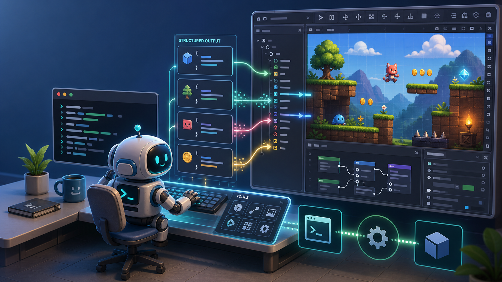

# godot-agent (`gda`)



> An agent-first **CLI and MCP server** that lets AI agents drive the [Godot Engine](https://godotengine.org) to build games — with **structured output** built for programmatic consumption.

[-orange)](#project-status)
[](https://github.com/aigengame/godot-agent/actions/workflows/ci.yml?query=branch%3Amain+event%3Apush)
[](https://www.python.org/)
[-478CBF)](https://godotengine.org)
[](https://github.com/astral-sh/uv)
[](LICENSE)

`godot-agent` lets AI agents drive the Godot engine through **structured, machine-readable
operations** rather than raw logs: an agent issues an operation and gets back a single clean
result it can act on, not prose it has to scrape.

It is delivered as three layers: **`gda`**, the agent-facing CLI that exposes Godot operations
with structured `--json` output and self-describing schemas; **`gda-mcp`**, a thin
[Model Context Protocol](https://modelcontextprotocol.io) server that turns those same
capabilities into MCP tools, derived mechanically from `gda`'s schemas; and **`gda-daemon`**, a
long-lived process holding a persistent connection to a running engine to serve *live operations*
that a one-shot headless process cannot. `gda` lands first as a standalone headless CLI (Phase 1);
live operations follow through `gda-daemon` (Phase 2). See [Architecture](#architecture-at-a-glance)
for the full picture.

---

## Why `gda`?

- **🤖 Agent-first, structured output.** Every command supports `--json` and emits exactly one
  result object on stdout. Engine noise and diagnostics are routed to stderr, so an agent never
  has to scrape prose. See the [structured-output contract](#the-structured-output-contract).
- **📐 Model-driven & self-describing.** Each command's input and output are defined as typed
  models. The same model serializes `--json` today and will emit a machine-readable `--schema`
  (a JSON Schema contract) — so an MCP adapter can generate tool definitions mechanically instead
  of hand-maintaining them. *(See [ADR-0004](docs/adr/0004-schema-flag-self-description.md).)*
- **🧩 Godot-native command surface.** Commands are grouped by Godot domain object
  (`gda scene create`, `gda node add`, …) with a small, orthogonal verb vocabulary — zero learning
  cost if you already know Godot. *(See [ADR-0005](docs/adr/0005-cli-command-taxonomy.md).)*
- **📦 Standalone, no service required.** The first delivery fulfils *headless operations* by
  spawning one-shot `godot --headless` processes — nothing to install in the editor, no daemon to
  run. Live, stateful operations arrive later behind the same CLI. *(See [ADR-0001](docs/adr/0001-godot-integration-mechanism.md).)*
- **🛡️ Fails loudly, not silently.** A missing or hung engine is bounded by a timeout and mapped
  to a non-zero exit with a clear diagnostic — never an indefinite hang or a raw traceback.

---

## Project status

> **`gda` is in active early development (Phase 1).** The architecture and contracts are settled
> (see [`CONTEXT.md`](CONTEXT.md) and [`docs/adr/`](docs/adr/)), and the first end-to-end slice ships
> today. This README documents the working surface *and* the roadmap, and is explicit about which
> is which.

**Working today**

- ✅ `gda info` / `gda info --json` — report the Godot engine version through the full Phase-1
  pipeline (binary resolution → headless one-shot runner → sentinel contract → typed model → JSON).
- ✅ Structured errors for every `gda info` failure mode — a stable `{"error": {category, code,
  message, diagnostics}}` JSON object on stdout plus a category-distinguishing non-zero exit code
  (environment 127/124, version 3, operation 4, parse 5); stderr carries engine diagnostics.
- ✅ `gda info --schema` — model-driven self-description: emits the command's `input` and `output`
  JSON Schemas, derived from the same typed models that back `--json`, without spawning Godot
  ([ADR-0004](docs/adr/0004-schema-flag-self-description.md)).
- ✅ `gda --help`, `gda info --help`.
- ✅ Godot binary resolution via flag / environment variable / default.
- ✅ `gda scene create <path> --root-type <Type>` / `gda scene get <path>` — the first domain
  command group ([ADR-0005](docs/adr/0005-cli-command-taxonomy.md)): create a `.tscn` headlessly
  and read its structured node tree back, with `--json`, `--schema`, structured errors with
  stable operation codes (`path_not_found`, `not_a_scene`, `invalid_root_type`, `save_failed`),
  and an e2e-verified create → get round-trip.

**On the roadmap** (designed, not yet implemented)

- 🔜 Further domain command groups and commands: `node`, `script`, `project`, `resource`,
  `export`, … (see the [command catalog](docs/command-catalog.md)).
- 🔜 `gda-mcp`, a thin [Model Context Protocol](https://modelcontextprotocol.io) adapter generated
  from `--schema`.
- 🔜 `gda-daemon` for *live operations* against a running engine (Phase 2).

See the [roadmap](#roadmap) and the [issue tracker](https://github.com/aigengame/godot-agent/issues).

---

## Architecture at a glance

`gda` is delivered bottom-up as three components and in two capability phases:

| Component     | Role                                                                                   | Phase |
| ------------- | -------------------------------------------------------------------------------------- | ----- |
| **`gda`**     | The agent-facing Godot CLI — the bottom layer that exposes Godot with structured output | 1     |
| **`gda-mcp`** | A thin MCP adapter that exposes `gda`'s capabilities as MCP tools, derived from `--schema` | 1+    |
| **`gda-daemon`** | A long-lived process holding a persistent connection to a running engine for *live operations* | 2     |

- **Headless operations** need no pre-existing engine state and are fulfilled by a one-shot
  `godot --headless` process (e.g. report version, create a scene, export). This is the basis of
  **Phase 1**.
- **Live operations** require an already-running engine (live scene tree, runtime inspection,
  UndoRedo, input simulation) and are served by `gda-daemon` in **Phase 2**.

The vocabulary above is defined precisely in [`CONTEXT.md`](CONTEXT.md); the decisions behind it live
in [`docs/adr/`](docs/adr/).

---

## Requirements

- **[uv](https://github.com/astral-sh/uv)** — the Python toolchain/package manager used by this project.
- **Python 3.13+** (uv can provision this for you).
- **Godot 4.4+** — `gda` targets Godot 4.x with a minimum of 4.4; 4.6 is the tested baseline.
  3.x is not supported. *(See [ADR-0003](docs/adr/0003-target-godot-version.md).)*

---

## Installation

`gda` is not yet published to a package index; install it from source with `uv`.

```bash
git clone https://github.com/aigengame/godot-agent.git
cd godot-agent
uv sync          # create the environment and install dependencies
uv run gda --help
```

To install `gda` as a standalone CLI on your `PATH`:

```bash
uv tool install .
gda --help
```

---

## Quick start

Point `gda` at your Godot binary and ask for the engine version:

```bash
# Use the GDA_GODOT environment variable (or the --godot flag, or the default path)
export GDA_GODOT="/path/to/Godot"

gda info --json
```

```json
{"major":4,"minor":6,"patch":3,"hex":263683,"status":"stable","build":"official","hash":"7d41c59c457bd5a245092b4e7eb2d833e3b3f8c3","string":"4.6.3-stable (official)","timestamp":0}
```

Without `--json`, `gda info` prints the human-readable version string (`4.6.3-stable (official)`).
All engine and script diagnostics go to **stderr**, so stdout is always clean JSON you can pipe:

```bash
gda info --json | jq .major   # → 4
```

Create a scene headlessly and read its structured tree back:

```bash
gda scene create game/main.tscn --root-type Node2D --json
# {"path":"game/main.tscn","root_name":"main","root_type":"Node2D"}

gda scene get game/main.tscn --json
# {"path":"game/main.tscn","root":{"name":"main","type":"Node2D","children":[]}}
```

---

## Usage

### Command surface

`gda` commands are **grouped by Godot domain object** and use a small, consistent verb vocabulary,
so the same verb means the same thing in every group:

```
gda <group> <command> [options]     # domain commands, e.g. gda scene create
gda <meta-command> [options]        # meta commands about gda/the engine, e.g. gda info
```

| Verb                     | Meaning                                                          |
| ------------------------ | ---------------------------------------------------------------- |
| `create` / `delete`      | Make / remove a **standalone** entity (scene, script, resource)  |
| `add` / `remove`         | Add / remove a **sub-entity** within a container (node → scene)  |
| `get` / `list`           | Read one entity / enumerate many                                 |
| `set`                    | Mutate a property                                                |
| domain verbs             | `play`, `run`, `export`, `import`, … kept with their natural meaning |

> Today the `info` meta command and the first domain commands — `gda scene create` and
> `gda scene get` — are implemented. The remaining groups and commands
> (`node`, `script`, …) are on the [roadmap](#roadmap); the full territory is mapped in the
> [command catalog](docs/command-catalog.md). The taxonomy and naming rules are
> specified in [ADR-0005](docs/adr/0005-cli-command-taxonomy.md).

### Global flags

| Flag       | Description                                                          |
| ---------- | ------------------------------------------------------------------- |
| `--json`   | Emit the result as a single JSON object on stdout. Without it, commands print a concise human-readable rendering. |
| `--schema` | Emit the command's input/output JSON Schema contract (no Godot spawned). |
| `--help`   | Show usage for `gda` or any command.                                |

---

## Configuration

`gda` resolves the Godot binary in this order (highest precedence first):

1. The **`--godot <path>`** flag.
2. The **`GDA_GODOT`** environment variable.
3. A **default development path** — `~/Applications/Godot.app/Contents/MacOS/Godot` (macOS).
   On other platforms, set `GDA_GODOT` or pass `--godot`.

```bash
gda info --godot "/Applications/Godot.app/Contents/MacOS/Godot" --json
```

---

## The structured-output contract

Headless Godot interleaves its banner, warnings, and `print()` output into stdout. `gda` solves this
with a sentinel contract ([ADR-0002](docs/adr/0002-headless-structured-output-contract.md)):

- The GDScript payload emits **exactly one** result, wrapped in unique sentinels on stdout:

  ```
  <<<GDA:RESULT>>>{ ...json... }<<<GDA:END>>>
  ```

- It routes **all** of its own diagnostics to stderr; stdout carries nothing but the contract.
- `gda` extracts and parses only the bytes between the sentinels, ignoring the surrounding engine
  noise, and surfaces stderr for inspection.

This is what makes `gda`'s output safe to consume programmatically, and it generalizes to the
per-message protocol the daemon will use in Phase 2.

---

## Development

```bash
uv sync                       # set up the environment

uv run pytest                 # run the full suite (includes an e2e test against a real Godot)
uv run pytest -m "not e2e"    # unit tests only (no Godot binary required)
uv run pytest -m e2e          # only the end-to-end test (needs Godot 4.4+ on this machine)
```

The `e2e` test auto-skips if no Godot binary is found at the resolved path.

### Project layout

```
src/gda/
  cli.py            # CLI entrypoint (Typer); commands, --json, binary override
  binary.py         # Godot binary resolution (flag > $GDA_GODOT > default)
  runner.py         # GodotRunner seam (Protocol) + SubprocessGodotRunner (one-shot headless)
  parser.py         # sentinel-contract result parser (ADR-0002)
  models.py         # typed result models (Pydantic) backing --json and --schema (ADR-0004)
  ops/operations.gd # GDScript payload, dispatched by operation name
tests/              # unit tests + an e2e test against a real engine
docs/adr/           # architecture decision records
CONTEXT.md          # the project's shared domain language
```

The codebase is intentionally built around **fakeable seams** (e.g. the `GodotRunner` Protocol) so
commands can be tested without launching a real engine.

---

## Roadmap

| Phase       | Delivers                                                                            |
| ----------- | ----------------------------------------------------------------------------------- |
| **Phase 1** | `gda` serving *headless operations* standalone: `info`, structured errors, `--schema`, and domain command groups (`scene`, `node`, `script`, `project`, `resource`, `export`, …). |
| **`gda-mcp`** | A thin MCP adapter generated mechanically from `--schema` — first on top of Phase 1, following `gda` forward automatically. |
| **Phase 2** | `gda` also serving *live operations* through `gda-daemon`'s persistent engine connection. |

Track progress and proposals on the [issue tracker](https://github.com/aigengame/godot-agent/issues).

---

## Contributing

Contributions are welcome. Before starting:

- Read [`CONTEXT.md`](CONTEXT.md) to align with the project's shared language, and review the
  relevant [ADRs](docs/adr/) for the area you're touching.
- Issues and PRDs live as GitHub issues in [`aigengame/godot-agent`](https://github.com/aigengame/godot-agent/issues).

Commits follow the [Conventional Commits](https://www.conventionalcommits.org/) specification.

> **Working with an AI coding agent?** This project is built to be agent-navigable.
> [`AGENTS.md`](AGENTS.md) is the entry point for coding agents — it wires in the project's
> rules, domain docs, and skills.

---

## Acknowledgements

`gda`'s design draws on two reference implementations from the Godot + agent ecosystem: the
one-shot-headless approach of `godot-mcp` and the persistent editor-plugin approach of
`godot-mcp-pro`. `gda` deliberately adopts a **hybrid, phased** strategy that combines their
strengths (see [ADR-0001](docs/adr/0001-godot-integration-mechanism.md)).

---

## License

Released under the [MIT License](LICENSE). Copyright (c) 2026 aigengame.
