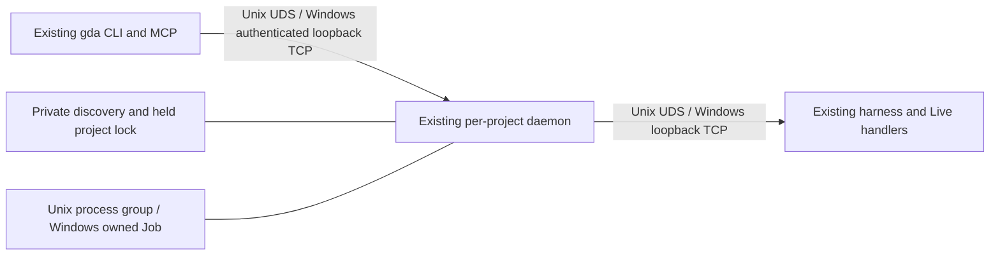

# Incremental Windows capability and portability plan

Status: user-accepted planning record, not a product implementation. The [tracker design](https://github.com/aigengame/godot-agent/issues/1109) owns scope and task acceptance; [ADR-0046](../adr/0046-windows-live-uses-local-tcp-and-owned-session-adapters.md) owns the accepted architectural decisions.
Date: 2026-10-06 (Asia/Shanghai).
Baseline revision: `6d5da3df36d7bf3ba6972c485ef955a2bf8c1926`.
Implementation base after the core-layering merge: `7e23ba2d819b69159f055bfca9d0a2cbd74bf923` (PR #1108, ADR-0045). Audit/prototype artifacts remain historical evidence at their original revisions; do not rewrite them to imply a new run.
Scope: root gda, gda-mcp, gda-daemon, and the bundled gda skill.
Tracking: [Windows adaptation milestone](https://github.com/aigengame/godot-agent/milestone/20), [published task index](windows-adaptation-tickets-2026-10-06/README.md). One native parent/sub-issue level represents scope/progress; explicit blocked-by links represent execution/completion order. See the [relationship research](github-issue-hierarchy-and-dependencies-2026-10-06.md).

## Recommendation

Fix the public entry points first, establish trustworthy local tests, and then add Windows adapters at the existing daemon seams. Windows should use authenticated loopback TCP on both IPC legs; macOS and Linux should retain UDS. Reuse the framing, sentinel result, RunResult, operation handlers, state consistency, and diagnostics already implemented. The final target includes all 24 commands whose current constraints exclude Windows, including rendered screen capture.

No Windows CI work is planned. The existing CI configuration remains outside the scope. The plan does not introduce a platform framework, provider registry, encoding negotiation, alternative code pages, generic process manager, export format registry, or a broad rewrite of gda's core.

The main risk is daemon infrastructure, not 19 separate Live implementations. Discovery, lifetime ownership, TCP readiness and fragmented frames must work before the existing operations can be claimed as supported.

## Evidence and limits

The [audit](windows-platform-audit-2026-10-06.md) is the authority for the baseline: 859 selected e2e cases, 655 passed, 48 failed, 32 setup errors, and 124 skipped. A UTF-8 retry of the 80 failures/errors gave 19 passed, 28 failed, 32 errors, and one skipped. These subset results do not establish a green full suite. Eleven engine-verdict observations were not reproduced; they are not grounds for speculative compatibility branches.

New, isolated feasibility experiments used Windows 11, Python 3.13.7 and Godot 4.6.3. Production code and existing tests were not changed.

| Question | New evidence | Implementation implication |
| --- | --- | --- |
| Can native drive/UNC file URIs use a standard parser? | `Path.from_uri` produced the correct checkout drive path and `\\server\share\game`. | Use the existing Python 3.13 requirement; do not write a URI parser. UNC parsing was verified; a network-share mount or runtime was not tested. |
| Does path case require a new project-identity scheme? | This host's `Path.resolve()` returned identical spelling for a case-swapped checkout reference, and existing `daemon_paths` matched. | Preserve canonical project identity. Add a Windows regression case; do not add broad case folding in advance. |
| Can a small Windows lock preserve discoverable metadata? | A separate stable lock excluded a second process, left metadata readable, and released after owner termination. | Use a dedicated Windows `.lock`, with metadata in another file. Keep the Unix flock implementation. |
| Can a private directory be created without an ACL framework? | `os.mkdir(mode=0o700)` created explicit owner/SYSTEM/administrator access; a metadata file inherited it. | Use standard-library creation of a dedicated new runtime directory. An existing directory still needs a narrow permission check; `chmod(0700)` is not that check. |
| Can existing Live handlers operate over TCP? | A copied full harness, with only peer/connection/receive changes, completed token and scene verification, game tree, rotation get/set/read-back, and 16 perf monitor entries. | Add transport adaptation; retain handlers and the Python framing. This was a direct harness prototype, not gda CLI/daemon e2e. |
| Can fragmented TCP input keep the game running? | After receiving the full header but only three body bytes, a 400 ms delay still allowed 25 scene ticks. | Wait for a complete frame without blocking the main thread. Preserve one pending operation and frame-coherent execution. |
| Can Windows own a process tree without process-name scanning? | Controlled children were assigned to two nested Jobs before descendants could start. Closing the inner Job ended descendants both while the leader ran and after the leader had exited with status 23. | A local Windows session adapter using Job Objects is viable. The real daemon/Godot/console-wrapper topology and parent-terminal exit remain acceptance tests. |

The engine confirms that both `StreamPeerTCP` and `StreamPeerUDS` inherit `StreamPeerSocket` in the installed 4.6.3 build. The prototype uses that common type. This confines harness adaptation to connection creation, readiness, and complete-frame receive logic.

Evidence and reproducible prototype scripts are saved in [windows-adaptation-plan-2026-10-06/](windows-adaptation-plan-2026-10-06/). The experiments do not implement authenticated CLI discovery, daemon lifecycle, windowed preflight, all Live operations, or a Windows export.

## Architecture and change limits

Use a few local additions, with names finalized when their interfaces are implemented:

| Addition or seam | Responsibility | Existing code that needs local adaptation |
| --- | --- | --- |
| Local UTF-8 entry setup | Establish UTF-8 before argument parsing or emission; no locale-specific fallback or shared utility layer | A separate CLI console wrapper reused by `__main__`, and a few equivalent stdlib calls or a private helper in MCP; relevant stdin/file/capture sites |
| `daemon/transport.py` | Internal UDS/TCP endpoint values, listening/connecting, and the Windows authentication handshake | `daemon.client._request`, daemon `_control`, server bind/accept, session harness endpoint handoff |
| Windows discovery/lock leaf | New private runtime directory, stable lock, readable and atomically published endpoint metadata | Existing discovery functions and server cleanup order |
| Windows session ownership leaf | Own the real engine tree, preserve exit status, stop/retire within the caller's remaining deadline | Session spawn/teardown; detached daemon spawn options |
| Windows display probe | Establish whether a windowed engine can run, with an honest unavailable/denied verdict | The existing display-probe selection function |

The existing production edits should be concentrated in `core/engine/binary.py`, the CLI/MCP entry and path helpers, and `daemon/discovery.py`, `daemon/server.py`, `daemon/session.py`, `daemon/client.py`, `commands/daemon.py`, `core/engine/execution.py`, `daemon/display.py`, and the harness connection/receive area. `core/failure/classify.py` may receive a small Windows exception-status correction. Lifecycle endpoint fields and their renderers need a small explicit schema change.

ADR-0045 remains binding: core imports only core and exit_codes, remains framework-free and has no process entry. Transport/lock/Job/display additions belong to daemon. The public endpoint DTO stays in the command surface, with no core import of daemon endpoint types. The sole static support predicate cannot read runtime discovery. MCP remains on the public CLI ABI and must not import CLI/core/surface internals merely to share a few stdio calls. Retain the existing completed-run step for export smoke and the existing import-direction gate on every slice; add no root/core utility, facade or old-path shim.

Do not replace dispatch, classify/parse/result pipelines, Value projection, headless GDScript operations, or individual Live handlers. Keep `EngineSession.request`, session identity, single-writer serialization, scene verification, logging and existing recipes as the callers' interfaces. If a slice requires moving these cores or copying handlers, stop that slice and review the seam before expanding it.

The additions are concrete adapters for two known implementations, not a plugin system. No transport-selection CLI flag, fixed port, port scan, dependency-heavy Windows runtime, or application-wide PlatformService is needed.

### Windows IPC and discovery

- Bind two listeners to literal `127.0.0.1` with port `0`, and retain the bound sockets. Publish their actual addresses only after both binds succeed. Do not choose a free port and close it before spawning.
- Keep the canonical project slug. Use a dedicated private runtime under `%LOCALAPPDATA%`, with a documented narrow fallback if the variable is absent. UDS length checks apply only to UDS.
- Windows uses a stable, separately locked `.lock` file. Never unlink that file during a daemon lifetime or stale recovery. Acquire it before publishing or reclaiming metadata; remove owned metadata after closing listeners and retiring the session; release the lock last.
- Publish a small private discovery record atomically, with canonical project, daemon identity/generation, actual endpoints and the CLI authentication secret. Reject foreign or malformed metadata; lock possession plus a matching authenticated endpoint replaces UDS file presence as evidence. PID existence alone does not prove ownership or liveness.
- Authenticate Windows live, status and stop requests. Use an internal fixed-size secret frame before the existing request, rather than accepting an arbitrary operation before authentication. Reuse the harness's token handshake; reject a wrong peer and continue accepting within the original launch deadline.
- Bound unauthenticated connections and frame reads by absolute deadlines. A local client that connects and sends nothing must not freeze the serial daemon. This preserves the existing bounded-call invariant; it is not a general security platform. Tokens stay out of public models, result JSON, normal logs and schema.

The subsequent #1109 documentation slice records these changes in ADR-0046 and adds explicit amendments to ADR-0021 and ADR-0017. The original Unix behavior remains; the accepted target design does not open the current Windows gate or establish product acceptance.

### Harness and process ownership

The shared `StreamPeerSocket` type can retain the common framing calls. Creating the concrete peer is a small OS choice. TCP needs an explicit CONNECTING-to-CONNECTED transition before the token is sent. Keep partial bytes until a complete prefix and body are available; only then dispatch the existing handler. Verify large replies and disconnect behavior before adding a separate send queue; do not preemptively rewrite the protocol into a generic asynchronous RPC stack.

Retain Unix process groups. On Windows, a Job must own the session's tree before the engine can create descendants. The experiment verifies a small controlled-start gate: launch a private worker that waits, assign it to the owned Job, and only then allow it to launch Godot. The worker can remain a normal Popen process for existing poll/wait callers and forward the engine's exit status. This is the recommended first implementation candidate; its worker/engine exit propagation and failure cleanup must pass with the real engine. A narrowly implemented suspended-spawn alternative is acceptable if it is simpler after that verification. Do not rely on private Popen handles, process-name kills, PID scans, or the console wrapper alone as the complete ownership model.

Worker startup is not engine startup. Within the original launch deadline, the worker must report whether Godot was spawned and preserve the actual launch exception or complete Windows exit status. Access denied or an invalid executable must retain the existing startup-failure classification rather than becoming a harness-connect timeout. Keep this small private startup handshake inside the ownership adapter; do not change the public result envelope or classification architecture.

Keep Job and process handles until retirement, even after the engine leader exits. Closing the owning Job must clean descendants if the daemon crashes. Test both explicitly configured GUI `.exe` and console wrapper paths. Do not force every user onto one local versioned executable name.

Windows forced retirement does not have Unix SIGTERM's normal-shutdown/stdio-flush semantics. Preserve captured diagnostics and the existing timeout contract; do not promise exit-time diagnostics after a forced stop. No phase gets a new timeout/grace budget merely because a Windows adapter was called.

### Public contract and support rollout

`daemon start/status` currently publish a required `socket_path`. Do not put a TCP URI or metadata filename into that path field. Keep its current Unix value, permit null on Windows, and add one optional typed endpoint containing transport/address only. Update the two models, renderers, schemas and focused contract tests together. Secrets remain private. This is a bounded public schema change, not an excuse to redesign result envelopes.

Prefer user-visible incremental availability: first Windows filesystem/lifecycle operations, then a complete headless Live subset, then rendered operations. During partial rollout, use the existing `live_stack_constraints` predicate as the only authority for supported operations. Runtime guards read the same decision. A small temporary Windows allow-list at this existing predicate can express the validated subset; remove it once the full surface is verified. Do not create a second capability matrix or let schema advertise untested operations. Before windowed support is delivered, a Windows `--windowed` request must fail explicitly and its help must state the limit.

If partial public schema changes prove more costly than useful, merge the transport/ownership additions behind the current Windows gate and open it once headless and rendered acceptance is complete. This is a release-packaging choice, not a second runtime feature system. The earlier entry-point and headless improvements remain independently deliverable.

Headless stays Godot 4.4+; Live stays 4.6+. The availability of TCP on older engines does not justify adding an older-engine compatibility project.

## Incremental delivery order

Difficulty is relative implementation risk, not a calendar estimate. Each increment can contain a few small PRs, but must end in the stated real user path. Documentation and schema work travel with the slice whose behavior they describe.

| Increment | Scope and smallest useful result | Difficulty | Exit evidence |
| --- | --- | --- | --- |
| 1. UTF-8 at the source | Add one stdio setup at real CLI/MCP entry points, before parsing. Explicit UTF-8 for JSON stdin and relevant file/capture I/O. Retain opaque engine-output bytes/CRLF. | Low | With UTF-8 mode disabled and no workaround env, both entry forms emit parseable schema; real MCP startup works; Chinese and emoji success/error payloads round-trip; a successful mutation does not fail merely while rendering its result. |
| 2. Paths, executable resolution and configuration | Use `Path.from_uri`; preserve Windows MCP `GDA_BIN` command argv using a small native parser, Unix shlex unchanged; retain the default paired `[sys.executable, -m, gda]`, never PATH lookup of gda. The separate Godot resolver is `--godot` > `GDA_GODOT` > bounded PATH candidates, with the legacy app fallback only on macOS. Add PowerShell and escaped JSON examples. | Low–medium | Roots create a file only in the advertised project; explicit GDA_PROJECT routing still works; spaces/backslashes and ordered MCP command argv survive; Godot discovery respects its own overrides. GUI-launched agent examples use explicit paths where PATH is unreliable. |
| 3. Trustworthy portable local tests | Port `/tmp`, HOME-only and locale captures; compare path semantics rather than separators; recount spill bytes from raw bytes. Use legal Windows filenames and meaningful permission fixtures. Add unprivileged directory-junction cases where equivalent; report unavailable file-symlink privilege honestly. | Medium | Full selected Windows headless run has no fixture setup errors or hidden reader-thread exceptions. Skips name actual prerequisites or capabilities. Keep the original audit and mark the new full run separately; do not weaken permission/containment assertions. |
| 4. Native Windows export and smoke | Add Windows Desktop host fixtures and matching local export-template setup. Verify the existing native export/smoke channels and harness exclusion/inertness. Correct only demonstrated channel-local runnable-file/error differences. | Medium | Build a real `.exe`, run it with ordered args, verify normal/strict verdicts, timeout capture, isolated user data and cleanup; exported and human-opened runs stay inert. No export format/packaging framework or installer is introduced. |
| 5. Windows daemon lifecycle | Implement loopback endpoints, private discovery, independent lock, authentication, detached spawn and cleanup. Amend transport ADR and the two lifecycle result models. Deliver install/start/status/stop/uninstall without claiming an Engine session is ready. | Medium–high | Two concurrent starts have one winner; losing start cannot overwrite it. Two projects are isolated. Both normal CLI exit and closing its terminal/IDE host leave the daemon usable; explicitly disclose any host Job restriction if that detachment cannot be met. Wrong/absent auth cannot stop or serve it. Crashed/stale slots recover; failed start retains existing harness rollback. |
| 6. First complete headless Engine session | Add TCP harness readiness/complete-frame receive and the Windows owned Job candidate. Wire wait-ready -> game tree/get -> stop using existing recipes. | High | Real CLI and MCP reach the requested scene. Worker startup failures and the engine's full exit status retain their original classification within the launch deadline. A fragmented request does not freeze game ticks. Deadline, disconnect and restart cases preserve current state rules. Stop/crash/timeout leaves no owned descendants, including after leader exit; unrelated processes are untouched. |
| 7. Complete non-rendered Live capability | Verify game find/get/set/call, rect where meaningful headless, input routes, perf windows, diag and logger over the same adapters. Broaden the single support predicate only with passing evidence. | Medium–high, mainly integration | Read-after-write, both action/event routes, paused games, bounded multi-frame calls, numeric fidelity, post-exit logs and timeout-triggered session replacement pass through real CLI/MCP. No per-operation Windows copies. |
| 8. Windowed Windows parity and final support statement | Add one Windows desktop-availability probe; run existing windowed/capture recipes, screen capture/frames and input-driven UI behavior. Complete support/schema/help/skill documentation. | High | A usable desktop produces expected pixels, dimensions and frame/session receipts. An unavailable/denied desktop gets the existing appropriate typed verdict. After all 24 commands are verified, publish three-platform Live constraints and remove transitional gating. |

Dependencies: 1 -> 2 -> 3; 4 can proceed once 1–3 stabilize and local templates are available. 5 -> 6 -> 7 -> 8 is the Live chain. Ownership helper implementation and TCP frame adaptation can be developed independently after 5 fixes their interface, but 6 is accepted only when they form one real vertical slice.

Each slice first runs its focused real-engine path plus relevant unit/contract tests. Run the complete Windows tier at the headless, first-Live, and final-parity milestones. Run relevant existing Unix tests after a shared seam changes and record an actual macOS/Linux regression run before the full-platform claim. A lack of access to one host remains an explicit verification gap; no Windows CI matrix is part of this plan.

Track the original excluded surface explicitly; passing a transport test does not automatically close an operation row:

| Original excluded commands | Count | Acceptance increment |
| --- | --- | --- |
| daemon install/start/status/stop/uninstall | 5 | 5 |
| daemon wait-ready | 1 | 6 |
| game tree/find/get/rect/set/call | 6 | 6 proves tree/get; 7 completes all six |
| input key/mouse-click/mouse-move/action/tap/sequence | 6 | 7 verifies headless routes; 8 verifies rendered UI effects |
| perf monitors/monitor, diag errors, logger tail | 4 | 7 |
| screen capture/frames | 2 | 8 |
| Total | 24 | Final parity |

For each milestone, save the command/environment, selected test count, passed/failed/setup-error/skipped counts, skip reasons and raw results. Report newly added cases separately from the original 859-case selection. Distinguish actual product failures from missing templates, desktop access or symlink privilege; never turn a failing supported operation into a platform skip to meet the exit criterion.

## Documentation and configuration that must follow implementation

- `README.md`, its translated versions and the command catalog: accurate partial/final support, version floors, PowerShell setup, and rendered prerequisites.
- `docs/gda-mcp-registration.md`: Windows executable paths, JSON escaping, native file roots, GDA_PROJECT precedence, and GUI-agent PATH advice. Keep UTF-8 automatic rather than an installation workaround.
- Bundled `src/gda/skill/SKILL.md` and `docs/gda-skill.md`: replace unconditional Unix-only recipes only when their Windows path is delivered. Keep the guidance tied to the shipped CLI.
- ADR-0021 and the new Windows ADR: loopback transport, authentication/private discovery, stable-lock liveness, endpoint publication and cleanup ownership. Narrowly amend ADR-0017 where its POSIX process-group implementation becomes platform-specific. Do not change the glossary into implementation notes.
- Schema constraints, human help and lifecycle endpoint fields: one support authority; examples must use that same released behavior. Keep the error/result shapes already consumed by MCP.
- Development instructions: local interpreter, console binary choice, matching templates and per-run basetemp. `--user-data-root` is per invocation; never export it for a whole suite and hide real templates. No machine-specific drive path becomes a code default.

## Scope control and completion

Encoding means one UTF-8 contract. No GBK/CP936/CP1252 conversion, code-page guessing, chcp requirement, CJK-specific branch or lossy fallback is planned. Portable tests must prove that the entry contract holds even on the native non-UTF-8 host; globally setting PYTHONUTF8 in tests would hide the original defect.

Authentication, private metadata, stable locking and process-tree cleanup are required by the existing daemon isolation/liveness/lifetime contracts when changing its transport. Keep them inside the new leaves. They do not authorize TLS, remote access, endpoint scanning, user/session management, or an extensible platform-control subsystem.

The Windows native-exception gap can be corrected by a localized known-status classification and focused tests. Do not classify every positive/nonzero exit as a crash. Include real abnormal engine evidence when available; the audit's chosen ExitProcess status was not an actual Godot crash. Unreproduced engine failures stay tracked, with raw RunResult/status captured on recurrence; no speculative fallback or new observability subsystem is required.

Final acceptance requires all 24 previously excluded commands to have truthful Windows support and real evidence, Windows CLI/MCP UTF-8 and roots correctness, portable test setup, owned-session retirement, windowed capture, native export/smoke, and synchronized configuration/docs/schema. It also requires relevant actual Unix regression evidence. A green mocked seam or a subset rerun does not fulfill that acceptance. Windows CI is explicitly excluded.

## Primary references

- [Project audit and raw results](windows-platform-audit-2026-10-06.md).
- [ADR-0017](../adr/0017-gda-daemon-live-execution-mechanism.md), [ADR-0020](../adr/0020-live-state-consistency.md), [ADR-0021](../adr/0021-gda-daemon-transport-discovery-and-live-version-floor.md), [ADR-0018](../adr/0018-gda-harness-lifecycle-and-concurrent-editor-boundary.md), [ADR-0028](../adr/0028-harness-export-cleanliness.md).
- Current socket seams: `src/gda/daemon/client.py:_request`, `src/gda/commands/daemon.py:_control`, `src/gda/daemon/server.py:_bind`. Discovery/lock semantics: `src/gda/daemon/discovery.py`. Harness connection/frame area: `src/gda/harness/gda_harness.gd`. Process ownership: `src/gda/daemon/session.py:_capture_owned_pgid`. Module ownership and dependency direction: [ADR-0045](../adr/0045-python-core-splits-into-functional-packages-in-import-order.md).
- [Python 3.13 Path.from_uri](https://docs.python.org/3.13/library/pathlib.html#pathlib.Path.from_uri), [private directory creation](https://docs.python.org/3.13/library/os.html#os.mkdir), and [byte-range locks](https://docs.python.org/3.13/library/msvcrt.html#msvcrt.locking).
- [Godot 4.6 StreamPeerTCP](https://docs.godotengine.org/en/4.6/classes/class_streampeertcp.html), [StreamPeerSocket](https://docs.godotengine.org/en/4.6/classes/class_streampeersocket.html), and [StreamPeer partial/blocking reads](https://docs.godotengine.org/en/4.6/classes/class_streampeer.html). Context7 was used first; exact class references and the installed-engine probe resolved the connection/receive details its snippets did not cover.
- [Microsoft Job Objects](https://learn.microsoft.com/en-us/windows/win32/procthread/job-objects): grouped lifetime ownership and nested Jobs, verified here with controlled child trees rather than inferred from the old console-wrapper probe.

The original planning task published no issue, PR, release or accepted ADR. Subsequent tracker delivery is recorded in the adjacent ticket breakdown/publication manifest, and the #1109 documentation slice records ADR-0046 and the narrow amendments. Future implementation outcomes are recorded only when their real paths are verified.
