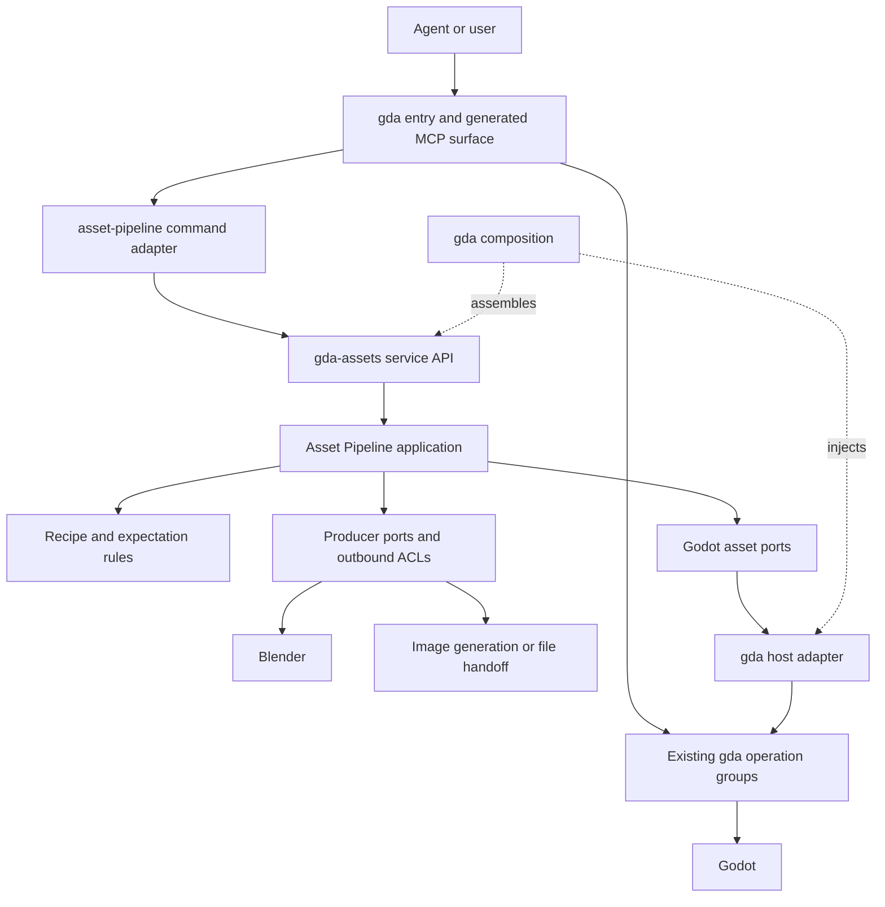

# Asset Pipeline architecture

**Status:** accepted design; file handoff (#908), saved Blender production (#909),
model expectation checks (#887), optional content observations (#889), controlled
runtime refresh (#890), preview (#891), package acceptance (#892), and local prompt
records (#912) are implemented. Concept selection and authoring consumers remain
planned. Accepted by the project owner
on 2026-09-07 after review of the Blender-to-Godot workflow and milestone #14.
Source baseline inspected: `cfcb8658e67df418a69694840a37a22a9cd3cbe0`.
Acceptance and delivery status are owned by
[#907](https://github.com/aigengame/godot-agent/issues/907)
and its linked implementation issues. No command, package, or production validation
is delivered merely by accepting this document.

## Purpose and authority

The repeated cost is establishing what a producer exported, what Godot loaded,
and what the current scene uses. The pipeline coordinates those steps and reduces
project-specific scripts for structure checks, import adjustments, preview, and
package acceptance. It initially supports Blender and image-generation outputs.
Preparation also preserves project prompts and supplies selected image-gen concept
references before new model or sprite authoring. Existing-file and saved-source
handoff remain independently usable.

| Authority | Owns |
| --- | --- |
| Umbrella and child issues | User outcomes, acceptance criteria, blocking edges, completion |
| Root CONTEXT-MAP and ADR-0042 | Context routing and integration with gda |
| Local ASSETS-CONTEXT | Asset Pipeline vocabulary and ownership |
| This document | Target module structure, complete workflow, delivery and validation mapping |
| aADR-0001 / aADR-0002 / aADR-0003 | Internal decomposition, minimum results, and prompt/reference preparation |
| Project recipes and scenes | Prompts, concept choices, art direction, output paths, gameplay expectations, authored overrides |
| gda operation contracts | Engine facts, import/cache semantics, sessions, capture, export |

The agreed drivers are: a single gda entry; additive integration into its existing
topology; independent workflow ownership; Blender and image-generation variation;
project/framework separation; and minimum sufficient mechanisms. No asset registry,
general workflow platform, automatic topology/UV/rig repair, universal art-quality
assessment, or hot swap is part of this design.

## Context boundary and integration

The binding gda integration contract is
[ADR-0042](../../../docs/adr/0042-asset-pipeline-supporting-context-integration.md).
This diagram shows runtime calls; source imports are described below it.



For the **pipeline service**, gda-assets is upstream; gda entry/integration consumes
it downstream. The runtime callback into the Godot host port does not make
gda-assets import gda. gda's engine model remains authoritative for engine facts.

Source dependency rules:

1. `gda.cli` composes the command group and host adapter; the integration never
   imports `gda.cli` to retrieve a service.
2. The group/integration consumes the package's explicit public API and port/result
   contracts. The host adapter also imports returning gda operations one-way.
3. `gda_assets.application` depends on its own Domain and ports; it imports no gda,
   vendor SDK, game configuration module, or CLI dispatch.
4. Producer adapters implement local contracts and depend on external systems.
   Their composition is internal. Domain depends on neither adapters nor the host.

| Boundary | Translation and owner |
| --- | --- |
| gda entry to pipeline service | gda integration maps CLI models/results/errors to the supported service API |
| Pipeline Godot port to gda operations | gda host adapter preserves engine semantics while projecting required facts |
| Blender to pipeline | Local Blender ACL maps source selection, export options, outputs, native errors |
| Image system to pipeline | Local image-generation ACL maps callable-provider responses or explicit file handoff |

These are small adapters at actual model boundaries. They do not justify duplicate
import-state rules, two result registries, or an integration framework.

## Responsibility and target structure

| Capability | Owner |
| --- | --- |
| Godot 3D properties and loaded resource/instance facts | Existing gda groups and engine payloads |
| Import metadata, option mutation, and actual engine work | gda resource operations |
| Production, installation, check ordering, selected comparison | Asset Pipeline Application |
| Prompt preservation/reuse, candidate selection, authoring handoff | Asset Pipeline Application, using local Domain values/rules and file handling |
| Expectation evaluation and comparison compatibility | Asset Pipeline Domain |
| Producer-specific preprocessing/export and native structure analysis | Producer adapter, with project-selected native operations |
| Raster normalization and format processing | Local processors; only for matching artifact kinds |
| Required limbs, scale tolerances, style, collision/scripts/material overrides | Project recipe and authored project resources |
| Session lifecycle, runtime sampling, captures, diagnostics, performance | gda; composed by preview/refresh workflows |
| Package-only acceptance | Asset Pipeline flow/evaluator using gda export and engine observations |

Create files with the slice that needs them, not empty layers in advance:

```text
src/gda/
  cli.py                              # composition, existing role
  commands/asset_pipeline.py           # gda transport slice and thin recipe
  integrations/asset_pipeline.py       # service ACL, Godot adapter, factory
  commands/resource.py, game.py, ...   # existing engine capability owners

libs/gda-assets/
  AGENTS.md
  ASSETS-CONTEXT.md
  docs/ARCHITECTURE.md
  docs/adr/
  src/gda_assets/
    api.py                            # deliberately supported cross-package API
    domain/
      recipe.py
      artifacts.py
      expectations.py
      prompt.py                       # prompt inputs, values, and composition rules
    application/
      ports.py
      integrate.py
      produce.py
      prompt.py                       # prepare, inspect, revise, register outputs
      prompt_ports.py                 # required local file persistence
      preview.py                      # isolated model preview orchestration
      package.py                      # isolated package acceptance orchestration
    adapters/
      blender/
      imagegen/
      files.py
      prompt_files.py                 # ordinary prompt snapshots and PNG copies
      raster.py
    bootstrap.py                      # producer composition, lazy setup
  tests/
```

The tree is a placement guide, not a requirement for one class per file. The
package API exports only supported service inputs/results and required ports;
it is not a wholesale re-export of internal modules. There is no second CLI.
Root `pyproject.toml` packages both source roots in one gda distribution; this
support context has no separate package manifest or release lifecycle. The
[asset pipeline guide](../README.md) documents file handoff and saved Blender
production. The latter adds the Application-owned `ProductionRequest`,
`ProductionOutput`, `ProducedFiles` and `AssetProducer` contracts. API composition
selects the local adapter only when production is requested. The host transports
generic options and injects the same Godot import/load port; native source
inspection and export stay inside the Blender adapter and its bundled worker.
The [Blender guide](blender.md) owns the supported execution and measurement policy.
The [model checks guide](checks.md) owns the implemented expectation document,
verdict, saved-report, and baseline-comparison user contract.
The [prompt guide](prompts.md) owns local preparation, explicit reuse/revision,
and completed-file registration. These use no Godot port or provider connection.
The [runtime refresh guide](runtime-refresh.md) owns the implemented controlled
restart, selected-instance comparison, and capture-association user contract.
The root [static model content guide](../../../docs/model-content.md) owns the two
gda fact commands and their shared native measurement scope.

## Tactical model and interfaces

[aADR-0001](adr/0001-domain-application-and-producer-adapters.md) owns the DDD
decomposition. Start with `AssetRecipe`, `ProducedFiles`, `AssetExpectations`,
`AssetCheckResult`, and `PipelineResult` as ordinary data/value types. The current
workflow has no demonstrated entity/aggregate/repository lifecycle requirement.

[aADR-0003](adr/0003-project-prompts-and-concept-references.md) adds `PromptRecord`
and `AuthoringHandoff` as ordinary project-local data. The recipe selects reusable
project art direction; a prompt record preserves the resolved input for one attempt.
This saved input is not a second editable authority for the project's current style.
Preparation precedes `AssetProducer.produce` and can finish with an explicit external
handoff. A missing candidate is not a successful produced-file result. Do not enlarge
every producer into a prompt manager or general authoring interface.

The contract shape remains small; these signatures summarize the current package
ports and results rather than freezing their serialized command schema:

```python
run_pipeline(request, *, producer, godot, files) -> PipelineResult
AssetProducer.produce(request, workspace) -> ProducedFiles
GodotAssetPort.import_assets(request) -> ImportOutcome
GodotAssetPort.check_load(request) -> LoadObservation
GodotAssetPort.inspect_model(request) -> ModelFacts
GodotRefreshPort.inspect_content(request) -> ImportedContent
GodotRefreshPort.observe_content(request) -> InstanceContent
GodotRefreshPort.status/stop/start/wait_ready/capture(request) -> lifecycle facts
```

Application owns these required contracts. A producer returns files with roles,
source mode, and available metadata. Its options stay in a producer-specific
validated section; Blender fields are not mandatory image fields. Add optional
source inspection only when used, and add runtime/package ports with their slices.
Do not mirror every gda operation into a general Godot SDK.

The first handoff slice needs only a bounded engine load observation for its PNG
and GLB fixtures. The richer `inspect_model` contract is implemented by [#886](https://github.com/aigengame/godot-agent/issues/886); the first
Blender tracer can verify its selected dimensions without waiting for the full
structure/material/animation report.

Project recipe paths are resolved relative to the recipe's declared base; target
`res://` paths use gda's resolved project. Do not let the current working directory
silently choose between those two meanings. The implementation slice freezes and
tests its concrete input/result schemas across CLI and generated MCP.

## Complete execution and failure path

1. Validate the recipe, selected producer/inputs, destination paths, and requested
   capabilities. Validate project configuration without contacting unused providers.
   For enabled generation, preserve the resolved prompt and selected inputs before
   external work. For new model/sprite authoring, generate or explicitly reuse a
   concept, select its references, and deliver them to the authoring consumer before
   that consumer starts. Record preparation, generation, selection, and consumption
   separately. Existing-file admission and saved-source export skip this preparation.
2. Obtain files from the selected producer or explicit existing-file handoff.
   Blender native preprocessing/export belongs in its adapter; style/export choices
   belong to the project. Report which saved source or supported live source was used.
3. Apply matching file processors in a workspace. A 3D export does not pass through
   Panda's raster-only `raw.png` assumptions. Unsupported transforms fail explicitly.
4. Install outputs into the selected project and report affected files. If a
   multi-file install is partial, stop before import and report remaining state.
5. Invoke gda import, optionally applying supported import options through the
   owning gda operation. Disclose actual project-wide work and preserve unselected
   options and project-authored scenes/material overrides.
6. Obtain engine facts and evaluate selected project expectations. Report exact
   resource/node/surface locators, expected/actual values, and incomplete coverage.
7. When requested, run preview, controlled session refresh, or package acceptance.
   Each returns separate stage outcomes; unsupported runtime evidence cannot become
   a verified result through a successful earlier stage.

Default results report completed stages, outputs, and failure/unsupported state.
Recovery reuses existing files/reports after checking inputs. A failed Godot import
must not regenerate an image or rerun Blender implicitly. There is no transaction
across a remote producer, filesystem writes, import, and a running engine. Cleanup
is restricted to owned temporary files; useful outputs remain available.

Pre/postprocessing does not grant permission to rewrite authored gameplay content.
A project can use wrapper scenes, inherited scenes, or import scripts to retain
collisions, scripts, and material overrides. gda exposes engine mechanisms; the
workflow does not impose a universal project composition strategy.

For image-generation tools available only to the agent runtime, the initial port
is an explicit generated-file handoff. The result states that production occurred
outside the Python command. A callable provider adapter can later automate that
step without changing the host integration; no invented background tool access or
automatic retry after an unknown provider outcome is assumed.

The concept-reference slice extends that handoff with saved prompts, candidates,
selection, and real authoring examples. It must prove usable reference delivery to
Blender and a small sprite-sheet workflow. It does not make the saved-source export
adapter a model generator or add full Aseprite support. Concept images have their
own role and are not installed as runtime assets without explicit mapping.

## Existing seams and required additions

| Seam | Treatment |
| --- | --- |
| Descriptor registration, structured params, schema and generated MCP | Reuse; new group and honest composite execution metadata |
| Project resolution and structured gda failures | Reuse in gda; translate at the service boundary |
| Returning resource import/export and other typed operations | Reuse; do not call CLI emit/exit dispatch from application code |
| Headless/Godot runners | Keep Godot-specific; do not use as generic Blender process launchers |
| Scene loading | Reuse PackedScene loading, including imported GLB; extend facts instead of claiming loading is absent |
| Shared property projection/coercion | Extend through [#885](https://github.com/aigengame/godot-agent/issues/885), retaining engine/harness parity |
| Import options and effective result verification | Extend resource operations through [#888](https://github.com/aigengame/godot-agent/issues/888); cached does not prove options applied |
| Producer ports, local ACLs, workflow API, Godot host ports | New narrow seams in this design |
| Prompt preparation and concept-reference handoff | Extend the local workflow API and file/producer adapters through #912/#913; no new Godot port or core prompt model |
| Optional content receipt / runtime content sampling | Add only scoped facts required by [#889](https://github.com/aigengame/godot-agent/issues/889)/[#890](https://github.com/aigengame/godot-agent/issues/890), with independent core operation use |
| Preview and package acceptance | Compose existing operations in isolated owned fixtures. Package checks reuse the model evaluator over editor-observed PCK facts and exact exclusions; no generic renderer/export verifier |

## Milestone delivery

The umbrella issue owns scope and completion; child issues own detailed acceptance.
The following is a delivery map, not a second editable acceptance checklist.

| Slice | Primary owner and independently observable result | Blocked by |
| --- | --- | --- |
| [#908](https://github.com/aigengame/godot-agent/issues/908) | Unified entry: existing files / generated-image handoff through processing, installation, real Godot import/load; installable internal library | None |
| [#912](https://github.com/aigengame/godot-agent/issues/912) | Save, inspect, revise, and reuse project prompts before generation; register associated outputs | [#908](https://github.com/aigengame/godot-agent/issues/908) |
| [#913](https://github.com/aigengame/godot-agent/issues/913) | Generate/select concept references and demonstrate their use before Blender and sprite authoring | [#912](https://github.com/aigengame/godot-agent/issues/912) |
| [#909](https://github.com/aigengame/godot-agent/issues/909) | Saved Blender source, bounded source inspection, export-only scale preparation, same integration path, and Godot load/dimension check | [#908](https://github.com/aigengame/godot-agent/issues/908) |
| [#885](https://github.com/aigengame/godot-agent/issues/885) | gda: structured Vector3 and Node3D local transform operations | None |
| [#886](https://github.com/aigengame/godot-agent/issues/886) | gda: bounded imported model facts | None |
| [#887](https://github.com/aigengame/godot-agent/issues/887) | Asset Pipeline: project expectations and compatible report comparison via `check` | [#886](https://github.com/aigengame/godot-agent/issues/886), [#908](https://github.com/aigengame/godot-agent/issues/908) |
| [#888](https://github.com/aigengame/godot-agent/issues/888) | gda: supported importer options and effective reimport | None; coordinate [#741](https://github.com/aigengame/godot-agent/issues/741)/[#853](https://github.com/aigengame/godot-agent/issues/853) |
| [#889](https://github.com/aigengame/godot-agent/issues/889) | Asset Pipeline: optional selected content receipt, using gda import facts | [#908](https://github.com/aigengame/godot-agent/issues/908) |
| [#890](https://github.com/aigengame/godot-agent/issues/890) | gda runtime facts plus Asset Pipeline controlled restart and content comparison | [#886](https://github.com/aigengame/godot-agent/issues/886), [#908](https://github.com/aigengame/godot-agent/issues/908); [#889](https://github.com/aigengame/godot-agent/issues/889) is optional enrichment |
| [#891](https://github.com/aigengame/godot-agent/issues/891) | Asset Pipeline: isolated three-view static preview with inspection, capture, diagnostics, scene-level performance, comparison, and cleanup | [#886](https://github.com/aigengame/godot-agent/issues/886), [#908](https://github.com/aigengame/godot-agent/issues/908) |
| [#892](https://github.com/aigengame/godot-agent/issues/892) | Asset Pipeline: isolated editor inspection of one bounded PCK, exact exclusion presence, package identity, and reused model expectations | [#887](https://github.com/aigengame/godot-agent/issues/887) |

All implementation slices are AFK under the accepted direction. The umbrella is
tracking/architecture, not one giant implementation task. Blocking edges express
technical prerequisites, not a waterfall: [#885](https://github.com/aigengame/godot-agent/issues/885), [#886](https://github.com/aigengame/godot-agent/issues/886), [#888](https://github.com/aigengame/godot-agent/issues/888) and the first integration
slice can progress independently. Producer integration does not wait for runtime
refresh or delivery-package features.

The new preparation branch is #908 → #912 → #913. The saved-source branch remains
#908 → #909: exporting an already authored source does not require generating a
new concept. For the new-authoring demonstration, #913 supplies the reference
consumer workflow; it does not rely on #909 to provide a modeling capability.

Panda extraction is part of the first applicable vertical slice: reuse acquisition
boundaries, selected raster transforms, deterministic emitters, and isolation test
ideas. Its raster-shaped orchestration and game manifest policy are redesigned in
the new home. The equal-frame packer/SpriteFrames emitter is not complete Aseprite
support for trimmed regions, frame timing, or richer metadata. Do not change the
original Panda codebase or mark it archived as part of this work.

## Evidence limits and validation gates

[aADR-0002](adr/0002-minimum-results-and-optional-content-checks.md) owns the minimum
result policy. The following stable claims are implementation validation items,
not a product evidence/profile framework. Evidence is recorded per slice: completed
slices below have implementation and native coverage in their owning tests, while
AP-06 remains open. Review, CI, and delivery status remain in the linked issues.

| Claim | Driver, owner, and available evidence | Disconfirming case and required validation |
| --- | --- | --- |
| AP-01 | Single entry and additive topology; root ADR-0042. Existing descriptor/recipe and returning-operation seams inspected | Clean built install needs checkout/PYTHONPATH, gda_assets imports gda, discovery starts a provider, or CLI/MCP disagree. Test install/discovery/import direction and real file-to-import path |
| AP-02 | Producer variation; aADR-0001. Panda's reusable pieces and raster limitations inspected; Blender native behavior researched | Image handoff requires Blender-only fields, adding saved Blender changes core dispatch, or saved source hides unsaved edits. Run image and saved-Blender tracers with declared source/measurement scope |
| AP-03 | Reliable option-only reimport; gda [#888](https://github.com/aigengame/godot-agent/issues/888). Current import fast path and engine docs inspected | Unchanged GLB plus changed root scale returns cached success with old dimensions. Real engine option-only, no-op, invalid, and failed cases |
| AP-04 | Honest runtime freshness; [#890](https://github.com/aigengame/godot-agent/issues/890). Current session/capture semantics inspected | A/B share path, names, counts, bounds, material refs but differ in supported content and compare equal. Test selected-instance content, stale/wrong instance, runtime replacement, session and capture scope |
| AP-05 | Minimum machinery with usable recovery; aADR-0002. Existing scripts offer reusable stages, no generic resume proof | Import failure or unknown producer outcome triggers regeneration or false completion. Inject stage failures, retain outputs, and explicitly retry remaining steps without production replay |
| AP-06 | Prompt preservation and usable concept references; aADR-0003, #912/#913. Local prompt commands preserve and reuse separate attempts and register external outputs. Real concept generation and authoring-reference consumption remain open under #913 | Editing style/reference inputs changes an earlier attempt, reuse regenerates silently, or an authoring consumer loads an unselected candidate. Test separate attempts, explicit reuse/revision, failure ordering, real image generation, and selected-reference consumption in Blender and sprite examples |
| AP-07 | Package-only acceptance; [#892](https://github.com/aigengame/godot-agent/issues/892) and aADR-0002. Real cold-export tests apply the same mesh, material, and animation rules to source and PCK facts, detect omitted models and included exclusions, and verify isolation, package hash, and cleanup | A warm source project masks an omitted packaged model, an exclusion scans outside selected exact paths, or an editor probe is reported as native release behavior. Unsupported-editor gating has separate runner tests; native executable behavior is outside this check |

The design's boundary review covers known owners and source cycles, but does not
prove runtime conformance. Each slice must test its complete public path and real
external boundary where relevant. Fakes can isolate local rules; they cannot be
the sole evidence for Blender, Godot import, a runtime instance, or an exported
package. The original design-only change ran no Godot/Blender or package-install
checks. #908 adds file-handoff evidence in `tests/asset_pipeline`, bounded resource
load tests in `tests/resource`, and `scripts/smoke_asset_pipeline.py` for a clean
built-distribution consumer. These cover PNG/GLB import and loading, declarations,
resize, no-op repeat, admission failures and partial file effects. They do not
establish runtime refresh or package-only acceptance. #909 adds real saved-source
Blender export through that same integration path, Godot-loaded dimension checks,
and native export/import fault cases in `test_e2e_blender_producer.py`. The native
result is bounded per invocation; it adds no persisted run or source identity model.
[#887](https://github.com/aigengame/godot-agent/issues/887) adds project-owned
expectations, native or supplied-report evaluation, bounded partial verdicts, and
compatible baseline comparison. Its user contract is documented in
[the model checks guide](checks.md); it adds no registry or run history.
[#890](https://github.com/aigengame/godot-agent/issues/890) adds imported and live
static-content fact operations plus controlled stop/start/readiness composition and
selected-instance comparison. Its user contract is documented in
[the runtime refresh guide](runtime-refresh.md). Native conformance cases in
`tests/asset_pipeline/test_e2e_runtime_refresh.py` cover stale content, same-path
replacement, independent geometry/material changes, and capture correlation;
`tests/resource/test_e2e_model_content_lods.py` guards the LOD refusal. Delivery
and CI status remain owned by #890.
[#892](https://github.com/aigengame/godot-agent/issues/892) adds returning package
inspection through gda's existing process and report seams. Asset Pipeline stages
one PCK, applies the same evaluator, and cleans its own staging. The public cold
export cases in `tests/asset_pipeline/test_e2e_package_check.py` and native package
operations in `tests/test_e2e_package_operations.py` cover both inclusion and direct
resource omission. They do not claim transitive-dependency corruption coverage or
native release execution. See [the package guide](../README.md#check-an-exported-package).

## Research basis and retained limits

- DDD bounded contexts and local anti-corruption layers support model ownership;
  they do not prescribe a service per context or aggregates for every workflow.
  Reference: [DDD Reference, 2015 edition](https://www.domainlanguage.com/wp-content/uploads/2016/05/DDD_Reference_2015-03.pdf).
- [Godot 4.6 import configuration](https://docs.godotengine.org/en/4.6/tutorials/assets_pipeline/importing_3d_scenes/import_configuration.html)
  provides engine-native settings and project composition mechanisms. [#888](https://github.com/aigengame/godot-agent/issues/888) must
  prove its selected mechanism, including option-only changes; this document does
  not assume complete built-in importer metadata is dynamically script-discoverable.
- [Godot 4.6 ResourceLoader](https://docs.godotengine.org/en/4.6/classes/class_resourceloader.html)
  cache replacement does not establish arbitrary instantiated-scene refresh. This
  design starts with explicit restart and bounded instance observations.
- [Blender dependency-graph API](https://docs.blender.org/api/current/bpy.types.Depsgraph.html)
  distinguishes original and evaluated geometry. The adapter must state which it
  measured and pin its supported Blender version in the implementation tests.
- [Aseprite CLI](https://www.aseprite.org/docs/cli/) is a future producer reference,
  not a current adapter commitment. Do not generalize the model around all its
  export variants before Blender and image paths work.

External documentation is design provenance. Local issues and operation contracts
define supported behavior; implementation must verify engine/vendor versions when
choosing actual APIs.
