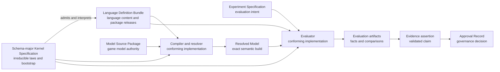
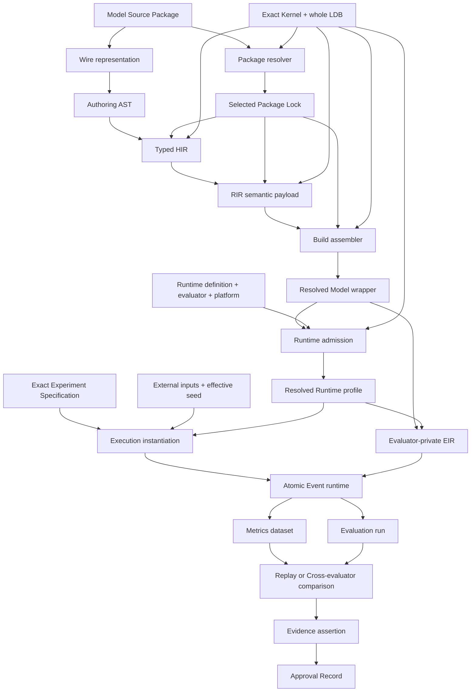
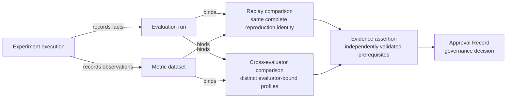

# Standard Schema 2.0 Architecture

Status: **Design authority; implementation and conformance gates remain open**

Standard Schema 2.0 is the language, compiler, runtime, and evidence architecture for describing
and evaluating game-balance models. It is designed to cover RPG and Roguelike numeric systems
without embedding either genre in the compiler or evaluator. The system is a restricted, typed,
non-Turing-complete modeling language with deterministic execution and an immutable evidence chain;
it is not a larger JSON template format.

This document is the human-readable authority for the **macro architecture**: system topology,
subsystem boundaries, cross-cutting invariants, and the order in which the design becomes an
implemented and proven Standard Schema 2.0. It synthesizes the accepted design decisions, PRD,
domain language, genre-coverage contract, and four disposable-prototype dogfooding rounds.

It describes the intended architecture, not a claim that Standard Schema 2.0 has shipped or passed
conformance. Every implementation and coverage gate called out in this document is open unless its
own acceptance artifact says otherwise.

## 1. How to use this document

Standard Schema 2.0 deliberately separates kinds of authority. No single prose document, source
module, or prototype may become an accidental second specification.

| Authority | Owns | Does not own |
| --- | --- | --- |
| This `ARCHITECTURE.md` | Macro topology, subsystem responsibilities, cross-cutting invariants, delivery order | Machine semantics, detailed decision rationale, acceptance status |
| [`BALANCING-CONTEXT.md`](../BALANCING-CONTEXT.md) | Canonical domain terms and distinctions | Architecture planning or executable semantics |
| [bADR-0012…0024](badr/) | Binding detailed decisions and their rationale | Consolidated system narrative or implementation status |
| [Product PRD #501](https://github.com/aigengame/godot-agent/issues/501) | `gda-balancing` product outcomes, milestones, and relationship to the `gda` family | Standard Schema 2.0 architecture details |
| [PRD #534](https://github.com/aigengame/godot-agent/issues/534) | Product requirements, acceptance criteria, and live completion tracking | Macro architecture or machine semantics |
| [`standard-schema-2.0/`](standard-schema-2.0/) | Acceptance artifacts, coverage matrices, and prototype evidence status | Language authority or proof by prose |
| Schema-major Kernel Specification | Irreducible bootstrap, admission, and execution laws | Evolving language content or game models |
| Language Definition Bundle (LDB) | The complete language content admitted by one exact Kernel Specification | Host implementation behavior outside its declared contract |
| Conformance vectors | Executable proof obligations derived from Kernel and LDB authority | New semantic decisions |
| Prototype code | Disposable evidence used to challenge the design | Architecture, language, or product authority |

The first permanent, machine-readable Kernel Specification and LDB are published under
`src/gda_balancing/schema2/authorities/` and independently admitted for #538's bounded Quantity
foundation. They prove the bootstrap, identity, closed meta-format, two selected rules, Diagnostic
reason closure, generated projections, and command discovery of that admitted slice only. They do
not yet prove the complete language, Model build, Runtime, Experiment, Evidence, or Genre contracts;
the remaining gates below grow the same authorities vertically.

When this document and an accepted bADR appear to conflict, neither silently overrides the other.
The conflict must be reconciled in the same change: the bADR records the detailed decision and this
document records its macro consequence. Machine semantics must ultimately be expressed by the exact
Kernel Specification and LDB, not inferred from either prose source.

Quick reading paths:

- system and authority overview: sections 3–4;
- language, compilation, and extension: sections 5–7;
- runtime, evidence, and public surface: sections 8–10;
- confidence, dogfooding, and delivery gates: sections 11–13; and
- decision traceability: section 16.

## 2. Design intent

### 2.1 Goals

Standard Schema 2.0 must:

- express numeric models across RPG and Roguelike systems through a small orthogonal type and
  operation core;
- add ordinary game attributes through Model Source alone and reusable mechanics through complete,
  versioned Domain packages rather than host-code changes;
- admit later game genres through those same source/package contracts without changing Kernel
  primitives, core constructors, runtime phases, compiler dispatch, or evaluator dispatch;
- compile source into a public semantic representation whose identity and meaning are independent of
  implementation-private execution plans;
- execute deterministic, atomic event transactions under an explicit, reproducible runtime profile;
- use one metrics model for simulated and observed data, then preserve an immutable chain from runs
  through comparisons, Evidence, and Approval;
- expose the same artifact and outcome model through a structured CLI surface;
- refuse unsupported or ambiguous behavior explicitly instead of accepting an open-ended escape
  hatch; and
- make implementation-independent conformance testable from authoritative machine rules and
  vectors.

These goals serve the broader `gda-balancing` product defined by PRD #501. The toolkit remains a
standalone, engine- and game-agnostic sibling of `gda`; Standard Schema output is consumed by games
but does not import game or engine code into the balancing core.

### 2.2 Non-goals

Standard Schema 2.0 does not:

- embed a general-purpose or Turing-complete programming language;
- make RPG templates, Python classes, evaluator functions, or JSON Schema the semantic authority;
- treat every named game attribute as a new language type;
- provide host plugins that can silently add syntax, operations, or runtime behavior;
- claim format or runtime compatibility with UCUM, MLIR, SBML, FMI, Modelica, or ONNX;
- preserve arbitrary Standard Schema 1.x saves, replays, runtime behavior, or unsupported source;
- equate one successful run with Evidence, or independent-evaluator agreement with exact Replay; or
- use disposable prototypes as release or coverage evidence.

### 2.3 Design principles

1. **One owner for each fact.** Language, model, experiment, approval, generated identity, and
   transport facts have distinct authority domains.
2. **Closed semantics, explicit extension.** The core is closed; extension happens through admitted,
   content-addressed packages and declared compatibility, never ambient host behavior.
3. **Semantic identity before optimization.** RIR is the public semantic boundary; evaluator-private
   lowering may vary without redefining the model.
4. **Determinism has a scope.** Reproduction binds an exact Resolved Runtime profile and every other
   declared identity, not merely a seed.
5. **Atomic facts, honest failures.** Runtime transitions and artifact publication have explicit,
   separately testable atomicity boundaries.
6. **Evidence is earned.** Evaluation records facts; validated comparisons and prerequisite graphs
   justify Evidence; humans or governance systems issue Approval Records.
7. **Coverage is operational.** Genre support is demonstrated by required operations, scenarios,
   vectors, and public artifact paths—not by vocabulary presence.
8. **Clean 2.0 baseline.** With no released Standard Schema artifacts to preserve, safe conversion is
   preferred over compatibility machinery; unsupported 1.x concepts are deprecated and refused.

## 3. System context and authority boundaries

Three authored domains feed the system and remain independently owned:

- **Model Source Package** is the sole editable authority for a game's model definitions and package
  requirements.
- **Experiment Specification** owns scenarios, inputs, selectors, metric definitions, statistical
  policy, calibration intent, and acceptance intent.
- **Approval Record** owns the governance decision to accept or reject a named Evidence assertion.

The language used to interpret model and experiment content has a layered machine-authority chain:

The **Schema-major Kernel Specification** is intentionally small and non-self-hosted. It defines
the canonical wire identity rules, the bootstrap meta-format, bundle admission, irreducible type and
evaluation judgments, primitive numeric and transition laws, resource limits, and closed
meta-diagnostics needed to accept or reject an LDB. A list of node names or prose descriptions is
not a Kernel Specification.

An exact, immutable **Language Definition Bundle** is the only language-content authority admitted
under that Kernel. Per bADR-0023 it is one sealed artifact graph: a canonical root manifest owns the
closed Package Release inventory, and each descriptor binds one Package Release manifest. Each
release is a sealed one-level aggregate: the manifest owns its runtime language semantics and binds
exactly one package-owned conformance-vector child. The two authority JSON members live in one
package-specific directory, including an empty vector child when necessary. Together the releases
own grammar, language types, structured rules, operations, post-admission diagnostics, runtime
profile definitions, and normative vectors. Admission may derive read-only flat indexes, but no
serialized registry or directory listing is a second authority. The LDB cannot redefine Kernel
laws, and the Kernel does not absorb ordinary language or game-domain evolution. The Kernel owns
package-coordinate patterns and the identity domains for the root, release, and evidence
collections; loaders, admission, public schemas, and rebuild tooling project those contracts.

Within one host process, those projections share one deeply immutable
`AdmittedAuthorityContext`. The authority lifecycle atomically loads, admits, indexes, and freezes
the exact packaged Kernel/LDB graph before publishing it; every compiler, Runtime, Experiment,
Template, and CLI consumer borrows that same context. This is a performance and ownership boundary,
not another authority. Explicitly injected Kernel/LDB candidates are admitted into separate,
independently owned contexts and cannot mutate or populate the packaged baseline. Canonical
Wire-Schema meta-validation is cached only by actual schema bytes plus the actual Kernel
schema-profile bytes. The test and CI verification contract for this lifecycle is documented in
[`docs/agents/testing.md`](agents/testing.md).

Compiler, resolver, evaluator, CLI, and storage code are conforming host implementations. They are
never semantic authorities. Generated JSON Schema, help text, and SDK types are projections of the
same authoritative artifacts. They may make the system easier to use but cannot add meaning.

## 4. End-to-end architecture

The system converts human-authored source into a resolved semantic build, executes it under an exact
runtime contract, and publishes facts that can later support evidence:

The major subsystems are:

| Subsystem | Responsibility | Stable output or boundary |
| --- | --- | --- |
| Kernel/LDB bootstrap | Admit and identify the exact language definition | Kernel identity, whole-LDB identity, admission outcome |
| Package resolver | Select a deterministic, compatible package closure | Canonical Package Lock and resolution receipt |
| Front end | Parse source, resolve names, type-check, and validate effects | Authoring AST and Typed HIR |
| Semantic lowering | Normalize all language meaning into canonical public semantics | RIR semantic payload and separate Debug Map |
| Build assembler | Bind all exact semantic dependencies | Resolved Model wrapper and build receipt |
| Runtime admission | Bind evaluator, platform, budgets, numeric policy, RNG, and scheduler | Resolved Runtime profile |
| Evaluator | Lower RIR privately and execute atomic events | Snapshots, outputs, refusals, and terminal audits |
| Experiment runner | Apply scenarios, inputs, metrics, statistics, and acceptance intent | Metrics datasets and Evaluation runs |
| Evidence validator | Validate comparisons and prerequisite graphs | Evidence assertions |
| Artifact publisher | Publish complete immutable artifact sets and retrieval metadata | Artifact envelopes, Locators, and Receipts |
| Structured CLI | Expose authority artifacts and operations without inventing a second model | Descriptor-derived commands and surface manifest |

## 5. Language and semantic model

### 5.1 Closed value and quantity core

The initial language uses a closed constructor set:

`Bool`, `Int`, `Fixed`, `Decimal`, `Float`, `Enum`, `Record`, `Vector`, `List`, `Set`, `Map`,
`Ref<T>`, `Quantity`, and `Distribution`.

The list is closed for one Schema major. New convenience names do not become primitive types.
`Quantity` carries orthogonal facets instead:

- representation (`Int`, `Fixed`, `Decimal`, or admitted `Float` profile);
- nominal kind;
- physical or game unit/dimension;
- support/domain constraints; and
- the applicable Numeric profile.

Terms such as `current`, `capacity`, `cost`, and `rate` are roles in a model, not numeric types.
Likewise, `constant`, `parameter`, `input`, `state`, `derived`, `output`, and `random` describe how a
value participates in evaluation rather than creating parallel type families. This separation is
the main orthogonality mechanism: representation, domain meaning, unit, bounds, and evaluation role
can evolve without a combinatorial type hierarchy.

Core lifecycle roles are closed by the language. Domain roles are versioned nominal terms exported
by packages; they never infer kind, unit, support, or Numeric policy. `rate`, for example, names a
use while the Quantity unit still owns its denominator and dimensional legality.

Parameters additionally declare legal domains and whether their variability is discrete or
continuous. Search and calibration may choose only admitted candidates; they cannot turn an invalid
value into a model by clipping or host-language coercion.

### 5.2 Structured rules and operations

Language rules are stable-ID, machine-readable judgments expressed in the Kernel's closed
meta-format. They cover grammar, name resolution, typing, effects, lowering, evaluation, runtime
steps, diagnostic construction, and resource exhaustion. Rule prose explains a rule; it does not
replace its structured semantics.

The pure-expression judgment is closed to literals, typed reads, pure calls, conditionals, local
bindings, statically bounded aggregation, and lookup. Named-stream sampling is a separate judgment
with a statically declared random-stream effect; it is never reclassified as pure. Recursion and
unbounded iteration are forbidden. Unit conversion is explicit, and persistent mutation occurs only
through declared transitions. Host callbacks, ambient RNG, implicit conversions, and
implementation-defined iteration are outside the language.

Model Source owns module-level named **Formula declarations** with typed parameters, result, and a
structured pure body. Formula names resolve statically, calls form an acyclic graph, and formulas
are neither first-class values nor dynamic callbacks. Every Formula declaration data instance
carries adjacent `body` and canonical human-readable `expression` members. The body is the pair's
authoritative source member; the expression is a package-owned reversible projection, never a peer
semantic authority. Inline expression syntax, if admitted, remains only Authoring-AST sugar
normalized to the same named Formula declaration-and-binding form before Typed HIR; it creates no
alternative typing, identity, evaluation, or explanation rules. bADR-0022/0024 own the detail.

Domain-package Operations declare zero or more typed **Formula slots**. For every slot on a selected
Operation, Model Source binds exactly one compatible Formula; missing, duplicate, or incompatible
bindings refuse before HIR. Every Formula call site also closes one total named
parameter-to-actual-operand mapping: each declared parameter is bound exactly once, and missing,
extra, duplicate, or unknown arguments are refused. Parameter order and same-name capture have no
semantic force. LDB rules
traverse the complete Formula and pure-Operation call graph, reject mixed cycles, and derive the
transitive refusal set, deterministic charge bound, and termination measure. A concrete binding
must fit its slot and surrounding Operation contract; HIR/RIR carry the binding identity, canonical
parameter map, and exact closure, and Runtime admission revalidates them. Packages, templates,
compilers, and evaluators provide no optional fallback. A template default is an ordinary Formula
and binding copied into the editable starter source. This separates reusable
mechanic/control/effect law, which remains Operation-owned, from a game's numeric design policy,
which remains Model-Source-owned.

Formula evaluation uses one timing model across derived values and Operations. A Formula itself has
no lifecycle timing. Every read/call lowers to an identified evaluation site with explicit operands
and context. A `derived` Symbol is read-only computed data, not stored state: repeated reads at one
site under the same frame/Snapshot, operands, and Numeric profile derive the same pure result and
deterministic charge vector; a new Snapshot is a new semantic evaluation. A cache may reuse the pure
result, but every dynamic evaluation still applies that charge to the current Runtime resource
ledger, so caching cannot move or remove resource exhaustion. Initialization reads an immutable
pre-Snapshot frame and commits Snapshot 0 only after all initialization succeeds; an Event reads
that Event's pre-event Snapshot and cannot observe buffered writes; observation reads the
post-transition committed Snapshot; a snapshot Effect evaluates once and captures; and a live
Effect reevaluates at each declared lifecycle Event against that Event's pre-event Snapshot.
Optimization cannot change result or charge observations.

The Kernel owns a small closed operation vocabulary sufficient to interpret those rules. The LDB
uses it to define complete language and Domain-package operations. Every operation definition must
declare its inputs, result, effects, refusals, numeric behavior, lowering, evaluation, and vectors.
A host function bearing the same name is not an operation definition.

Operation composition is explicit and directional. An LDB Operation is the sole authority for its
named formal ports. Every nested call binds the callee's complete formal-port set to caller ports,
caller locals, literals, or another Kernel-admitted expression; equality of display names has no
semantic force. A Model Source entrypoint then binds one exact Operation's ports to resolved Model
symbols and binds or explicitly discards its result. Experiment transition-invocation members may
select only those entrypoints. Scenario initialization assigns the canonical union of their
generated Scenario Input Contracts; each Event-local payload is admitted by a separately derived
contract. The assignment mode owns that payload cardinality: only an admitted read-only
Experiment-initialized parameter or input can be overridden for one Event; fixed, writable,
derived, result, and internal values cannot. Experiments cannot select an LDB Operation or repeat
its port schema. The selected LDB
lowering owns the total Symbol assignment table
(value ownership, legal port access and result roles, required/optional Experiment modes, and
actual-target deduplication) and the nested-call composition policy (callee effect/refusal closure
and transitive resource bounds). The host interprets those admitted tables; it does not maintain a
parallel role, mode, or composition registry. Every assignment-policy role also declares one
machine-readable binding kind: `operand`, `result`, or `internal`. Admission requires every readable
operand mode to have a concrete value producer through an Experiment assignment or Model
initializer, requires result roles to be execution-produced, and keeps internal generated roles out
of both entrypoint surfaces.

`math.equation` is reserved for a possible future algebraic/continuous subset and is refused by the
initial 2.0 LDB. It cannot be approximated through evaluator-specific behavior.

### 5.3 Static effects and runtime facts

Effects are statically declared and checked. Effect specifications describe readable and writable
state, emitted signals, randomness, scheduling, resource use, and other observable capabilities.
They support exhaustiveness checks, prevent hidden mutation, and allow the resolver and runtime to
reject undeclared behavior before partial execution.

Signals are typed **intra-transaction facts** routed over statically resolved topology. They are not
independent runtime events and do not silently become persistent state. The LDB owns their type,
validation, ordering, effect, and execution laws.

Entities compose stable identity with explicitly typed components; Model Source chooses the
composition, while Domain packages own reusable component and operation semantics. Adding an
admitted component field does not add a compiler branch. Dynamic membership and target selection
remain declared operations over `EntityRef`, never evaluator-owned object traversal.
`EntityRef` itself is the `game.entity` specialization of the generic nominal `Ref<T>` constructor,
not a game-specific core primitive.

Effects are a composition of separate contracts for apply requirements, value source
(`base`/authored or `resolved`/derived), capture timing (`snapshot` or `live`), continuous or
discrete contribution, buildup and threshold activation, state transition, scheduling, stacking
identity/reducer, reapplication, removal/expiry/dispel, and immunity. Source and timing are
independent axes: a resolved value may be snapshotted or read live, and a base value may be handled
the same two ways. Buildup accumulates before activation; crossing its threshold creates exactly one
effect instance and its bounded schedule, while typed removal cancels that instance's exact
outstanding events. Action owns interruption, combat owns damage/healing resolution, resource owns
stored quantities, and the runtime owns atomic scheduling; no universal Effect object may silently
absorb those responsibilities.

## 6. Compilation, artifacts, and identity

### 6.1 Compilation boundaries

The public compilation pipeline is:

`wire representation → Authoring AST → Typed HIR → RIR semantic payload → Resolved Model`.

- The **wire representation** is the ingress serialization, initially JSON. It is not the language
  semantic model.
- The **Authoring AST** preserves source structure after parsing.
- **Typed HIR** resolves names, types, units, package symbols, and static effects while retaining
  enough structure for useful diagnostics.
- The **RIR semantic payload** is the canonical, public semantic normal form. Its
  `semantic_identity` excludes Formula `expression` text; the complete canonical RIR JSON has a
  separate `content_identity` for wire integrity. Equivalent admitted source must lower to the same
  semantic projection under the same selected semantic dependencies (bADR-0013/0024).
- The **Resolved Model wrapper** binds the RIR payload to the exact Kernel Specification, whole LDB,
  selected Package Lock, RIR semantic identity, exact RIR content identity, and all other required
  build identities.
- **EIR** is an evaluator-private execution representation. It may contain schedules, bytecode,
  layouts, or optimized kernels, but it is neither portable Standard Schema bytecode nor an
  interchange authority.

The **Debug Map** is separate from RIR semantics so that source locations and explanatory provenance
can change without changing model meaning. Resolution and build receipts record how an artifact was
obtained; they are not part of the RIR semantic payload.

Every successful build also publishes a mandatory, separately identified **Model explanation**
derived from the exact RIR and Debug Map. Its closed `formula_explanations` section renders
Formula declarations with their structured bodies and canonical expressions, bindings,
parameter-to-operand mappings, result contracts/types, and evaluation contexts; its closed
`operation_explanations` section renders Operation control/effect/outcome/commit boundaries and
references the exact Formula binding identities instead of restating their expression semantics.
It is inspection data, not execution authority. Model explanation generation, validation, and
publication are part of the same atomic build-success artifact set.

### 6.1.1 Resolved invocation graph

Typed HIR closes every invocation before RIR:

1. the LDB owns each Operation's formal ports, result/outcomes, body, and nested call sites;
2. Model Source owns symbols, their initialization policies, and entrypoints that bind those
   symbols to one exact Operation interface;
3. lowering resolves every formal-to-actual edge to canonical symbol/local/literal identities,
   rejects missing, extra, duplicate, unknown, incompatible, cyclic, or illegally writable
   bindings, closes every Formula parameter-to-actual mapping without parameter-order or same-name
   capture, requires each literal to have
   one exact contextual-type match in the selected
   package-owned Literal Typing Profiles, requires each nested callee's effect/refusal closure to
   fit the caller declaration, and
   derives the transitive resource charge under the LDB composition policy;
4. RIR records the exact entrypoint and call-site graph plus its generated Scenario Input Contract,
   including each Operation-formal and Formula-parameter mapping identity, each literal's resolved
   context type, Model-owned initializers, and exact required/optional Experiment assignment
   targets;
5. an Experiment selects one entrypoint and totally assigns that contract; and
6. runtime and any private EIR consume those identities without name lookup or ambient capture.

Renaming a Model symbol while updating its entrypoint and Scenario assignments is an authored
semantic change: the actual-operand, call-site, RIR, and Resolved-Model identities change. Reusing
one symbol for two compatible read-only ports is explicit aliasing, not duplication. A writable
alias is legal only when the selected Operation contract explicitly admits it. The accepted #590
Formula contract introduces another Kernel-admitted expression operand, but it does not replace or
weaken the same entrypoint/call-site closure.

A literal has no host-default type. Each type package may independently export Literal Typing
Profiles, and the runtime projection selects the profiles reachable from the Model's exact Type
exports. A profile closes against its owner Type, the LDB value inventories, and at least one
Operation formal value contract. Selection matches source kind, formal type, representation, kind,
unit, domain, Numeric policy, and numeric bound; overlapping ranges for the same match contract are
invalid. Zero or multiple matches refuse before HIR; successful lowering preserves the selected
profile in the RIR operand and its identity. The Symbol assignment policy therefore remains
orthogonal: it owns only Symbol roles, access, initialization ownership, and Experiment
cardinality. Under
`operation-body-order`, writable aliases denote one runtime location for the complete invocation:
a write in one child call is visible to every later sibling call, while a propagated rollback
restores the operation's entry snapshot.

### 6.2 Identity layers

Identity follows semantic responsibility rather than file location:

- vector-set identity covers one canonical package-owned conformance-vector child;
- Package Release content identity covers its canonical manifest, including the exact vector-child
  artifact kind, identity, and byte size;
- Package Release semantic identity covers only its runtime semantic closure, so a vector-only
  change does not pretend that selected runtime semantics changed; the Kernel-owned projection also
  removes only the release's explicit `runtime_semantic_excluded_extensions`, so package-owned
  Formula notation changes exact content without pretending executable Operation semantics changed;
- whole-LDB graph identity covers the root's normative content and child descriptors normalized by
  the Kernel-declared `id`, then `version` order; descriptors bind every Package Release manifest
  identity and byte size without binding transport order or physical locator;
- Package Lock identity covers the exact selected dependency closure;
- RIR payload identity covers reachable normalized model semantics;
- Resolved Model identity covers the exact build wrapper, including Kernel and whole LDB;
- Resolved Runtime profile identity covers the model plus evaluator, platform, numeric, RNG,
  scheduler, effect, and resource-budget contracts;
- Experiment identity covers the exact evaluation intent and its declared model/runtime binding;
- artifact-envelope identity covers the immutable published artifact; and
- Locator and Receipt record transport and retrieval facts without redefining artifact identity.

The detailed identity law and unused-package metamorphic obligation belong to
[bADR-0013](badr/0013-compiler-stages-and-semantic-equivalence-boundary.md). At macro level, selected
semantic-payload identity is narrower than exact-build identity: changing unused LDB inventory may
leave Lock/RIR bytes unchanged while rebinding the Resolved Model, downstream Runtime profile, and
exact Experiment eligibility. Such executions are not Replay.

### 6.3 Package resolution

Model Source declares requirements; it does not select ambient installed packages. The resolver
uses the exact LDB inventory and deterministic compatibility rules to produce one canonical Package
Lock. Ambiguity, unavailable capabilities, cycles, version conflicts, and unsatisfied requirements
are typed refusals. A complete resolver must handle the general dependency graph. Package-release
identity is exact within one LDB; the same logical id/version in another LDB is a distinct,
non-interchangeable release world rather than a globally unique publication claim. The prototype's
selected cases are not a substitute.

## 7. Extension and genre architecture

### 7.1 Two extension paths

Standard Schema distinguishes ordinary modeling from language evolution:

1. A new admitted `Quantity` attribute or a new composition of existing operations belongs in
   **Model Source**. Examples include a game's `poise`, `heat`, or `corruption` attribute when its
   representation, kind, unit, domain, and role already fit admitted semantics.
2. A reusable nominal kind or mechanic belongs in a complete, content-addressed **Domain package
   release** in the LDB. Each release contains its manifest, dependencies, capabilities, types,
   operations, diagnostics, and normative vectors.

Only a genuinely irreducible primitive, judgment, core constructor, or bootstrap rule requires a
Kernel/Schema-major change. Neither a source attribute nor a Domain package may introduce implicit
syntax, host callbacks, incomplete semantic stubs, or an escape hatch around the LDB.

This three-level test—Model Source, Domain package, or Kernel change—is the architecture's main
extensibility control. It permits new game concepts while keeping semantics closed and reviewable.

It is also a hard **Core Extension Invariance** promise. A later genre may grow Model Source,
packages, templates, Experiments, coverage rows, and vectors, but not Kernel primitives, core
constructors, runtime phases, or host dispatch. A bounded deterministic mechanic that cannot pass
that test falsifies Standard Schema 2.0's architecture and reopens its design gate; it is never
papered over with a genre exception. Shipping support artifacts for every genre is out of scope,
but preserving this extension route for every later genre is not.

### 7.2 Package ownership and boundaries

Domain packages own reusable mechanics rather than broad gameplay nouns. Their boundaries must keep
state ownership, transition policy, and observation concerns separable. The RPG package map and its
complete operation contract are specified by [bADR-0017](badr/0017-genre-templates-and-coverage-contract.md)
and the [genre coverage matrix](standard-schema-2.0/genre-coverage.md).

One dogfooding correction is especially important:

- `entity` owns defeat/revival **state storage**;
- `resource` owns health/shield `Quantity` **storage**; and
- `combat` owns damage, healing, and shield **resolution**, plus defeat/revival transition policy.

This prevents three packages from claiming the same fact while still allowing them to compose.
The genre-research reconciliation made five further boundaries explicit:

- `combat` resolves an ordered vector of typed damage components through matching per-kind
  mitigation before aggregation; a scalar total cannot erase component type or order early;
- `collection` owns typed ordered instance collections, stable order, zone membership, legal moves,
  and named-stream shuffle handoff. Core `List` is representation only; `build` owns admission,
  run scope owns reset, and `economy` owns only economic ledger/inventory facts;
- `generation` returns a typed offer or selected definition plus a reward disposition. The owning
  destination package—`economy`, `collection`, `effect`, or `build`—performs the mutation, so a
  direct card or effect reward does not fabricate an economic transfer;
- `action` owns the closed immutable Action-plan schema, admission, identity, and exact execution.
  A declared external input may submit a plan for admission directly; optional `decision` owns bounded
  candidate evaluation, selection, and Intent projection, while `encounter` supplies actor, context,
  and decision window; and
- `build` replacement is one atomic transition that removes the exact old admission and installs
  the exact new one. It is not an observable remove-then-add sequence.

These boundaries compose with the independent Effect source/timing axes and buildup/activation
contract in section 5.3. Progression, economy, spatial/topology, time/scheduling, and randomness
still require their own permanent conformance vectors at the relevant coverage gates.

Two cross-contract protocols close previously implicit ordering:

- Runtime Events follow the total order. Within one Event, declared Operations/Signal subscribers
  contribute typed requests to one canonical request envelope, which is partitioned by canonical
  effect lifecycle key into exactly one `EffectRequestSet` per key; typed removal then dominates
  same-key tick/transition/contribution/reapplication before application/immunity,
  buildup/activation, stack/cap/reapplication, capture/contribution/transition, and final schedule
  delta. Child-Event requests resolve later against the post-commit Snapshot. bADR-0017 owns the
  exact payload boundary, origin key, same-stage reducers, order, and cross-product vectors.
- Interactive priority/reaction windows are bounded Domain state machines. `game.action` owns the
  pending proposal; `game.turn` owns responder order, pass/close policy, and bounded nesting;
  external responses enter at declared input boundaries. Counter, replace, cancel, and final
  resolution remain ordinary Events, never a fourth phase or host callback.

### 7.3 Genre templates are distributions

A Genre template is a versioned distribution containing:

- an instantiable starter Model Source Package;
- companion pre-build Experiment templates with scenarios, metrics, and targets;
- a requirements-to-operations coverage matrix with its Golden scenarios and negative vectors; and
- a manifest binding template version, compatible LDB/package ranges, and every member's content
  identity.

Examples and documentation may accompany a release as non-semantic material, but they are not a
substitute for any required member or manifest binding.

Instantiation materializes the starter under a new Model Source Package identity and records the
template id, version, and member-content provenance. That new model is thereafter authored by the
game. Installing a later template release cannot mutate, rebase, or reinterpret it; adoption
requires re-instantiation or explicit authored changes. Initial 2.0 defines no implicit template
upgrade path.

Templates are not Standard Schema instances, runtime profiles, language authorities, or privileged
compiler inputs. Genre behavior exists only through admitted operations and Domain packages. A
template may make a good model easy to start; it may not make otherwise invalid semantics valid.
The Kernel defines a closed Schema-major machine specification for generic artifact-graph
primitives used by template-release admission: graph projection and derivation,
uniqueness/inventory/set/scoped/interval relations, ordinary Model Source admission, and Model
Source vector execution. Each primitive fixes typed arguments and result effects, evaluation law
and order, exact failure behavior, canonical comparison/identity consequences, and resource-charge
events. Kernel operations bind stable LDB-facing names to those primitives; the LDB orders a
versioned program over the operations, maps member kinds to role collections with explicit
cardinality and required-operation obligations, declares every derived-fact binding, and fixes a
per-release step budget. Admission therefore supports multiple pre-build Experiment templates,
Golden scenarios, and vectors without host-selected singleton roles, and metric identifiers are
unique within their owning Experiment template rather than globally across the release. The LDB
uses the distinct member kind `experiment-template` for this editable pre-build intent; an exact
executable `experiment-specification` is created only after Model build identities exist. Neither
may masquerade as the other. The Kernel defines only the generic role identifier/cardinality
contract—not a role-name inventory—so an LDB may add genre-specific member roles and schemas
without a core change. Structural JSON Schema validation, named host callbacks, or host-only
companion checks cannot substitute for that semantic path.

Coverage claims are evidence-backed and granular. A `Tracer` row requires a public vertical path;
broader RPG or Roguelike support requires its own Golden scenarios, vectors, and acceptance evidence.
bADR-0012 exclusively owns the generic Claim closure law; bADR-0015 exclusively owns the
terminal-audit member/binding contract for Runtime-refusal prerequisites; and bADR-0017 plus the
coverage matrix add only each row's admitted operations, scenarios, vectors, and observations.
Research mappings may refine those row inputs but remain non-conformance context. All rows in the
current matrix remain open.

### 7.4 Attributing a design failure

An extension failure must be assigned to the authority that can actually fix it:

| Observed failure | Owning defect | Required response |
| --- | --- | --- |
| Admitted operations can express the mechanic, but the starter source, companion Experiment, examples, or coverage mapping are wrong or incomplete | Genre template release | Correct and re-version the template distribution; do not change language semantics |
| The mechanic is reusable and fits the existing Kernel, but its package omits an operation law, capability, diagnostic, dependency, or vector | Domain package release/LDB content | Complete and re-version the package release under LDB authority |
| Source, package, compiler, runtime, identity, refusal, publication, or Evidence contracts cannot represent the mechanic without hidden host behavior or overlapping ownership | Standard Schema/LDB architecture | Reopen the relevant bADR/PRD gate and correct the common language contract before continuing template work |
| The missing behavior is genuinely irreducible and cannot be defined by the admitted rule meta-format and Semantic kernel | Kernel/Schema-major architecture | Treat it as a Schema-major decision with executable laws and independent conformance |

The attempted Standard Schema 1.x RPG template fell into the third category: adding template fields
would not have fixed the underlying authority, type, compilation, runtime, and evidence boundaries.
The four 2.0 probes likewise found mostly Standard Schema foundation gaps, plus narrower package
ownership and template-coverage obligations. A failed genre example is therefore not automatically
a template defect, and a missing convenience field is not automatically a Kernel defect.

## 8. Deterministic atomic runtime

### 8.1 Runtime admission and scope

An LDB-owned **Runtime profile definition** declares an admitted execution policy. Before dispatch,
runtime admission produces a **Resolved Runtime profile** binding that definition to the exact
Kernel, whole LDB, selected Package Lock, Resolved Model/RIR payload, evaluator build, platform,
Numeric profile, RNG algorithm and streams, scheduler/effect policy, and resource budgets.
The Kernel declares the Runtime-profile-definition identity domain; admission hashes the complete
selected definition and the Resolved Runtime profile binds that identity. The definition,
Evaluator Capability Manifest, and Resolved Runtime profile therefore form an explicit acyclic
three-node identity graph rather than relying on an embedded value comparison. The Kernel's
active-definition contract supplies the required member set, Runtime/RNG bindings, budget scopes,
and positive-bound shape; the LDB supplies the concrete bound values. Hosts interpret that contract
instead of carrying a peer profile schema or copied budget constants.
The Kernel's Runtime-program component contract likewise closes every evaluator-consumed scheduler,
Runtime-configuration, transition, and step object behind required abstract roles, then declares
the relations among phase, lifecycle, and boundary inventories. Bootstrap consumers implement only
that role meta-protocol; component paths, member shapes, inventories, and concrete values remain
Kernel authority. The complete role-to-structure mapping has its own content identity, and an
evaluator admits only a mapping identity it explicitly implements; changing a path, member shape,
or relation therefore requires an evaluator capability update without turning concrete authority
values into host constants.

The evaluator build also publishes an immutable **Evaluator Capability Manifest**. Admission checks
its implemented Kernel laws, constructors, Numeric/RNG policies, scheduler/effect features,
artifact schemas, and resource accounting against the exact requested authority and binds the
manifest/validation receipt into the Resolved Runtime profile. It advertises implementation support;
it cannot add or weaken semantics.

Determinism is promised only inside that exact profile and complete reproduction key. A seed alone
cannot establish reproducibility. Resource exhaustion is a typed refusal, not permission to publish
partial success.

One execution instance follows a closed lifecycle:

1. `instantiated` binds exact RIR, Experiment, Resolved Runtime profile, inputs, and seed without
   creating mutable state;
2. `initializing` evaluates against an immutable pre-Snapshot Initialization frame and atomically
   creates and validates Snapshot 0;
3. `event` applies one internal scheduler transition and dispatches one atomic Event;
4. public `step` applies those transitions until the next declared observation or logical boundary;
   an Event-count terminal threshold becomes effective only at such a boundary, after the active
   logical-time transition phase drains;
5. `terminated` seals terminal trace, Snapshot, Metrics, and evidence identities; and
6. reset discards the instance and initializes a new one from the same immutable artifacts rather
   than mutating RIR.

### 8.2 Event transaction model

Runtime execution is a sequential, total-order stream of atomic Event transactions. Each event has
one phase in its stable ordering key. At each logical time the fixed order is `input`, `transition`,
then `observation`; signed priority descending and runtime-assigned FIFO enqueue sequence complete
the total order. Models and packages cannot add or reorder phases.

Runtime admission first resolves the Experiment's closed Executable Event plan. Every authored
external-input or transition-invocation root member has a unique stable `root_event_ref`; canonical
array order assigns initial enqueue sequence and Runtime-owned `event_id`, while the Kernel
scheduler contract maps each root kind to its phase. This produces an explicit root-reference map
before dispatch. Equal logical times are legal. Event identity, host-container iteration, wall
clock, threads, and evaluator parallelism never break ties. Observation members are derived from
exact Observation/Metric contracts and cannot choose a phase or Model entrypoint.

- An `input` event admits externally supplied, source-sequenced facts and cannot be scheduled by
  model operations.
- A `transition` event executes actions, effects, resource changes, combat, generation, and other
  declared stateful behavior.
- An `observation` event reads final committed state after the transition queue for that logical time
  drains. It emits observations only: it cannot mutate model state, consume model resources, or
  schedule another event at the same logical time.

Dispatching **each queued event** is one atomic transaction over the latest committed Snapshot.
Writes, signals, child events, cancellations, and RNG changes remain buffered until that event
commits; refusal discards that event's buffers. Every committed Snapshot identity covers both its
state values and the resumable Runtime continuation (lifecycle/`step` boundary, Scenario cursor,
admitted-Event catalog and committed-trace prefix identities, pending count, Snapshot coordinate,
Named RNG state, scoped resource ledger, enqueue cursor, root-map identity, and Resolved Runtime
profile identity), so equal state values cannot conceal different future execution. Snapshot Series
materialize each complete normalized admitted Event specification once, bind its recomputable
identity, and cross-bind the Event Trace used to revalidate every catalog/commit/cancellation prefix
and reconstruct the exact pending queue. Catalog admission independently re-derives roots from the
Experiment, observations from Metrics, and scheduled Events from committed parent provenance and
the exact RIR scheduling Operation, nested call path/site, normalized actual arguments, and state
references. Recovery boundedly replays the admitted RIR path from the committed parent inputs and
state, so port, local, and literal schedule operands are recomputed rather than trusted from the
trace. Named-RNG-derived locals additionally replay from the checked seed through the independently
verified committed draw prefix; coordinated re-hashing cannot invent a different queue.
Snapshot Series do not duplicate growing pending or completed arrays at every boundary.

A successful schedule operation provisionally admits and returns a Runtime-owned child `event_id`;
commit makes each uncanceled child queue-visible under the same law and traces its
parent/call-site provenance. Cancellation targets only a stable admitted pending identity,
including one provisionally admitted in the same transaction, and is buffered atomically. Backward scheduling,
hidden input admission, active/completed cancellation, illegal same-time priority, queue overflow,
zero-time derivation overflow, total-Event exhaustion, and logical-time exhaustion follow their
distinct LDB-owned typed outcomes or Runtime refusals. Runtime node-step, per-Event operation-step,
queue, zero-time-depth, total-Event, and logical-time budgets remain separately identified and
observable in the Resolved Runtime profile and audit artifacts.

Initialization is a distinct atomic pre-Event boundary. A refusal while deriving or validating
Snapshot 0 discards the whole Initialization frame and returns a `runtime`-stage refusal with exact
Formula-site/frame provenance. Because no Event or committed Snapshot exists, it publishes no
terminal audit and cannot claim rollback facts. Only successful initialization begins Event
dispatch.

Each state slot has one final write, either directly or through an admitted reducer. Reads and
writes follow explicit snapshot boundaries; iteration order and tie-breaking are never inherited
from a host container. RNG uses named streams so unrelated features cannot perturb each other's
draw sequences. Numeric behavior—including overflow, rounding, non-finite values, comparison, and
sampling—is fixed by the selected profile.

Priority/reaction packages may advance bounded proposal/response/pass state across later input
boundaries and ordinary transition Events. They cannot pause a running Event, schedule backward to
input, or use Signals as interactive callbacks. Final Action resolution is scheduled only after the
declared Domain window closes.

On refusal, only the current event rolls back. Earlier committed snapshots remain part of the
terminal audit. A refund, compensation, resurrection, or later correction is a new domain
transition, not retroactive rollback.

### 8.3 Outcomes, refusals, and publication

The architecture keeps three ideas separate:

- a **gameplay outcome** is a modeled result such as victory, defeat, or resource exhaustion;
- a **Refusal** means the Standard Schema invocation could not lawfully complete at a declared
  pipeline stage; and
- a **Verdict** is an Experiment-level judgment under declared acceptance intent.

If a refusal occurs after Event dispatch, the invocation atomically publishes a separate,
retrievable, and verifiable **terminal-audit artifact set**. bADR-0015 exclusively owns that set's
closed member and binding contract. At the architecture level, it is a refusal-only publication: it
must not publish fabricated or half-complete Evaluation, Metric, Replay, or Evidence success
artifacts, and admission failures before dispatch have no terminal audit.
Recovery revalidates the set's internal Event-catalog/trace/Snapshot/state/rollback/refusing-event/
Diagnostic closure as well as member identities. The audit materializes its exact catalog prefix,
complete last Snapshot, and refusing Event specification so recovery can re-derive Event admission,
recompute continuation journals and the Snapshot identity, bind a derived observation refusal to
the next Metric/enqueue cursor, and—without rerunning the evaluator—walk admitted RIR resource
transitions to derive the first budget-breaching instruction, completed nested-call prefix, and
exact Event charge before closing attempted steps against the committed resource ledger; a
wire-valid, re-hashed cross-field mutation is not an authoritative refusal.

An initialization refusal occurs after Runtime inputs bind but before Event dispatch. It is a
`runtime`-stage refusal with no terminal-audit receipt, Snapshot, trace, Evaluation, or Metric
artifact. This is not an admission failure and does not weaken the post-dispatch terminal-audit
requirement.

Event-transaction atomicity and artifact-publication atomicity are distinct invariants. Both must be
fault-injected and verified independently.

## 9. Experiment, metrics, and evidence

### 9.1 Experiment-owned intent

An Experiment Specification owns everything that turns a model into a testable question:

- scenarios and their bounded external-input/transition-invocation root Event plans;
- canonical one-time initialization over the union of selected entrypoints' Scenario Input
  Contracts;
- exact per-Event Model-entrypoint selection and separately derived Event-local payload admission;
- derived observation Events from exact Observation/Metric contracts;
- exact model/runtime compatibility binding;
- metric definitions and observation points;
- statistical method, sample plan, and uncertainty policy;
- calibration objective, observation model, and identifiability/replication policy;
- acceptance intent and comparison policy; and
- holdout and drift policy where observed data is involved.

Model Source must not hide experiment-specific acceptance thresholds, and evaluator code must not
silently choose metrics or statistical policy.

### 9.2 One metrics schema

Simulated and observed measurements use the same Metrics schema. Provenance distinguishes their
origin; parallel metric languages do not. Calibration requires an explicit observation model,
identifiability or replication analysis, a frozen holdout, and drift handling. A fitted value is not
automatically an accepted model.

### 9.3 Immutable evidence chain

An Evaluation run records what happened; it does not issue Evidence by itself. Comparisons bind
exact inputs, policies, datasets, and identities. Evidence is an immutable assertion whose complete
prerequisite graph has been independently validated. Approval is a separate governance artifact.

**Replay** requires identical complete reproduction identities, including one identical Resolved
Runtime profile. Independent evaluator builds necessarily have distinct evaluator-bound profiles;
their agreement is a **Cross-evaluator comparison**, not Replay. It may support an independently
validated `cross_evaluator_conformant` claim but can never issue `reproducible` for a different
profile.

Cross-evaluator comparison uses one exact LDB-owned **Portable Observation Policy**. That closed,
versioned artifact owns the selector grammar, mandatory classes, projection/comparator mapping,
applicable Runtime/Numeric profile scope, and deterministic closure/order algorithm. The algorithm
derives a **Resolved Portable Observation Plan** for the common profile, selected Lock/RIR, exact
Experiment, and vectors. The comparison binds that plan and both complete observation sets;
empty/under-covering policies or plans, caller-filtered subsets, unknown selectors, and widened
tolerances refuse. Missing, unexpected, and mismatched observations are reported explicitly, so
agreement cannot be manufactured by comparing only convenient fields or by copying Experiment
intent into the LDB.

## 10. CLI and artifact publication

### 10.1 Public command taxonomy

The Standard Schema 2.x CLI follows artifact ownership rather than internal implementation modules:

| Group | Commands or reserved surface | Purpose |
| --- | --- | --- |
| `schema` | `get language-bundle`, `get wire-schema`, `get diagnostic-catalog` | Retrieve language authority or generated projections |
| `package` | `list`, `get` | Inspect LDB package inventory |
| `formula` | `parse`, `render` | Convert contextual Formula notation and structured bodies without execution |
| `model` | `check`, `build`, `inspect`, `diff`, `migrate` | Validate and resolve model artifacts |
| `template` | `list`, `get`, `instantiate` | Distribute and instantiate starter sources |
| `experiment` | `check`, `run`, `replay`, `compare` | Validate and execute evaluation intent |
| `evidence` | `inspect`, `verify` | Inspect and independently validate Evidence graphs |
| `calibration`, `approval` | Reserved | Future surfaces; absence is explicit |
| meta | `version`, `manifest`, `help` | Product and command-surface discovery |

There is no public `runtime` or `metrics` command group: those are execution and artifact concepts
owned through model/experiment operations, not independent user workflows.

Each command has one structured **Command descriptor** that owns its parameters, defaults,
channels, outcome decoding, and schema reference. Help, structured parameter schema, `--schema`, and
the aggregate Surface manifest are derived from it; conformance verifies those projections. CLI
parsing must not create a second default or outcome authority.

### 10.2 Publication model

Artifact identity is independent of filesystem path, URL, object-store key, or transport. An
immutable artifact envelope carries the artifact and its identity; a **Locator** says where it can be
retrieved; a **Receipt** records publication or retrieval facts.

Each artifact-producing Command descriptor publishes one complete atomic artifact set for its
producing outcome. It also requires an **Invocation key**, which makes retries idempotent and allows
a client to recover the already committed outcome after a transport failure. A stdout-only command
need not publish an artifact set or accept an Invocation key. Local filesystem publication and
production storage adapters must satisfy the same observable contract, but their trust boundaries
and durability guarantees remain explicit.

Every successful `model build` set includes its Debug Map and Model explanation, and its Build
receipt and artifact-set framing bind both exact identities. If either projection cannot be
generated, validated, or committed, the command publishes no partial success. `model inspect`
retrieves and pretty-renders the stored Model explanation; it never regenerates meaning from source
or RIR. Presentation whitespace is non-canonical and cannot change artifact identity.

## 11. Quality attributes and current confidence

The architecture is designed around six quality attributes. The current rating distinguishes design
coverage from implementation proof.

| Attribute | Architectural mechanism | Current conclusion |
| --- | --- | --- |
| Consistency | Scoped authority, canonical terms, one semantic pipeline, identity rules | Macro decisions and the genre-research ownership refinements are aligned; ongoing anti-drift checks are required |
| Completeness | Closed language/runtime/artifact contracts plus RPG/Roguelike coverage matrix | Research broadened the requirement contract and exposed new Variant rows; all rows remain open, so full Schema and genre coverage are not yet proven |
| Reliability | Deterministic profiles, atomic events/publication, typed refusals, terminal audits, immutable evidence | The bounded executable authority mechanism passed independent mutation/refusal probes; permanent publication, Evidence issuance, and full-system conformance remain open |
| Orthogonality | Quantity facets, source/package/kernel extension test, separate authored domains, RIR/EIR split | Selected extension and authority mechanisms passed narrow mutation probes without RPG host dispatch; whole-system and cross-genre proof remain open |
| Extensibility | Complete content-addressed Domain packages, Core Extension Invariance, and permanent cross-genre witnesses | A non-RPG economy Event reaches Lock, RIR, evaluator, trace, Snapshot, and Metric without core or host dispatch changes; the public Extension Invariance Receipt and broader mechanic breadth remain open |
| Operability | Descriptor-derived CLI, immutable artifacts, idempotent invocation, receipts | Local descriptor and publication paths were exercised; production adapters and complete public surface remain open |

Therefore the present conclusion is:

- the design is **internally coherent enough to replace disposable evidence with the permanent
  conformance foundation**;
- the requirement model is **architecturally complete at macro level**, but completeness has not been
  demonstrated over every language judgment, package interaction, or genre coverage row;
- semantic-authority reliability and orthogonality are **strongly validated for the selected
  slices**, not system-level guarantees;
  and
- selected mechanisms may be described as locally feasible in the slices actually tested, but
  Standard Schema 2.0 must not be described as end-to-end feasible, conformant, RPG-complete, or
  production ready until the remaining gates close with authoritative artifacts and independent
  evidence.

## 12. Dogfooding: what changed and what remains open

Four disposable prototypes were used to attack the design. Their code remains evidence only. The
historical conclusions below explain how dogfooding changed the accepted architecture; live test
details and evidence status remain owned by the
[`standard-schema-2.0` evidence record](standard-schema-2.0/README.md) and PRD #534. The following
language distinguishes architectural learning from acceptance:

- **Confirmed—narrowly:** a mechanism behaved as designed in the selected slice.
- **Refined—adopted:** dogfooding exposed an ambiguity or wrong assumption and the accepted design
  changed.
- **Open gate:** the design still needs authoritative semantics or broader proof.
- **Non-claim:** a passing prototype must not be reported as closing this property.

### 12.1 First RPG vertical tracer

**Confirmed—narrowly:** one exact-`Int` RPG path connected prototype LDB admission, Model Source,
Authoring AST, Typed HIR, canonical RIR, cross-process identity, atomic events, Metrics, Evaluation,
and prototype-local Evidence. Fixture replay and no-partial-visibility under injected local-store
faults were demonstrated.

**Open gate:** the tracer exposed missing closed rule semantics, full wire transport, exact
Experiment binding, outcome/refusal staging, RNG laws, terminal audit, honest Replay/Evidence,
target and signal semantics, host-semantic leakage, RIR identity rules, Command descriptors,
diagnostic ownership, Resolved Runtime profiles, and complete Lock/manifest behavior.

**Non-claim:** it did not validate LDB semantic authority, independent evaluator conformance,
independent-lowerer RIR agreement, general package resolution, portable publication, normative
Evidence, or any genre coverage row.

### 12.2 Semantic-authority probe

**Confirmed—narrowly:** two source-level bootstrap/compiler/evaluator paths consumed each other's
artifacts for a small Kernel-node vocabulary, removed RPG-specific host dispatch, agreed on exact
`Int`, named RNG, and one buffered event, and exercised RIR/Debug Map/receipt separation,
descriptor-owned outcomes, Invocation keys, and publication boundaries. Its implementation suite
passed its declared narrow checks; the evidence record owns the exact result.

**Refined—adopted:** exact Replay now requires one identical evaluator-bound Resolved Runtime
profile. Agreement between honest independent evaluators is a separately typed Cross-evaluator
comparison. The probe issued neither Replay nor Evidence.

**Open gate:** both paths still shared handwritten semantic code. Kernel laws, LDB-driven complete
Source → HIR → RIR rules, admission and post-admission Diagnostic authority, static exhaustiveness,
general package resolution, complete terminal-audit schemas, store trust boundaries, and independent
Evidence validation remain unresolved.

**Non-claim:** passing the probe's checks is not a semantic-authority gate pass.

### 12.3 Orthogonality and extensibility probe

**Confirmed—narrowly:** a generic Quantity attribute required only Model Source; reusable resource,
interruption/refund, and effect-lifecycle mechanics required complete package releases; operations
had closed input/result/effect/refusal projections; Experiment selectors and acceptance intent were
exactly bound; runtime admission used the selected Lock; prior commits survived refusal; descriptors
owned outcomes; and local publication was anchored without RPG-specific compiler/runtime dispatch.
The selected mechanism passed its declared narrow checks; the evidence record owns the exact result.

**Refined—adopted:** the unused-package identity matrix in section 6.2 corrected the specification's
blast-radius ambiguity. Compensation/refund is a later domain transition, not rollback. Entity,
resource, and combat ownership was separated as stated in section 7.2.

**Open gate:** executable selector/acceptance and Kernel/LDB judgments, general solving, complete
Effect and genre breadth, portable stores, exact Replay, independent
Evidence, and all coverage rows remain open.

**Non-claim:** passing the probe's checks is not a Schema, semantic-authority, genre, Replay, or
Evidence pass.

### 12.4 Executable Kernel/LDB authority gate

**Confirmed—narrowly:** two independently implemented bootstrap/lowerer/evaluator stacks admitted
the same executable Kernel/LDB, derived Source → Typed HIR → RIR through LDB judgments, consumed
each other's sealed artifacts, produced byte-identical RIR for equivalent Sources, and agreed on
the selected Numeric/RNG/scheduler/effect/refusal slice. Every consulted Kernel law and selected
LDB rule survived old-identity tamper, reidentified deletion, and reidentified behavior mutation;
renaming authority tokens did not require host changes.

**Refined—adopted:** Kernel law contracts must close and enforce parameters, results, transitive
effects, refusals, and resource accounting. Diagnostic authority needs exact reverse closure plus
behavior coverage, not only forward lookup. Comparison artifacts are bound inputs to later Evidence
eligibility, never Evidence assertions themselves. Artifact-set manifests bind typed member names
and identities; an unframed concatenation digest is insufficient.

**Open gate:** the probe did not author the permanent Kernel/LDB, exhaustive rule ontology,
canonical integer/Unicode/Fixed wire laws, general package solver, complete Effect/Genre breadth,
portable publication/crash recovery, independent Evidence issuance, or production CLI/runtime.

**Non-claim:** this is a bounded architecture-authority PASS, not Schema conformance, full
abstraction proof, RPG/Roguelike completeness, or production readiness. The evidence commits remain
on closed, unmerged PR #537; prototype code is not part of this authority branch.

### 12.5 First permanent RPG product-feedback slice

Issue #540 replaced inline architectural confidence with one committed
[`rpg.combat.cast-v1`](../examples/schema2/rpg-combat-cast/) designer loop. The observations are
classified by the same vocabulary used above:

| Classification | Observation | Narrowest owner and disposition |
| --- | --- | --- |
| Confirmed—narrowly | Public `model build` → `experiment check` → `experiment run` consumes an exact authored Model/Experiment pair; editing one combat value changes the Experiment identity, trace, and Metric in the explainable direction. Exact seed, Runtime requirement, Metrics, and acceptance remain Experiment-owned. | Product/Experiment surface; retained |
| Refined—adopted | A reusable package type could not reuse core Quantity domains/profiles while runtime-projection seeding assumed every match was package-local. Seed and edge matching now declare `same_package` independently instead of relying on a host/package special case. | Kernel runtime-projection contract plus LDB lowering program; machine authority updated |
| Refined—adopted | Runtime projection assumed every selected package closure contained every requested semantic path. A selected package may legitimately contribute no row for one collection; absence now contributes nothing, while duplicate matches still refuse. | LDB lowering/runtime-projection judgment; implementation and conformance updated |
| Refined—adopted | The first Event program exposed `draw` and precondition as control nodes missing from the Kernel program vocabulary, and exact-int64 overflow needed an authoritative rollback refusal. | Kernel runtime-program contract plus LDB Diagnostic/reason/vector; machine authority updated |
| Refined—adopted | A Template member authored before build and an executable Experiment bound after build had been assigned the same artifact kind. They are now `experiment-template` and `experiment-specification`, respectively. | LDB artifact/member-role contracts and Template distribution; machine authority updated |
| Refined—adopted | Runtime terminal audit initially copied only Diagnostic code/message and recovery fabricated a broader pointer. The audit now binds the complete original primary/related locations and retry reconstructs that exact Diagnostic without rerunning. | bADR-0015 terminal-audit contract and LDB wire schema; machine authority updated |
| Refined—adopted | Kernel node and RNG name inventories still left field shapes, operators, results/refusals, charges, exact-int64 bounds, SplitMix64 derivation/constants/sampling/bias, and typed gameplay outcomes in host code. The Kernel now owns those machine contracts and vectors; the LDB Operation owns the exhaustive default/alternative outcome algebra and profile parameters. | Kernel Specification plus LDB Operation/Runtime profile; authority and both consumers updated |
| Refined—adopted | The evaluator advertised a generic runtime-program version and every Kernel node instead of the exact selected Runtime profile and actually implemented operators. Its identity also varied with the current model projection rather than binding one evaluator build. Experiment requirements now equal the selected program closure; the manifest binds a source-build identity and reverse-enumerates the exact authority-reachable profile/operators that build advertises, independently of the current model. | Runtime admission and Evaluator Capability Manifest; implementation/conformance updated |
| Refined—adopted | Evaluator-capability mismatch happens before Event dispatch, so publishing a Runtime terminal audit or Resolved Runtime profile falsely implied execution. It is now a plain `resolution` refusal with no artifact set; only a refusal after Event dispatch may publish terminal audit. | bADR-0014/0015 staging and command outcome contract; implementation updated |
| Refined—adopted | The first Metric dataset carried values but not the complete definition, window/time, dimensions, replication, missing/censoring, provenance, data version, partition, ordering, and ingestion binding required by bADR-0018. Those fields and definition identities are now mandatory even in this one-scenario slice. | Experiment Metric contract and Metric-dataset wire schema; machine authority updated |
| Refined—adopted | Duplicate JSON keys were collapsed by host decoding, non-empty external inputs were silently ignored, a multi-scenario refusal named the first scenario, and an Operation step budget accumulated across scenarios. Canonical ingress now rejects duplicate keys, unsupported external inputs refuse explicitly, terminal audit retains the exact scenario, and per-Event/per-run budgets have separate scopes. | Canonical ingress, Experiment admission, and Runtime accounting; implementation/conformance updated |
| Refined—adopted | The first cast selected a raw LDB Operation while Model symbols, Operation inputs, and scenario values repeated equal names. That made the host's same-name lookup an undeclared peer binding authority and could not express one defense symbol feeding distinct hit and mitigation ports. Operations now own formal ports, Model Source owns explicit entrypoint bindings, the LDB assignment policy owns initialization/access/cardinality, RIR owns resolved call-site identities plus the derived Scenario Input Contract, and Experiment owns only assignments exported by that contract. | bADR-0012/0013/0016/0022 invocation-authority chain; machine authority, tutorial, runtime, and both consumers updated |
| Refined—adopted | Nested Operation execution initially shared one ambient value map, so caller locals and same-named model values could be captured across call boundaries. Runtime now creates lexical call frames from the RIR's exact formal-to-actual bindings and traces entrypoint, call-site, operation, outcome, operand, and result identities. RIR admission independently rederives the graph so coherent identity rewriting cannot bless a tampered binding. | Kernel invoke law, LDB call sites, RIR/runtime admission, and trace provenance; machine authority and conformance updated |
| Refined—adopted | Literal admission first treated every exact-int64 host integer as compatible with every readable formal port, then placed the repair inside the Symbol assignment policy. That fixed Boolean misbinding but coupled a type package's literal rules to one Model lowering. Literal Typing Profiles are now independent package exports with exact Type/value reference closure, ambiguity refusal, runtime projection, positive/negative package vectors, and RIR identity/admission evidence; the Symbol assignment policy owns only Symbol assignment. | Kernel/LDB literal-typing contract, Core Quantity package, RIR wire/admission contract, package vectors, and two independent consumers updated |
| Refined—adopted | `operation-body-order` aliases shared one state location inside a child call, but the parent frame refreshed only ports passed to that child. A write through one alias could therefore be invisible to a later sibling call through another alias. Runtime now refreshes the complete parent alias group after every child return, preserving shared-location semantics across continue/propagate and rollback boundaries. | Runtime invocation semantics plus cross-child differential regression; implementation and conformance updated |
| Confirmed—narrowly | One Model symbol intentionally supplies the cast's two compatible read-only defense ports. Package-owned Model Program vectors also cover distinct defense symbols, a source-symbol rename, multiple entrypoints selecting the same exact Operation with different bindings, stale Operation coordinates, and every value-contract axis. The `core.quantity` vector proves an `experiment-override` entrypoint emits both a Model initializer and an optional override target. Dual-consumer mutation tests close effect/refusal/resource/cycle violations; Experiment tests refuse under/over/duplicate assignments, raw-Operation selection, and rebinding. | `game.combat.model-binding.*`, `quantity.assignment-policy.optional-override`, plus bounded dual-consumer conformance tests; retained |
| Confirmed—narrowly | An independent lowerer derives byte-identical entrypoint, call-site, alias, closure, Scenario Input Contract, and identity graphs. A second evaluator builds its root frame only from RIR resolved operands and agrees with production on the committed cast's typed outcome, facts, state, RNG and call provenance. It validates every runtime-node contract vector and executes every RNG vector; nodes outside the cast are not claimed as independently executed semantics. | Bounded differential witness for `rpg.combat.cast-v1`; retained as a test, not generalized |
| Refined—adopted | The descriptor conformance fixture repeated the complete RPG source, evaluator requirements, seed, and seven scenario values in Python after the package already owned source/runtime vectors. The fixture now selects those package vectors, builds their Model Source through the public command, and derives assignments, streams, and evaluator closure from admitted RIR/Kernel authority. | Descriptor conformance plus `game.combat` vector ownership; host copies removed |
| Refined—adopted | The public package-vector schema named RFC 6901 in Kernel metadata but copied its grammar into host code. The Kernel now owns the exact JSON Schema grammar and target policy, and the public schema projects those bytes directly. | Kernel JSON Pointer meta-contract, dual bootstrap admission, and package schema projection updated |
| Refined—adopted | Repairing the tutorial's unreachable RNG branch temporarily gave the product example and package conformance vectors the same tuning inputs. The committed tutorial now uses an independent `45 → 65` edit while the package vectors retain their own normative inputs; both consume the same admitted Operation semantics. | RPG tutorial, public e2e assertions, and package-vector ownership boundary updated |
| Refined—adopted | Template member identities and RNG candidate formatting were implemented as host literals even though release identities and RNG laws were otherwise authoritative. The Template profile now declares its member identity domain, while Model Source identity remains owned only by the default Resolution profile and Template admission proves its source-identity judgment is an exact projection. Each non-artifact Wire-Schema definition owns its identity domain, Artifact Contracts remain the sole owner for artifact schemas, and the Kernel owns only the two irreducible root-authority projection domains plus the exact 64-bit lowercase hexadecimal candidate encoding; Template/runtime/public-schema consumers project those declarations with no host fallback or Kernel enumeration of extension kinds. | Kernel Specification, `standard.compiler` Resolution profile, and `standard.schema` Package Release; both bootstrap consumers and public schemas updated |
| Refined—adopted | Artifact discovery skipped every malformed publication, including a member that a fully authenticated publication explicitly named as the requested exact artifact. It now validates `anchor/index → receipt → manifest` before target selection. Unbound or unrelated damaged framing remains non-blocking, while corruption of a member named by that complete chain returns a precise typed authority-integrity refusal instead of masquerading as absence. | Publication adapter and Experiment resolution boundary; adversarial member-corruption and manifest-substitution regressions retained |
| Confirmed—narrowly | Fixed seeds `20260726` and `4` cross the critical threshold under the same Model, assignments, Runtime profile, and Metrics, producing byte-deterministic but observably different draws, damage, and terminal health. Repeating either exact input through a different Invocation key produces byte-identical semantic artifact members. | RPG tutorial plus direct deterministic-run conformance; retained |
| Authored-example only | The chosen cast formula, starting values, targets, and two Metrics make this feedback loop useful; they do not establish that the package inventory or abstraction is RPG-complete. | Example/Experiment; retain without generalizing |

The public outcome algebra is also confirmed for this slice: completed success and negative Verdict
publish only their declared complete sets, admission/evaluation refusal publishes none, a
post-dispatch Runtime refusal rolls back the current Event and publishes only terminal audit, and
post-commit delivery recovery covers all three published outcomes without evaluator rerun.

PRD #534 and its linked issues own live acceptance and sequencing for follow-on product-feedback
and implementation work.

### 12.6 Sealed orthogonal LDB dogfooding

Issue #592 replaced the near-limit monolithic LDB with the sealed graph required by bADR-0023. Its
observations are deliberately separated from the #540 product findings:

| Classification | Observation | Narrowest owner and disposition |
| --- | --- | --- |
| Confirmed—narrowly | One root-declared graph can admit complete package releases, expose byte-identical source/wheel `package list|get` results, and derive the consumer index only after the entire graph passes membership, coordinate, identity, dependency, resource, and vector checks. | bADR-0023, Kernel graph meta-format, and bootstrap consumers; retained |
| Refined—adopted | The first loader derived a flat index before admitting the raw graph, which made an invalid candidate observable in memory. Loading now keeps the raw graph distinct and permits index construction only after successful atomic admission. | Authority loader and both bootstrap consumers; implementation/conformance updated |
| Refined—adopted | Bare dependency ids were insufficient once the LDB became a versioned package graph. Every required/optional dependency now binds an exact `{id, version}` coordinate, and Package Lock edges retain the selected target version. | bADR-0016, Kernel package meta-format, resolver, and Lock contract; authority/conformance updated |
| Refined—adopted | The first transitive-closure implementation keyed selected releases by package id, so it silently retained the first of two conflicting dependency versions and deferred failure to a host assertion. The Kernel's single-version law now observes the complete coordinate closure and returns the declared bounded `language.resolution_ambiguity` refusal before HIR. | bADR-0016 resolution judgment, Kernel relation recipe, and resolver; authority/conformance updated |
| Refined—adopted | Reusing `schema get` for packages obscured the accepted resource taxonomy, while handwritten command schemas risked becoming peer package definitions. Public access is now `package list|get`, and exhaustive reverse conformance binds its success schemas to the Kernel package meta-format. | bADR-0021 command surface and descriptor schemas; implementation/conformance updated |
| Refined—adopted | Stage-wide refusal projection advertised outcomes a command could not reach. Model, Template, and Experiment descriptors now publish exact semantic-reason projections, and every non-bootstrap advertised code has package-owned vector evidence. | bADR-0015/0021 refusal catalogs; descriptor and reverse-evidence tests updated |
| Refined—adopted | Re-admitting the complete sealed graph separately for every static command descriptor pushed cold CLI startup beyond the special-file nonblocking gate. Descriptor assembly now shares one already-admitted read-only projection; command execution still performs its own authority admission. | Non-authoritative descriptor construction and operability gate; implementation updated |
| Refined—adopted | Package semantic ownership was correct, but physically inlining normative vectors beside runtime semantic closure made the largest Package Release manifests another growth monolith and blurred semantics versus executable evidence. Each Package Release is now a sealed one-level aggregate in its own directory: the manifest binds one separately identified conformance-vector child, including a closed empty child. | bADR-0016/0023, Kernel package/vector-set meta-format, loader, package CLI, and packaging checks; authority/conformance updated |
| Confirmed—narrowly | A vector-only mutation propagates through vector-set, Package Release content, whole-LDB, and downstream exact identities while preserving Package Release semantic identity and selected runtime semantic payload bytes. Missing, extra, substituted, malformed, digest/size/coordinate-mismatched, and over-limit children are refused before index derivation by both consumers. | Identity and admission contract for the one-level aggregate; retained |
| Refined—adopted | Fixed host constants for vector identity domains and package-coordinate regular expressions made the first split structurally correct but left two peer authorities. The Kernel identity law and package meta-format now own both; loader, admission, CLI schemas, the independent consumer, and rebuild tooling project them. | Kernel identity and package-coordinate contracts; host duplicates removed |
| Refined—adopted | Identity and byte-size checks over decoded values did not prove that shipped evidence used its declared canonical transport bytes; reordered keys could retain the same semantic value. Packaged LDB root, release, and vector members now require raw-byte equality with Kernel canonical encoding, and public schemas reject invented vector-definition shapes. | bADR-0023 admission/public retrieval; loader and descriptor conformance updated |
| Confirmed—narrowly | A non-RPG economy Event package added after the Kernel and host implementation were fixed reaches Package Lock, canonical RIR, the unchanged evaluator, Event trace, Snapshot, and Metric without a genre-selected compiler/evaluator branch. | Bounded Core Extension Invariance witness; retained as conformance evidence |
| Gap-opened | The bounded economy witness is not the public Extension Invariance Receipt required by bADR-0016/0017: it does not freeze two independent build identities, derive and exhaustively rename the reachable Non-Kernel Authority Token Inventory, or publish the independently validated receipt. | Later cross-genre conformance/coverage work; the architectural invariant remains mandatory |
| Authored-example only | `game.resource`, `game.check`, and `game.combat` are orthogonal owners for the committed cast, and removing `game.rpg`/`RpgValue` prevents that example from defining the core. This one composition does not prove RPG or Roguelike package completeness. | #540 example and package map; retain without generalizing |

The graph split also rebases #590: Formula schemas, rules, operations, diagnostics, and vectors must
live in complete root-declared package releases, and any Formula edit that changes a child must
reidentify that child, the sealed root, and every downstream exact binding. Formula behavior remains
out of scope for #592.

### 12.7 Formula-authoring dogfooding

Issue #590 rebuilt the committed RPG cast around Model Source-owned Formulas and classified the
result before handing the public artifact contract downstream:

| Classification | Observation | Narrowest owner and disposition |
| --- | --- | --- |
| Confirmed—narrowly | One game-owned derived Symbol Formula initializes before Snapshot 0, and one existing damage Formula fills the exact `game.combat.damage-v1` slot. Both compile and execute through the same Kernel primitives, compiler/evaluator dispatch, and Runtime phases as the scalar baseline. | Model Source, `standard.schema`/`standard.compiler`, `core.quantity`, `game.combat`, and `standard.runtime`; retained |
| Confirmed—narrowly | Editing only `mitigated-damage` changes Formula/RIR/Resolved-Model/Experiment identities, trace, health, and Metrics while Kernel, LDB, Package Lock, compiler build, evaluator build, and unrelated source declarations stay fixed. The stale exact Experiment refuses; a newly bound Experiment executes. | Public Model/Experiment identity boundary and RPG tutorial; retained |
| Refined—adopted | An Operation Formula slot cannot remain an evaluator callback without creating Formula-specific host dispatch. The compiler now specializes the selected reachable pure Formula graph into the Operation's existing Runtime instruction vocabulary while RIR retains the exact Formula declaration, binding, evaluation site, and transitive contract. | `standard.compiler` lowering plus `game.combat` slot contract; machine authority and independent-lowerer coverage updated |
| Refined—adopted | A successful build's Debug Map was insufficient for direct Formula inspection, while regenerating an explanation would make inspection depend on current code. Every build now atomically stores one separately identified Model explanation; `model inspect` authenticates that exact stored artifact and renders its value without regenerating it. Its Formula section owns expression/binding detail, and its Operation section summarizes control nodes, RNG streams, effects, outcomes/commit policy, refusals, resources, and Formula-site identities without duplicating Formula semantics. | Model-explanation schema, build publication set, and CLI taxonomy; machine authority and recovery tests updated |
| Refined—adopted | Formula timing and caching could not remain an implementation convention. The selected Runtime profile now declares Initialization/Event frames, atomic pre-Snapshot refusal, the cache key, Snapshot invalidation, and the rule that cache hits replay the same charge against the current ledger. | `standard.runtime@1.1.0` Runtime profile and package-owned vectors; authority and dual-consumer tests updated |
| Refined—adopted | Adding Formula grammar, lowering, Runtime policy, pure Quantity Operations, and the combat slot changed several sealed package contracts. Each affected Package Release was versioned once, exact dependency coordinates were closed, vector children were reidentified, and the root plus downstream exact bindings were rebuilt; no flat registry or peer Formula authority was introduced. | Sealed LDB graph under bADR-0023; package releases and root rebuilt |
| Refined—adopted | The first notation converter still duplicated identifier/integer tokenization, ignored declared infix precedence and associativity, interpreted Operation bodies through host node names, and let the independent consumer copy node results from the body under test. `standard.schema` now closes lexical patterns and group bounds; `standard.compiler` owns the contextual transfer and infix-normalization policy; production consumes both; and the separate consumer resolves and infers without a reference body. | bADR-0024 Formula conversion contract; sealed authorities, production converter, and independent conformance consumer updated |
| Refined—adopted | Package-owned Operation notation initially sat inside a runtime-semantic authority path, so a spelling-only mutation changed the Package Release semantic identity. The Kernel package contract now projects an explicit per-release non-runtime extension inventory out of semantic closure while retaining it in Package Release content, whole-LDB, Lock, and downstream exact identities. | Kernel Package Release semantic projection and bADR-0024 identity contract; dual bootstrap consumers and rebuild tooling updated |
| Authored-example only | The `effective-accuracy` minimum, mitigation policy, fixed seeds, and the `60 → 90` damage comparison are useful Formula-authoring witnesses, not a complete RPG stat library, arbitrary scripting claim, or general Formula catalog. | RPG example; retain without generalizing |

### 12.8 Reciprocal same-time Event dogfooding

Issue #595 composed the permanent cast into two same-time directional roots and classified the
product feedback before broader Action/Combat work:

| Classification | Observation | Narrowest owner and disposition |
| --- | --- | --- |
| Confirmed—narrowly | Two exact Model entrypoints reverse player/enemy operands over the same directional `game.combat.cast-v1`; Runtime admits both roots, derives transition phase, assigns stable ids/enqueue sequence, commits after each Event, and makes the later Event read the earlier committed Snapshot. | Model Source, Experiment, and bADR-0014 Runtime ordering; retained |
| Refined—adopted | Package-owned cancellation could address a child scheduled in the active transaction but could not address a distinct root Event already admitted by #594. The Kernel now owns one fixed Event-reference contract and a closed `cancel` target union; Model Source names the reference role, Experiment binds it to a same-Scenario Root Event reference, and Runtime resolves it to the admitted id. | Kernel Runtime program, `standard.schema@2.2.0`, `game.combat@2.1.0`, compiler/Experiment closure, and dual bootstrap consumers; machine authority updated |
| Refined—adopted | Artifact-set journal admission assumed every cataloged root eventually appeared in the committed trace, so a valid canceled root made a freshly produced set fail its own semantic re-admission. Canceled ids now close the authoritative catalog set and every Snapshot continuation proves them as canceled rather than pending or committed. | Runtime journal validation and Snapshot/Event-trace schemas; conformance updated |
| Refined—adopted | A Scenario selecting only one directional entrypoint still tried to evaluate initialization Formula sites reachable only from the other entrypoint and misreported missing inputs as a cycle. Lifecycle evaluation now selects the explicit-input-reachable site closure for the Scenario's selected entrypoints, prunes only branches open on absent explicit inputs, and retains closed cycles for invariant rejection. | bADR-0022 lifecycle Formula evaluation and Runtime evaluator; regression coverage added |
| Confirmed—narrowly | Priority-only and admission-order-only variants produce distinct deterministic ordering/trace identities; exact recovery is byte-stable. Explicit cancellation removes only the pending counterattack, while the no-cancellation vector still dispatches an actor whose health-like value reached zero. | Experiment vectors and public Event/Snapshot artifacts; retained without inventing defeat policy |
| Confirmed—narrowly | The reciprocal baseline remains focused on two same-time directional roots, while a companion Experiment over the same exact Model retains #594's external-input root, scheduled and canceled children, and multiple logical times. | RPG tutorial `experiment.json` plus `multi-time-experiment.json`; retained as separate public paths rather than conflated Metrics |
| Authored-example only | Player/enemy values, same-time exchange, miss/resource alternatives, cancellation choice, and six Metrics are feedback witnesses, not a complete Action interruption, turn, defeat, RPG, Replay, Evidence, or general same-time-combat contract. | Reciprocal combat tutorial; retain without generalizing |

### 12.9 Periodic Effect dogfooding

Issue #596 composed Formula authoring and the ordinary multi-Event Runtime into one bounded
periodic lifecycle and classified the resulting product feedback before broader Effect coverage:

| Classification | Observation | Narrowest owner and disposition |
| --- | --- | --- |
| Confirmed—narrowly | `game.effect@1.0.0` can own one complete apply/tick/tick/expire lifecycle as ordinary package Operations over Kernel schedule, Named-stream, state and commit nodes. Duration `3`, period `1`, tick times `1/2`, expiry `3`, capture/read policy and Effect-instance allocation are one closed package extension rather than Runtime or host semantics. | `game.effect` Package Release and bADR-0016; retained without closing immunity, stacking, dispel, buildup, contributor or request-precedence scope |
| Refined—adopted | Formula reachability originally followed only direct Operation calls, so a Formula slot on a package Operation reachable solely through `schedule` could be omitted from the selected Model closure. Reachability now traverses every Operation-valued Runtime instruction under the Kernel contract; independent lowering proves the same selected closure. | `standard.compiler` Model lowering and Kernel Runtime-node contract; implementation and regression coverage updated |
| Refined—adopted | Public Event artifacts named the specialized Operation and state changes but did not expose the exact Formula evaluation that supplied a Runtime magnitude. Event trace and terminal-audit committed prefixes now carry closed Formula-evaluation records with site/binding/Formula/Operation identities, context, ordered operands, result, frame and call path. | `standard.schema@2.2.0` artifact schemas, bADR-0018 and Runtime evaluator; authority and semantic re-admission updated |
| Confirmed—narrowly | Snapshot policy evaluates once at apply and schedules the captured value; live policy evaluates at each tick's pre-Event committed Snapshot. A combat root sharing logical time `1` with the first tick produces the priority-selected deterministic order and corresponding Formula inputs, state, trace and Metrics without exposing buffered writes. | `game.effect` magnitude policy, bADR-0014 ordering, and public same-time Experiment vectors; retained |
| Refined—adopted | Runtime already produced typed queue, zero-time-depth, event-count, logical-time and hidden/illegal-schedule refusals, but the public Experiment descriptor did not declare those outcomes and therefore collapsed them to internal errors. The descriptor now exposes the exact canonical refusal catalog, and failed apply transactions publish no state, RNG or scheduled child buffer. | Experiment command descriptor and Runtime terminal-audit publication; public refusal vectors updated |
| Confirmed—narrowly | Editing only `periodic-magnitude` reidentifies Source, Formula, RIR, Resolved Model, exact Experiment, trace and Metrics while Kernel, LDB, Package Lock, package Operations and compiler/evaluator dispatch remain fixed. A newly exact-bound Experiment is required. | Model/Experiment identity boundary and periodic tutorial; retained |
| Authored-example only | Health `100`, threshold `85`, captured magnitude `15`, two ticks and the combat value `10` are inspection witnesses, not general damage-over-time, regeneration, buff/debuff, RPG, Replay, Evidence or Genre support. | Periodic Effect tutorial; retain without generalizing |

### 12.10 Architecture consequence

The four disposable rounds validated one RPG vertical path, selected orthogonality/identity
mechanisms, and the bounded executable Kernel/LDB authority boundary, but issue #540 overturned the
inference that they had already removed hidden-host uncertainty. The permanent slice exposed
host-owned runtime semantics that their shared assumptions did not detect. After moving those laws
into machine authority, one independent reference evaluator now closes that uncertainty only for
the committed cast slice. General evaluator conformance, complete package resolution, broader
Runtime/Effect semantics, and cross-genre verticals remain open; another disposable prototype would
not close them.

Subsequent research instances mapped representative mechanics from three game families into the
coverage matrix. The complete, non-authoritative research record is preserved on the dedicated
research branch at commit [`9664c80`](https://github.com/aigengame/godot-agent/tree/9664c80ea57c7dece4f7e7cd7b9fe746cfa3049f/libs/gda-balancing/research/schema2-genre-conformance),
not in this specification branch. That exercise did not identify a Kernel- or host-owned stop
signal in those instances, but it refined eight Domain-package and coverage contracts: split typed
damage, base/resolved plus snapshot/live Effect axes, buildup/activation, ordered collection zones,
closed rarity-policy variants, typed reward disposition, decision/intent separation, and atomic
build replacement. Those mappings are requirement discovery, not executable conformance. They do
not prove abstraction completeness, close a coverage row, or advance Gate 2.

## 13. Validation and delivery plan

Work proceeds through gates; later claims depend on earlier authority and conformance.

### Gate 1 — independent Kernel/LDB authority mechanism (bounded PASS)

The final architecture-level disposable probe established:

- an executable Kernel Specification with complete laws for every admitted bootstrap node and
  judgment in the probe;
- an LDB that drives Source → HIR → RIR, post-admission diagnostics, Numeric/RNG/scheduler/effect
  behavior, and discriminating prototype vectors;
- truly independent bootstrap, lowerer, and evaluator implementations with no shared semantic code;
- mutual artifact consumption, mutation/refusal convergence, byte-identical RIR for equivalent
  source, and honest Cross-evaluator results; and
- explicit negative cases proving that host-only primitives and incomplete rules are rejected.

The source and evidence commits are retained through closed, unmerged PR #537. This result confirms
the authority mechanism only; no #534 acceptance criterion or Genre row closes until the same
contracts exist as permanent Kernel/LDB artifacts and normative conformance vectors.

### Gate 2 — permanent conformance foundation

Human acceptance of this architecture and its bADRs authorizes Gate 2 and the later vertical-slice
implementation work. PRD #534 stays open while that work executes: its acceptance criteria and
Genre rows are delivery/claim gates, not prerequisites that must be closed before implementation
can start.

Replace disposable evidence with the **smallest permanent conformance foundation needed by the
production RPG tracer**: versioned Kernel/LDB artifacts, a reusable harness, and authoritative
vectors for the bootstrap, grammar, types/effects, lowering, diagnostics, Numeric/RNG, selected
package resolution, identity, audit/publication, CLI, comparison, and Evidence paths exercised by
that slice. This is not a horizontal implementation of every rule or package. Gate 3 grows the same
suite source-to-evidence; later gates add general resolver, cross-LDB identity, broader publication,
and Evidence cases as their vertical scenarios require them.

Issue #538 delivers the first bounded sub-slice of this gate: packaged content-addressed Kernel/LDB
authority, independent bootstrap/rule/reason conformance, one typed-Quantity source schema, exact
wire/Diagnostic projections, and descriptor-derived `schema get`/`manifest` discovery. Numeric/RNG,
selected package resolution, publication, comparison, and Evidence obligations named above remain
open until the vertical tracer that first exercises each contract lands; #538 makes no success claim
for those absent artifact domains.

Gate 2 follows bADR-0012's dependency order: permanent Kernel/LDB and encoding/identity/schema
authorities → bounded artifact/graph/terminal-audit validation → authenticated eligible independent
Verifier receipt → aggregation. This architecture fixes the stage order; bADR-0012 exclusively owns
the detailed Claim closure contract, while bADR-0015 owns terminal-audit members and bindings.

Gate 2 also publishes and validates the closed Evaluator Capability Manifest, Portable Observation
Policy, and Resolved Portable Observation Plan schemas required by the first independent-evaluator
comparison. A comparison cannot close through an empty or caller-selected observation subset.

A host or candidate utility may not mint Schema 2.x canonical encoding, identity domains,
algorithms, or wire-schema identities. It consumes the permanent authorities from step 1 or is
reverse-conformance checked against them. Until steps 1–3 are permanent and validated, any
aggregator remains a research utility rather than a permanent Gate 2 sub-slice, regardless of
whether its local envelopes and copied identities are internally consistent.

Every Gate 2 claim evaluator implements bADR-0012's Claim closure contract. Gate 2 remains open
until its permanent authorities, validators, receipt contract, and verification path exist; the
receipt law does not preselect a signature algorithm, credential system, or deployment trust
topology. Runtime-refusal prerequisites additionally implement bADR-0015's complete terminal-audit
contract and exact vector-result binding. All validators preserve deterministic caps, report-all
ordering/deduplication, and explicit truncation before aggregation runs.

### Gate 3 — production RPG tracer

Implement one production vertical slice through the public CLI and durable artifact path. It must
close all 12 `Tracer` rows in the genre coverage matrix with Golden scenarios and normative vectors.
Within this gate, product-feedback slices exercise the public Model/Experiment path before the proof
infrastructure they expose is hardened. These slices consume and challenge permanent artifacts but
do not close a coverage row by themselves. PRD #534 and its linked issues own their live sequence
and acceptance criteria; row closure remains governed by the matrix's closure rules.

### Gate 4 — full RPG coverage

Close the remaining 11 RPG rows without adding parallel compiler/runtime semantics. Validate package
composition, state ownership, effect breadth, encounters, progression, economy, and evidence paths.

### Gate 5 — Roguelike cross-genre tracer

Close the seven Roguelike-specific rows—including generated effect pools and cross-run Meta
progression—by reusing the same Kernel, LDB, package, runtime, artifact, and
evidence contracts. If Roguelike support requires a second language or host dispatch, the
orthogonality claim fails and the architecture must be revisited.
An earlier Roguelike-shaped product-feedback slice may challenge these assumptions, but it neither
advances this gate nor owns the cross-genre claim. Formal Gate 5 validation still begins only after
Gate 4 closes.

### Gate 6 — adversarial non-RPG extension witness

Add a permanent nested priority/reaction-window scenario that exercises proposal, response,
counter-to-counter, pass, cancellation/replacement, and final resolution across declared input
boundaries. It is a focused scheduler-abstraction witness, not a promise that a complete card or
tactics template ships. The witness may add only Model Source, package/LDB content, Experiments,
rows, and vectors. Any Kernel, constructor, phase, compiler-dispatch, or evaluator-dispatch change
fails Core Extension Invariance and reopens the architecture.
Closure publishes an independently validated Extension Invariance Receipt: implementation builds
are fixed before the complete reachable witness graph is traversed into a closed Non-Kernel
Authority Token Inventory. The inventory covers every non-Kernel identity that can affect
resolution, dispatch, result decoding, or trace; an independently validated exhaustive bijection
renames every member. Both implementations mutually consume the artifacts without rebuild, and the
receipt binds identical core projections/build identities plus the inventory, rename map, and public
results. Any omitted token class or representative-only rename fails the gate.

No further disposable architecture prototypes are planned. Gate 1 resolved the bounded semantic-
authority mechanism risk; additional validation belongs in the permanent conformance and production
tracer suites unless a later decision introduces a new semantic root, open host extension, or
cross-artifact authority boundary.

## 14. Migration and compatibility

Standard Schema 2.0 is a clean forward baseline because no Standard Schema product artifacts have
been released. New models, templates, experiments, and evidence use 2.0 authority and identity from
the start.

Schema version and `gda-balancing` product/package version are independent compatibility axes.
Adopting Standard Schema 2.0 does not by itself require a `gda-balancing` 2.0.0 release, and a
toolkit release cannot silently change the Schema major, exact Kernel, or LDB identity.

A limited converter may migrate 1.x **source** only when the mapping is semantics-preserving and
auditable. It emits a migration report binding the input identity, an embedded, independently
rehashable LDB-validated Source Converter Specification, LDB identity, successful mappings,
defaults, warnings, and refusals. A concept without a safe mapping is declared
deprecated/unsupported and refused. Exact input identity is claimed only for regular files whose
complete stream fits the converter's 16 MiB observation cap; non-regular or larger inputs fail at
usage ingress without a fabricated identity.
Before success, the converter canonicalizes the candidate Model Source and applies the LDB's
`max_source_bytes` as well as `max_symbols`; either target-bound overflow is a typed migration
refusal and publishes no partial Source.

Successful conversion atomically publishes the new Model Source Package and a separately typed
`migration-report`. A pre-runtime conversion refusal publishes no command success artifact; its
exit-2 envelope carries an LDB-validated `migration-refusal-report` that binds the attempted safe
mappings and the complete bounded refusal evidence. The refusal report is auditable evidence of
the failed attempt, not a partial Source, success receipt, or terminal-audit artifact set.

There is no dual 1.x/2.x semantic stack, gray runtime rollout, reverse migration, or compatibility
promise for saves, replays, runtime behavior, rulesets, or partial Evidence. Standard Schema 1.x
remains design history and conversion input, not a constraint that can weaken 2.0 invariants.

## 15. External design provenance

External standards contribute selected mechanisms, never peer authority or an ambient compatibility
claim. [bADR-0020](badr/0020-explicit-mappings-to-external-modeling-standards.md) is the sole detailed
mapping authority for the pinned editions, adopted mechanisms, excluded surfaces, local owners, and
required vectors. The local Kernel Specification and LDB remain the only machine authority; this
architecture document deliberately does not duplicate the mapping table.

## 16. Decision and acceptance map

Use this map when a macro statement needs its detailed decision or live acceptance status:

| Area | Detailed decision | Acceptance/evidence surface |
| --- | --- | --- |
| Authority domains and artifact ownership | [bADR-0012](badr/0012-language-and-artifact-authority-domains.md) | PRD #534 authority criteria |
| Compiler stages, RIR, Debug Map, Model explanation, EIR | [bADR-0013](badr/0013-compiler-stages-and-semantic-equivalence-boundary.md) | Kernel/LDB, Formula/explanation, and independent-lowerer vectors |
| Deterministic atomic runtime and profiles | [bADR-0014](badr/0014-deterministic-atomic-event-runtime.md) | Runtime, refusal, Replay, and fault vectors |
| Outcomes, refusals, diagnostics, terminal audit | [bADR-0015](badr/0015-invocation-outcomes-and-diagnostic-locations.md) | Diagnostic catalogs and publication vectors |
| Closed core and package extension | [bADR-0016](badr/0016-closed-type-core-and-versioned-package-extensions.md) | Package and orthogonality vectors |
| Genre templates and coverage | [bADR-0017](badr/0017-genre-templates-and-coverage-contract.md) | [Genre coverage matrix](standard-schema-2.0/genre-coverage.md) |
| Metrics, calibration, comparisons, Evidence | [bADR-0018](badr/0018-unified-metrics-calibration-and-evidence-chain.md) | Evidence graph and independent validation vectors |
| Clean break and limited source migration | [bADR-0019](badr/0019-schema-2.0-clean-break-and-limited-source-migration.md) | Migration fixtures and reports |
| External-standard mappings | [bADR-0020](badr/0020-explicit-mappings-to-external-modeling-standards.md) | Mapping-specific conformance vectors |
| CLI taxonomy and structured surface | [bADR-0021](badr/0021-schema-2.0-cli-taxonomy-and-structured-surface.md) | Command descriptors and Surface manifest |
| Executable Kernel/LDB semantics | [bADR-0022](badr/0022-machine-readable-language-rules-and-formal-semantics.md) | Completed bounded Gate 1 evidence and permanent conformance suite |
| Sealed multi-member LDB graph | [bADR-0023](badr/0023-sealed-multi-member-language-definition-bundle.md) | Root/package admission, public retrieval, packaging, and mutation vectors |

PRD #534 remains the live answer to “is this accepted and complete?” This document answers “what
system are we building, where does each responsibility belong, and in what order can we prove it?”
