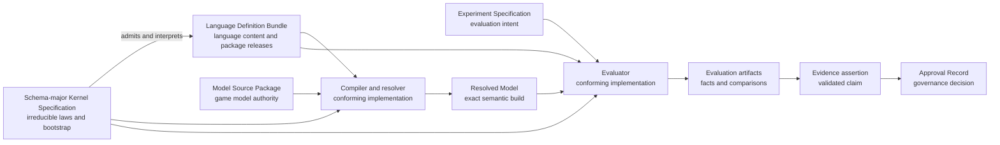
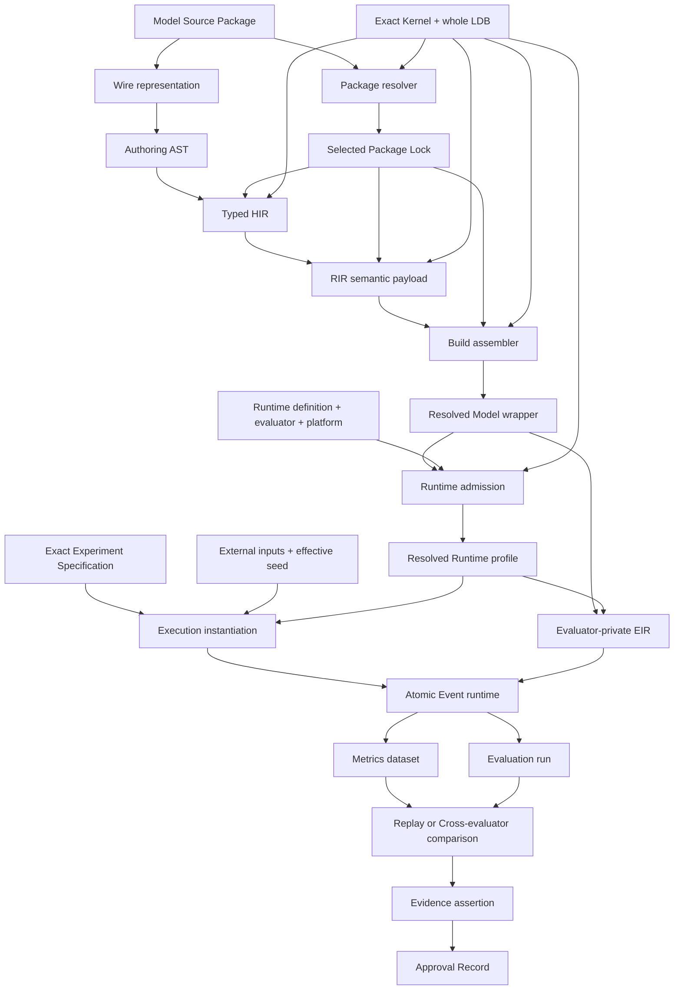
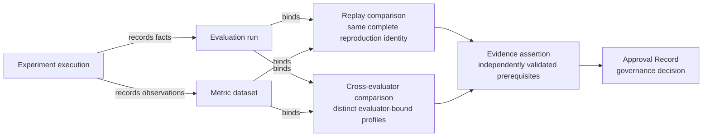

# Standard Schema 2.0 Architecture

Status: **Design authority; implementation and conformance gates remain open**

Standard Schema 2.0 is the language, compiler, runtime, and evidence architecture for describing
and evaluating game-balance models. It is designed to cover RPG and Roguelike numeric systems
without embedding either genre in the compiler or evaluator. The system is a restricted, typed,
non-Turing-complete modeling language with deterministic execution and an immutable evidence chain;
it is not a larger JSON template format.

This document is the human-readable authority for the **macro architecture**: system topology,
subsystem boundaries, cross-cutting invariants, and the order in which the design becomes an
implemented and proven Standard Schema 2.0. It synthesizes the accepted design decisions, PRD,
domain language, genre-coverage contract, and four disposable-prototype dogfooding rounds.

It describes the intended architecture, not a claim that Standard Schema 2.0 has shipped or passed
conformance. Every implementation and coverage gate called out in this document is open unless its
own acceptance artifact says otherwise.

## 1. How to use this document

Standard Schema 2.0 deliberately separates kinds of authority. No single prose document, source
module, or prototype may become an accidental second specification.

| Authority | Owns | Does not own |
| --- | --- | --- |
| This `ARCHITECTURE.md` | Macro topology, subsystem responsibilities, cross-cutting invariants, delivery order | Machine semantics, detailed decision rationale, acceptance status |
| [`BALANCING-CONTEXT.md`](../BALANCING-CONTEXT.md) | Canonical domain terms and distinctions | Architecture planning or executable semantics |
| [bADR-0012…0022](badr/) | Binding detailed decisions and their rationale | Consolidated system narrative or implementation status |
| [Product PRD #501](https://github.com/aigengame/godot-agent/issues/501) | `gda-balancing` product outcomes, milestones, and relationship to the `gda` family | Standard Schema 2.0 architecture details |
| [PRD #534](https://github.com/aigengame/godot-agent/issues/534) | Product requirements, acceptance criteria, and live completion tracking | Macro architecture or machine semantics |
| [`standard-schema-2.0/`](standard-schema-2.0/) | Acceptance artifacts, coverage matrices, and prototype evidence status | Language authority or proof by prose |
| Schema-major Kernel Specification | Irreducible bootstrap, admission, and execution laws | Evolving language content or game models |
| Language Definition Bundle (LDB) | The complete language content admitted by one exact Kernel Specification | Host implementation behavior outside its declared contract |
| Conformance vectors | Executable proof obligations derived from Kernel and LDB authority | New semantic decisions |
| Prototype code | Disposable evidence used to challenge the design | Architecture, language, or product authority |

The Kernel Specification and LDB are future machine-readable artifacts. Until they exist and pass
independent conformance, this document and the accepted bADRs state the design but cannot prove that
two implementations will interpret it identically.

When this document and an accepted bADR appear to conflict, neither silently overrides the other.
The conflict must be reconciled in the same change: the bADR records the detailed decision and this
document records its macro consequence. Machine semantics must ultimately be expressed by the exact
Kernel Specification and LDB, not inferred from either prose source.

Quick reading paths:

- system and authority overview: sections 3–4;
- language, compilation, and extension: sections 5–7;
- runtime, evidence, and public surface: sections 8–10;
- confidence, dogfooding, and delivery gates: sections 11–13; and
- decision traceability: section 16.

## 2. Design intent

### 2.1 Goals

Standard Schema 2.0 must:

- express numeric models across RPG and Roguelike systems through a small orthogonal type and
  operation core;
- add ordinary game attributes through Model Source alone and reusable mechanics through complete,
  versioned Domain packages rather than host-code changes;
- compile source into a public semantic representation whose identity and meaning are independent of
  implementation-private execution plans;
- execute deterministic, atomic event transactions under an explicit, reproducible runtime profile;
- use one metrics model for simulated and observed data, then preserve an immutable chain from runs
  through comparisons, Evidence, and Approval;
- expose the same artifact and outcome model through a structured CLI surface;
- refuse unsupported or ambiguous behavior explicitly instead of accepting an open-ended escape
  hatch; and
- make implementation-independent conformance testable from authoritative machine rules and
  vectors.

These goals serve the broader `gda-balancing` product defined by PRD #501. The toolkit remains a
standalone, engine- and game-agnostic sibling of `gda`; Standard Schema output is consumed by games
but does not import game or engine code into the balancing core.

### 2.2 Non-goals

Standard Schema 2.0 does not:

- embed a general-purpose or Turing-complete programming language;
- make RPG templates, Python classes, evaluator functions, or JSON Schema the semantic authority;
- treat every named game attribute as a new language type;
- provide host plugins that can silently add syntax, operations, or runtime behavior;
- claim format or runtime compatibility with UCUM, MLIR, SBML, FMI, Modelica, or ONNX;
- preserve arbitrary Standard Schema 1.x saves, replays, runtime behavior, or unsupported source;
- equate one successful run with Evidence, or independent-evaluator agreement with exact Replay; or
- use disposable prototypes as release or coverage evidence.

### 2.3 Design principles

1. **One owner for each fact.** Language, model, experiment, approval, generated identity, and
   transport facts have distinct authority domains.
2. **Closed semantics, explicit extension.** The core is closed; extension happens through admitted,
   content-addressed packages and declared compatibility, never ambient host behavior.
3. **Semantic identity before optimization.** RIR is the public semantic boundary; evaluator-private
   lowering may vary without redefining the model.
4. **Determinism has a scope.** Reproduction binds an exact Resolved Runtime profile and every other
   declared identity, not merely a seed.
5. **Atomic facts, honest failures.** Runtime transitions and artifact publication have explicit,
   separately testable atomicity boundaries.
6. **Evidence is earned.** Evaluation records facts; validated comparisons and prerequisite graphs
   justify Evidence; humans or governance systems issue Approval Records.
7. **Coverage is operational.** Genre support is demonstrated by required operations, scenarios,
   vectors, and public artifact paths—not by vocabulary presence.
8. **Clean 2.0 baseline.** With no released Standard Schema artifacts to preserve, safe conversion is
   preferred over compatibility machinery; unsupported 1.x concepts are deprecated and refused.

## 3. System context and authority boundaries

Three authored domains feed the system and remain independently owned:

- **Model Source Package** is the sole editable authority for a game's model definitions and package
  requirements.
- **Experiment Specification** owns scenarios, inputs, selectors, metric definitions, statistical
  policy, calibration intent, and acceptance intent.
- **Approval Record** owns the governance decision to accept or reject a named Evidence assertion.

The language used to interpret model and experiment content has a layered machine-authority chain:

The **Schema-major Kernel Specification** is intentionally small and non-self-hosted. It defines
the canonical wire identity rules, the bootstrap meta-format, bundle admission, irreducible type and
evaluation judgments, primitive numeric and transition laws, resource limits, and closed
meta-diagnostics needed to accept or reject an LDB. A list of node names or prose descriptions is
not a Kernel Specification.

An exact, immutable **Language Definition Bundle** is the only language-content authority admitted
under that Kernel. It owns grammar, language types, structured rules, operations, package releases,
post-admission diagnostics, runtime profile definitions, generated projections, and normative
vectors. The LDB cannot redefine Kernel laws, and the Kernel does not absorb ordinary language or
game-domain evolution.

Compiler, resolver, evaluator, CLI, and storage code are conforming host implementations. They are
never semantic authorities. Generated JSON Schema, help text, and SDK types are projections of the
same authoritative artifacts. They may make the system easier to use but cannot add meaning.

## 4. End-to-end architecture

The system converts human-authored source into a resolved semantic build, executes it under an exact
runtime contract, and publishes facts that can later support evidence:

The major subsystems are:

| Subsystem | Responsibility | Stable output or boundary |
| --- | --- | --- |
| Kernel/LDB bootstrap | Admit and identify the exact language definition | Kernel identity, whole-LDB identity, admission outcome |
| Package resolver | Select a deterministic, compatible package closure | Canonical Package Lock and resolution receipt |
| Front end | Parse source, resolve names, type-check, and validate effects | Authoring AST and Typed HIR |
| Semantic lowering | Normalize all language meaning into canonical public semantics | RIR semantic payload and separate Debug Map |
| Build assembler | Bind all exact semantic dependencies | Resolved Model wrapper and build receipt |
| Runtime admission | Bind evaluator, platform, budgets, numeric policy, RNG, and scheduler | Resolved Runtime profile |
| Evaluator | Lower RIR privately and execute atomic events | Snapshots, outputs, refusals, and terminal audits |
| Experiment runner | Apply scenarios, inputs, metrics, statistics, and acceptance intent | Metrics datasets and Evaluation runs |
| Evidence validator | Validate comparisons and prerequisite graphs | Evidence assertions |
| Artifact publisher | Publish complete immutable artifact sets and retrieval metadata | Artifact envelopes, Locators, and Receipts |
| Structured CLI | Expose authority artifacts and operations without inventing a second model | Descriptor-derived commands and surface manifest |

## 5. Language and semantic model

### 5.1 Closed value and quantity core

The initial language uses a closed constructor set:

`Bool`, `Int`, `Fixed`, `Decimal`, `Float`, `Enum`, `Record`, `Vector`, `List`, `Set`, `Map`,
`EntityRef`, `Quantity`, and `Distribution`.

The list is closed for one Schema major. New convenience names do not become primitive types.
`Quantity` carries orthogonal facets instead:

- representation (`Int`, `Fixed`, `Decimal`, or admitted `Float` profile);
- nominal kind;
- physical or game unit/dimension;
- support/domain constraints; and
- the applicable Numeric profile.

Terms such as `current`, `capacity`, `cost`, and `rate` are roles in a model, not numeric types.
Likewise, `constant`, `parameter`, `input`, `state`, `derived`, `output`, and `random` describe how a
value participates in evaluation rather than creating parallel type families. This separation is
the main orthogonality mechanism: representation, domain meaning, unit, bounds, and evaluation role
can evolve without a combinatorial type hierarchy.

Parameters additionally declare legal domains and whether their variability is discrete or
continuous. Search and calibration may choose only admitted candidates; they cannot turn an invalid
value into a model by clipping or host-language coercion.

### 5.2 Structured rules and operations

Language rules are stable-ID, machine-readable judgments expressed in the Kernel's closed
meta-format. They cover grammar, name resolution, typing, effects, lowering, evaluation, runtime
steps, diagnostic construction, and resource exhaustion. Rule prose explains a rule; it does not
replace its structured semantics.

The pure-expression judgment is closed to literals, typed reads, pure calls, conditionals, local
bindings, statically bounded aggregation, and lookup. Named-stream sampling is a separate judgment
with a statically declared random-stream effect; it is never reclassified as pure. Recursion and
unbounded iteration are forbidden. Unit conversion is explicit, and persistent mutation occurs only
through declared transitions. Host callbacks, ambient RNG, implicit conversions, and
implementation-defined iteration are outside the language.

The Kernel owns a small closed operation vocabulary sufficient to interpret those rules. The LDB
uses it to define complete language and Domain-package operations. Every operation definition must
declare its inputs, result, effects, refusals, numeric behavior, lowering, evaluation, and vectors.
A host function bearing the same name is not an operation definition.

`math.equation` is reserved for a possible future algebraic/continuous subset and is refused by the
initial 2.0 LDB. It cannot be approximated through evaluator-specific behavior.

### 5.3 Static effects and runtime facts

Effects are statically declared and checked. Effect specifications describe readable and writable
state, emitted signals, randomness, scheduling, resource use, and other observable capabilities.
They support exhaustiveness checks, prevent hidden mutation, and allow the resolver and runtime to
reject undeclared behavior before partial execution.

Signals are typed **intra-transaction facts** routed over statically resolved topology. They are not
independent runtime events and do not silently become persistent state. The LDB owns their type,
validation, ordering, effect, and execution laws.

Entities compose stable identity with explicitly typed components; Model Source chooses the
composition, while Domain packages own reusable component and operation semantics. Adding an
admitted component field does not add a compiler branch. Dynamic membership and target selection
remain declared operations over `EntityRef`, never evaluator-owned object traversal.

Effects are a composition of separate contracts for apply requirements, snapshot/live capture,
continuous or discrete contribution, state transition, scheduling, stacking identity/reducer,
reapplication, removal/expiry/dispel, and immunity. Action owns interruption, combat owns
damage/healing resolution, resource owns stored quantities, and the runtime owns atomic scheduling;
no universal Effect object may silently absorb those responsibilities.

## 6. Compilation, artifacts, and identity

### 6.1 Compilation boundaries

The public compilation pipeline is:

`wire representation → Authoring AST → Typed HIR → RIR semantic payload → Resolved Model`.

- The **wire representation** is the ingress serialization, initially JSON. It is not the language
  semantic model.
- The **Authoring AST** preserves source structure after parsing.
- **Typed HIR** resolves names, types, units, package symbols, and static effects while retaining
  enough structure for useful diagnostics.
- The **RIR semantic payload** is the canonical, public semantic normal form. Equivalent admitted
  source must lower to identical RIR payload bytes under the same selected semantic dependencies.
- The **Resolved Model wrapper** binds the RIR payload to the exact Kernel Specification, whole LDB,
  selected Package Lock, and all other required build identities.
- **EIR** is an evaluator-private execution representation. It may contain schedules, bytecode,
  layouts, or optimized kernels, but it is neither portable Standard Schema bytecode nor an
  interchange authority.

The **Debug Map** is separate from RIR semantics so that source locations and explanatory provenance
can change without changing model meaning. Resolution and build receipts record how an artifact was
obtained; they are not part of the RIR semantic payload.

### 6.2 Identity layers

Identity follows semantic responsibility rather than file location:

- whole-LDB identity covers the exact admitted language-content inventory;
- Package Lock identity covers the exact selected dependency closure;
- RIR payload identity covers reachable normalized model semantics;
- Resolved Model identity covers the exact build wrapper, including Kernel and whole LDB;
- Resolved Runtime profile identity covers the model plus evaluator, platform, numeric, RNG,
  scheduler, effect, and resource-budget contracts;
- Experiment identity covers the exact evaluation intent and its declared model/runtime binding;
- artifact-envelope identity covers the immutable published artifact; and
- Locator and Receipt record transport and retrieval facts without redefining artifact identity.

An orthogonality probe exposed a previously ambiguous identity blast radius. The accepted rule is:

| Change: add an unused package while ambiguity and selected closure remain unchanged | Required identity result |
| --- | --- |
| Exact whole LDB | Changes |
| Selected Package Lock | Remains byte-identical |
| RIR semantic payload | Remains byte-identical |
| Exact-build Resolved Model wrapper | Changes because it binds the whole LDB |
| Resolved Runtime profile | Changes because it binds the exact Resolved Model |
| Old exact Experiment binding | Becomes ineligible; a new Experiment identity or an explicit compatibility-binding receipt must select the new wrapper |

This is not exact Replay: the complete reproduction identity changed. The rule requires a normative
metamorphic conformance vector before acceptance.

### 6.3 Package resolution

Model Source declares requirements; it does not select ambient installed packages. The resolver
uses the exact LDB inventory and deterministic compatibility rules to produce one canonical Package
Lock. Ambiguity, unavailable capabilities, cycles, version conflicts, and unsatisfied requirements
are typed refusals. A complete resolver must handle the general dependency graph and historical
package identity rules; the prototype's selected cases are not a substitute.

## 7. Extension and genre architecture

### 7.1 Two extension paths

Standard Schema distinguishes ordinary modeling from language evolution:

1. A new admitted `Quantity` attribute or a new composition of existing operations belongs in
   **Model Source**. Examples include a game's `poise`, `heat`, or `corruption` attribute when its
   representation, kind, unit, domain, and role already fit admitted semantics.
2. A reusable nominal kind or mechanic belongs in a complete, content-addressed **Domain package
   release** in the LDB. Each release contains its manifest, dependencies, capabilities, types,
   operations, diagnostics, and normative vectors.

Only a genuinely irreducible primitive, judgment, core constructor, or bootstrap rule requires a
Kernel/Schema-major change. Neither a source attribute nor a Domain package may introduce implicit
syntax, host callbacks, incomplete semantic stubs, or an escape hatch around the LDB.

This three-level test—Model Source, Domain package, or Kernel change—is the architecture's main
extensibility control. It permits new game concepts while keeping semantics closed and reviewable.

### 7.2 Package ownership and boundaries

Domain packages own reusable mechanics rather than broad gameplay nouns. Their boundaries must keep
state ownership, transition policy, and observation concerns separable. The RPG package map and its
complete operation contract are specified by [bADR-0017](badr/0017-genre-templates-and-coverage-contract.md)
and the [genre coverage matrix](standard-schema-2.0/genre-coverage.md).

One dogfooding correction is especially important:

- `entity` owns defeat/revival **state storage**;
- `resource` owns health/shield `Quantity` **storage**; and
- `combat` owns damage, healing, and shield **resolution**, plus defeat/revival transition policy.

This prevents three packages from claiming the same fact while still allowing them to compose.
Similar boundaries must be validated for progression, inventory/equipment, status/effect lifecycle,
economy, encounter, AI/decision policy, spatial/topology, time/scheduling, and randomness.

### 7.3 Genre templates are distributions

A Genre template is a versioned distribution containing:

- an instantiable starter Model Source Package;
- companion Experiment Specifications with scenarios, metrics, and targets;
- a requirements-to-operations coverage matrix with its Golden scenarios and negative vectors; and
- a manifest binding template version, compatible LDB/package ranges, and every member's content
  identity.

Examples and documentation may accompany a release as non-semantic material, but they are not a
substitute for any required member or manifest binding.

Instantiation materializes the starter under a new Model Source Package identity and records the
template id, version, and member-content provenance. That new model is thereafter authored by the
game. Installing a later template release cannot mutate, rebase, or reinterpret it; adoption
requires re-instantiation or explicit authored changes. Initial 2.0 defines no implicit template
upgrade path.

Templates are not Standard Schema instances, runtime profiles, language authorities, or privileged
compiler inputs. Genre behavior exists only through admitted operations and Domain packages. A
template may make a good model easy to start; it may not make otherwise invalid semantics valid.

Coverage claims are evidence-backed and granular. A `Tracer` row requires a public vertical path;
broader RPG or Roguelike support requires its own Golden scenarios, vectors, and acceptance evidence.
All rows in the current matrix remain open.

### 7.4 Attributing a design failure

An extension failure must be assigned to the authority that can actually fix it:

| Observed failure | Owning defect | Required response |
| --- | --- | --- |
| Admitted operations can express the mechanic, but the starter source, companion Experiment, examples, or coverage mapping are wrong or incomplete | Genre template release | Correct and re-version the template distribution; do not change language semantics |
| The mechanic is reusable and fits the existing Kernel, but its package omits an operation law, capability, diagnostic, dependency, or vector | Domain package release/LDB content | Complete and re-version the package release under LDB authority |
| Source, package, compiler, runtime, identity, refusal, publication, or Evidence contracts cannot represent the mechanic without hidden host behavior or overlapping ownership | Standard Schema/LDB architecture | Reopen the relevant bADR/PRD gate and correct the common language contract before continuing template work |
| The missing behavior is genuinely irreducible and cannot be defined by the admitted rule meta-format and Semantic kernel | Kernel/Schema-major architecture | Treat it as a Schema-major decision with executable laws and independent conformance |

The attempted Standard Schema 1.x RPG template fell into the third category: adding template fields
would not have fixed the underlying authority, type, compilation, runtime, and evidence boundaries.
The four 2.0 probes likewise found mostly Standard Schema foundation gaps, plus narrower package
ownership and template-coverage obligations. A failed genre example is therefore not automatically
a template defect, and a missing convenience field is not automatically a Kernel defect.

## 8. Deterministic atomic runtime

### 8.1 Runtime admission and scope

An LDB-owned **Runtime profile definition** declares an admitted execution policy. Before dispatch,
runtime admission produces a **Resolved Runtime profile** binding that definition to the exact
Kernel, whole LDB, selected Package Lock, Resolved Model/RIR payload, evaluator build, platform,
Numeric profile, RNG algorithm and streams, scheduler/effect policy, and resource budgets.

Determinism is promised only inside that exact profile and complete reproduction key. A seed alone
cannot establish reproducibility. Resource exhaustion is a typed refusal, not permission to publish
partial success.

One execution instance follows a closed lifecycle:

1. `instantiated` binds exact RIR, Experiment, Resolved Runtime profile, inputs, and seed without
   creating mutable state;
2. `initializing` creates and validates the first Snapshot boundary;
3. `event` dispatches the atomic events at the current logical time;
4. `step` advances to the next declared observation or logical boundary;
5. `terminated` seals terminal trace, Snapshot, Metrics, and evidence identities; and
6. reset discards the instance and initializes a new one from the same immutable artifacts rather
   than mutating RIR.

### 8.2 Event transaction model

Runtime execution is a sequential, total-order stream of atomic Event transactions. Each event has
one phase in its stable ordering key. At each logical time the fixed order is `input`, `transition`,
then `observation`; signed priority descending and runtime-assigned FIFO enqueue sequence complete
the total order. Models and packages cannot add or reorder phases.

- An `input` event admits externally supplied, source-sequenced facts and cannot be scheduled by
  model operations.
- A `transition` event executes actions, effects, resource changes, combat, generation, and other
  declared stateful behavior.
- An `observation` event reads final committed state after the transition queue for that logical time
  drains. It emits observations only: it cannot mutate model state, consume model resources, or
  schedule another event at the same logical time.

Dispatching **each queued event** is one atomic transaction over the latest committed Snapshot.
Writes, signals, child events, cancellations, and RNG changes remain buffered until that event
commits; refusal discards that event's buffers.

Each state slot has one final write, either directly or through an admitted reducer. Reads and
writes follow explicit snapshot boundaries; iteration order and tie-breaking are never inherited
from a host container. RNG uses named streams so unrelated features cannot perturb each other's
draw sequences. Numeric behavior—including overflow, rounding, non-finite values, comparison, and
sampling—is fixed by the selected profile.

On refusal, only the current event rolls back. Earlier committed snapshots remain part of the
terminal audit. A refund, compensation, resurrection, or later correction is a new domain
transition, not retroactive rollback.

### 8.3 Outcomes, refusals, and publication

The architecture keeps three ideas separate:

- a **gameplay outcome** is a modeled result such as victory, defeat, or resource exhaustion;
- a **Refusal** means the Standard Schema invocation could not lawfully complete at a declared
  pipeline stage; and
- a **Verdict** is an Experiment-level judgment under declared acceptance intent.

If a refusal occurs after runtime dispatch, the invocation atomically publishes a separate,
retrievable, and verifiable **terminal-audit artifact set**. It records the committed prefix, last
committed snapshot, refusing event, rollback facts, Diagnostic, Resolved Runtime profile, and exact
reproduction identities. It must not publish fabricated or half-complete Evaluation, Metric,
Replay, or Evidence success artifacts. Admission failures before dispatch have no terminal audit.

Event-transaction atomicity and artifact-publication atomicity are distinct invariants. Both must be
fault-injected and verified independently.

## 9. Experiment, metrics, and evidence

### 9.1 Experiment-owned intent

An Experiment Specification owns everything that turns a model into a testable question:

- scenarios and external inputs;
- selectors and parameter assignments;
- exact model/runtime compatibility binding;
- metric definitions and observation points;
- statistical method, sample plan, and uncertainty policy;
- calibration objective, observation model, and identifiability/replication policy;
- acceptance intent and comparison policy; and
- holdout and drift policy where observed data is involved.

Model Source must not hide experiment-specific acceptance thresholds, and evaluator code must not
silently choose metrics or statistical policy.

### 9.2 One metrics schema

Simulated and observed measurements use the same Metrics schema. Provenance distinguishes their
origin; parallel metric languages do not. Calibration requires an explicit observation model,
identifiability or replication analysis, a frozen holdout, and drift handling. A fitted value is not
automatically an accepted model.

### 9.3 Immutable evidence chain

An Evaluation run records what happened; it does not issue Evidence by itself. Comparisons bind
exact inputs, policies, datasets, and identities. Evidence is an immutable assertion whose complete
prerequisite graph has been independently validated. Approval is a separate governance artifact.

**Replay** requires identical complete reproduction identities, including one identical Resolved
Runtime profile. Independent evaluator builds necessarily have distinct evaluator-bound profiles;
their agreement is a **Cross-evaluator comparison**, not Replay. It may support an independently
validated `cross_evaluator_conformant` claim but can never issue `reproducible` for a different
profile.

## 10. CLI and artifact publication

### 10.1 Public command taxonomy

The Standard Schema 2.x CLI follows artifact ownership rather than internal implementation modules:

| Group | Commands or reserved surface | Purpose |
| --- | --- | --- |
| `schema` | `get language-bundle`, `get wire-schema`, `get diagnostic-catalog` | Retrieve language authority or generated projections |
| `package` | `list`, `get` | Inspect LDB package inventory |
| `model` | `check`, `build`, `inspect`, `diff`, `migrate` | Validate and resolve model artifacts |
| `template` | `list`, `get`, `instantiate` | Distribute and instantiate starter sources |
| `experiment` | `check`, `run`, `replay`, `compare` | Validate and execute evaluation intent |
| `evidence` | `inspect`, `verify` | Inspect and independently validate Evidence graphs |
| `calibration`, `approval` | Reserved | Future surfaces; absence is explicit |
| meta | `version`, `manifest`, `help` | Product and command-surface discovery |

There is no public `runtime` or `metrics` command group: those are execution and artifact concepts
owned through model/experiment operations, not independent user workflows.

Each command has one structured **Command descriptor** that owns its parameters, defaults,
channels, outcome decoding, and schema reference. Help, structured parameter schema, `--schema`, and
the aggregate Surface manifest are derived from it; conformance verifies those projections. CLI
parsing must not create a second default or outcome authority.

### 10.2 Publication model

Artifact identity is independent of filesystem path, URL, object-store key, or transport. An
immutable artifact envelope carries the artifact and its identity; a **Locator** says where it can be
retrieved; a **Receipt** records publication or retrieval facts.

Each artifact-producing Command descriptor publishes one complete atomic artifact set for its
producing outcome. It also requires an **Invocation key**, which makes retries idempotent and allows
a client to recover the already committed outcome after a transport failure. A stdout-only command
need not publish an artifact set or accept an Invocation key. Local filesystem publication and
production storage adapters must satisfy the same observable contract, but their trust boundaries
and durability guarantees remain explicit.

## 11. Quality attributes and current confidence

The architecture is designed around six quality attributes. The current rating distinguishes design
coverage from implementation proof.

| Attribute | Architectural mechanism | Current conclusion |
| --- | --- | --- |
| Consistency | Scoped authority, canonical terms, one semantic pipeline, identity rules | Macro decisions are aligned after dogfooding corrections; ongoing anti-drift checks are required |
| Completeness | Closed language/runtime/artifact contracts plus RPG/Roguelike coverage matrix | Requirement contract is broad and systematic; full Schema and genre coverage are not yet proven |
| Reliability | Deterministic profiles, atomic events/publication, typed refusals, terminal audits, immutable evidence | The bounded executable authority mechanism passed independent mutation/refusal probes; permanent publication, Evidence issuance, and full-system conformance remain open |
| Orthogonality | Quantity facets, source/package/kernel extension test, separate authored domains, RIR/EIR split | Selected extension and authority mechanisms passed narrow mutation probes without RPG host dispatch; whole-system and cross-genre proof remain open |
| Extensibility | Complete content-addressed Domain packages with capabilities and vectors | Package seam is credible; general solving, historical uniqueness, and full mechanic breadth remain open |
| Operability | Descriptor-derived CLI, immutable artifacts, idempotent invocation, receipts | Local descriptor and publication paths were exercised; production adapters and complete public surface remain open |

Therefore the present conclusion is:

- the design is **internally coherent enough to replace disposable evidence with the permanent
  conformance foundation**;
- the requirement model is **architecturally complete at macro level**, but completeness has not been
  demonstrated over every language judgment, package interaction, or genre coverage row;
- semantic-authority reliability and orthogonality are **strongly validated for the selected
  slices**, not system-level guarantees;
  and
- selected mechanisms may be described as locally feasible in the slices actually tested, but
  Standard Schema 2.0 must not be described as end-to-end feasible, conformant, RPG-complete, or
  production ready until the remaining gates close with authoritative artifacts and independent
  evidence.

## 12. Dogfooding: what changed and what remains open

Four disposable prototypes were used to attack the design. Their code remains evidence only. The
historical conclusions below explain how dogfooding changed the accepted architecture; live test
details and evidence status remain owned by the
[`standard-schema-2.0` evidence record](standard-schema-2.0/README.md) and PRD #534. The following
language distinguishes architectural learning from acceptance:

- **Confirmed—narrowly:** a mechanism behaved as designed in the selected slice.
- **Refined—adopted:** dogfooding exposed an ambiguity or wrong assumption and the accepted design
  changed.
- **Open gate:** the design still needs authoritative semantics or broader proof.
- **Non-claim:** a passing prototype must not be reported as closing this property.

### 12.1 First RPG vertical tracer

**Confirmed—narrowly:** one exact-`Int` RPG path connected prototype LDB admission, Model Source,
Authoring AST, Typed HIR, canonical RIR, cross-process identity, atomic events, Metrics, Evaluation,
and prototype-local Evidence. Fixture replay and no-partial-visibility under injected local-store
faults were demonstrated.

**Open gate:** the tracer exposed missing closed rule semantics, full wire transport, exact
Experiment binding, outcome/refusal staging, RNG laws, terminal audit, honest Replay/Evidence,
target and signal semantics, host-semantic leakage, RIR identity rules, Command descriptors,
diagnostic ownership, Resolved Runtime profiles, and complete Lock/manifest behavior.

**Non-claim:** it did not validate LDB semantic authority, independent evaluator conformance,
independent-lowerer RIR agreement, general package resolution, portable publication, normative
Evidence, or any genre coverage row.

### 12.2 Semantic-authority probe

**Confirmed—narrowly:** two source-level bootstrap/compiler/evaluator paths consumed each other's
artifacts for a small Kernel-node vocabulary, removed RPG-specific host dispatch, agreed on exact
`Int`, named RNG, and one buffered event, and exercised RIR/Debug Map/receipt separation,
descriptor-owned outcomes, Invocation keys, and publication boundaries. Its implementation suite
passed its declared narrow checks; the evidence record owns the exact result.

**Refined—adopted:** exact Replay now requires one identical evaluator-bound Resolved Runtime
profile. Agreement between honest independent evaluators is a separately typed Cross-evaluator
comparison. The probe issued neither Replay nor Evidence.

**Open gate:** both paths still shared handwritten semantic code. Kernel laws, LDB-driven complete
Source → HIR → RIR rules, admission and post-admission Diagnostic authority, static exhaustiveness,
general package resolution, complete terminal-audit schemas, store trust boundaries, and independent
Evidence validation remain unresolved.

**Non-claim:** passing the probe's checks is not a semantic-authority gate pass.

### 12.3 Orthogonality and extensibility probe

**Confirmed—narrowly:** a generic Quantity attribute required only Model Source; reusable resource,
interruption/refund, and effect-lifecycle mechanics required complete package releases; operations
had closed input/result/effect/refusal projections; Experiment selectors and acceptance intent were
exactly bound; runtime admission used the selected Lock; prior commits survived refusal; descriptors
owned outcomes; and local publication was anchored without RPG-specific compiler/runtime dispatch.
The selected mechanism passed its declared narrow checks; the evidence record owns the exact result.

**Refined—adopted:** the unused-package identity matrix in section 6.2 corrected the specification's
blast-radius ambiguity. Compensation/refund is a later domain transition, not rollback. Entity,
resource, and combat ownership was separated as stated in section 7.2.

**Open gate:** executable selector/acceptance and Kernel/LDB judgments, general solving, historical
package uniqueness, complete Effect and genre breadth, portable stores, exact Replay, independent
Evidence, and all coverage rows remain open.

**Non-claim:** passing the probe's checks is not a Schema, semantic-authority, genre, Replay, or
Evidence pass.

### 12.4 Executable Kernel/LDB authority gate

**Confirmed—narrowly:** two independently implemented bootstrap/lowerer/evaluator stacks admitted
the same executable Kernel/LDB, derived Source → Typed HIR → RIR through LDB judgments, consumed
each other's sealed artifacts, produced byte-identical RIR for equivalent Sources, and agreed on
the selected Numeric/RNG/scheduler/effect/refusal slice. Every consulted Kernel law and selected
LDB rule survived old-identity tamper, reidentified deletion, and reidentified behavior mutation;
renaming authority tokens did not require host changes.

**Refined—adopted:** Kernel law contracts must close and enforce parameters, results, transitive
effects, refusals, and resource accounting. Diagnostic authority needs exact reverse closure plus
behavior coverage, not only forward lookup. Comparison artifacts are bound inputs to later Evidence
eligibility, never Evidence assertions themselves. Artifact-set manifests bind typed member names
and identities; an unframed concatenation digest is insufficient.

**Open gate:** the probe did not author the permanent Kernel/LDB, exhaustive rule ontology,
canonical integer/Unicode/Fixed wire laws, general package solver, complete Effect/Genre breadth,
portable publication/crash recovery, independent Evidence issuance, or production CLI/runtime.

**Non-claim:** this is a bounded architecture-authority PASS, not Schema conformance, full
abstraction proof, RPG/Roguelike completeness, or production readiness. The evidence commits remain
on closed, unmerged PR #537; prototype code is not part of this authority branch.

### 12.5 Architecture consequence

The four rounds validate one RPG vertical path, selected orthogonality/identity mechanisms, and the
bounded executable Kernel/LDB authority boundary. They remove the known architecture-level hidden-
host uncertainty for the tested slice. The remaining gaps require permanent specifications,
normative vectors, durable adapters, and cross-genre verticals; another disposable prototype would
not close them.

## 13. Validation and delivery plan

Work proceeds through gates; later claims depend on earlier authority and conformance.

### Gate 1 — independent Kernel/LDB authority mechanism (bounded PASS)

The final architecture-level disposable probe established:

- an executable Kernel Specification with complete laws for every admitted bootstrap node and
  judgment in the probe;
- an LDB that drives Source → HIR → RIR, post-admission diagnostics, Numeric/RNG/scheduler/effect
  behavior, and discriminating prototype vectors;
- truly independent bootstrap, lowerer, and evaluator implementations with no shared semantic code;
- mutual artifact consumption, mutation/refusal convergence, byte-identical RIR for equivalent
  source, and honest Cross-evaluator results; and
- explicit negative cases proving that host-only primitives and incomplete rules are rejected.

The source and evidence commits are retained through closed, unmerged PR #537. This result confirms
the authority mechanism only; no #534 acceptance criterion or Genre row closes until the same
contracts exist as permanent Kernel/LDB artifacts and normative conformance vectors.

### Gate 2 — permanent conformance foundation

Human acceptance of this architecture and its bADRs authorizes Gate 2 and the later vertical-slice
implementation work. PRD #534 stays open while that work executes: its acceptance criteria and
Genre rows are delivery/claim gates, not prerequisites that must be closed before implementation
can start.

Replace disposable evidence with the **smallest permanent conformance foundation needed by the
production RPG tracer**: versioned Kernel/LDB artifacts, a reusable harness, and authoritative
vectors for the bootstrap, grammar, types/effects, lowering, diagnostics, Numeric/RNG, selected
package resolution, identity, audit/publication, CLI, comparison, and Evidence paths exercised by
that slice. This is not a horizontal implementation of every rule or package. Gate 3 grows the same
suite source-to-evidence; later gates add general resolver, historical package, broader publication,
and Evidence cases as their vertical scenarios require them.

### Gate 3 — production RPG tracer

Implement one production vertical slice through the public CLI and durable artifact path. It must
close all 12 `Tracer` rows in the genre coverage matrix with Golden scenarios and normative vectors.

### Gate 4 — full RPG coverage

Close the remaining 10 RPG rows without adding parallel compiler/runtime semantics. Validate package
composition, state ownership, effect breadth, encounters, progression, economy, and evidence paths.

### Gate 5 — Roguelike cross-genre tracer

Close the seven Roguelike-specific rows—including generated effect pools and cross-run Meta
progression—by reusing the same Kernel, LDB, package, runtime, artifact, and
evidence contracts. If Roguelike support requires a second language or host dispatch, the
orthogonality claim fails and the architecture must be revisited.

No further disposable architecture prototypes are planned. Gate 1 resolved the bounded semantic-
authority mechanism risk; additional validation belongs in the permanent conformance and production
tracer suites unless a later decision introduces a new semantic root, open host extension, or
cross-artifact authority boundary.

## 14. Migration and compatibility

Standard Schema 2.0 is a clean forward baseline because no Standard Schema product artifacts have
been released. New models, templates, experiments, and evidence use 2.0 authority and identity from
the start.

Schema version and `gda-balancing` product/package version are independent compatibility axes.
Adopting Standard Schema 2.0 does not by itself require a `gda-balancing` 2.0.0 release, and a
toolkit release cannot silently change the Schema major, exact Kernel, or LDB identity.

A limited converter may migrate 1.x **source** only when the mapping is semantics-preserving and
auditable. It emits a migration report binding the input identity, converter/LDB identities,
successful mappings, defaults, warnings, and refusals. A concept without a safe mapping is declared
deprecated/unsupported and refused.

There is no dual 1.x/2.x semantic stack, gray runtime rollout, reverse migration, or compatibility
promise for saves, replays, runtime behavior, rulesets, or partial Evidence. Standard Schema 1.x
remains design history and conversion input, not a constraint that can weaken 2.0 invariants.

## 15. External design provenance

External standards contribute selected mechanisms, not authority or compatibility claims:

| Source | Adopted mechanism | Explicitly not adopted |
| --- | --- | --- |
| UCUM 2.2 | Pinned physical-unit codes and full parsing, canonical semantic equality, commensurability, dimension, and conversion-magnitude semantics | Treating game-only nominal kinds or units as UCUM concepts |
| MLIR | Operation/dialect/interface/conversion architecture | MLIR libraries, TableGen, textual syntax, bytecode, or runtime |
| SBML modular packages/composition | Explicit optional packages, capabilities, and composition discipline | SBML documents, simulation semantics, or compatibility |
| FMI 3.0.2 | Lifecycle and instantiated-execution discipline | FMU packaging, C API, or FMI runtime |
| Modelica 3.6 | Reserved equation-oriented modeling pattern | Initial continuous/algebraic execution; `math.equation` is refused |
| ONNX | Separation of format version, operator domain/opset, evaluator, and model identity | ONNX graphs, operators, runtime, or compatibility |

Each adopted mapping must name an exact source version, identify its local Kernel/LDB owner, and
have conformance vectors. The local Kernel Specification and LDB remain the only machine authority.

## 16. Decision and acceptance map

Use this map when a macro statement needs its detailed decision or live acceptance status:

| Area | Detailed decision | Acceptance/evidence surface |
| --- | --- | --- |
| Authority domains and artifact ownership | [bADR-0012](badr/0012-language-and-artifact-authority-domains.md) | PRD #534 authority criteria |
| Compiler stages, RIR, Debug Map, EIR | [bADR-0013](badr/0013-compiler-stages-and-semantic-equivalence-boundary.md) | Kernel/LDB and independent-lowerer vectors |
| Deterministic atomic runtime and profiles | [bADR-0014](badr/0014-deterministic-atomic-event-runtime.md) | Runtime, refusal, Replay, and fault vectors |
| Outcomes, refusals, diagnostics, terminal audit | [bADR-0015](badr/0015-invocation-outcomes-and-diagnostic-locations.md) | Diagnostic catalogs and publication vectors |
| Closed core and package extension | [bADR-0016](badr/0016-closed-type-core-and-versioned-package-extensions.md) | Package and orthogonality vectors |
| Genre templates and coverage | [bADR-0017](badr/0017-genre-templates-and-coverage-contract.md) | [Genre coverage matrix](standard-schema-2.0/genre-coverage.md) |
| Metrics, calibration, comparisons, Evidence | [bADR-0018](badr/0018-unified-metrics-calibration-and-evidence-chain.md) | Evidence graph and independent validation vectors |
| Clean break and limited source migration | [bADR-0019](badr/0019-schema-2.0-clean-break-and-limited-source-migration.md) | Migration fixtures and reports |
| External-standard mappings | [bADR-0020](badr/0020-explicit-mappings-to-external-modeling-standards.md) | Mapping-specific conformance vectors |
| CLI taxonomy and structured surface | [bADR-0021](badr/0021-schema-2.0-cli-taxonomy-and-structured-surface.md) | Command descriptors and Surface manifest |
| Executable Kernel/LDB semantics | [bADR-0022](badr/0022-machine-readable-language-rules-and-formal-semantics.md) | Completed bounded Gate 1 evidence and permanent conformance suite |

PRD #534 remains the live answer to “is this accepted and complete?” This document answers “what
system are we building, where does each responsibility belong, and in what order can we prove it?”
