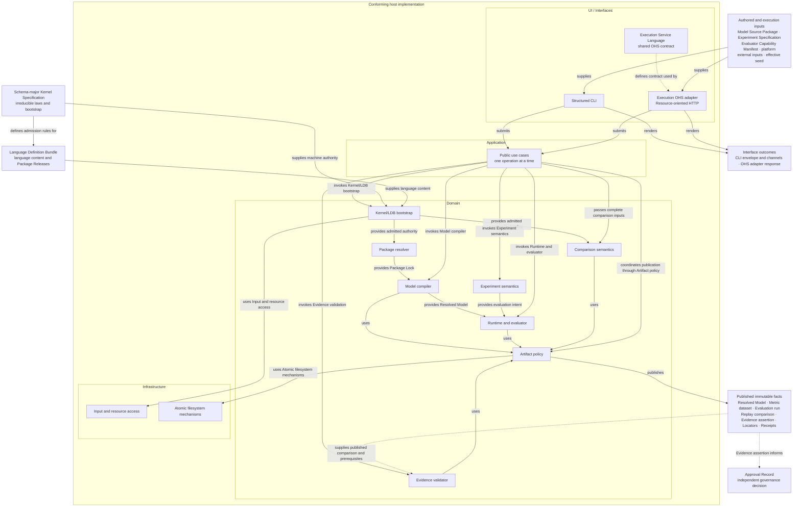
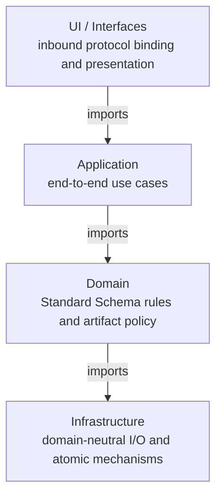
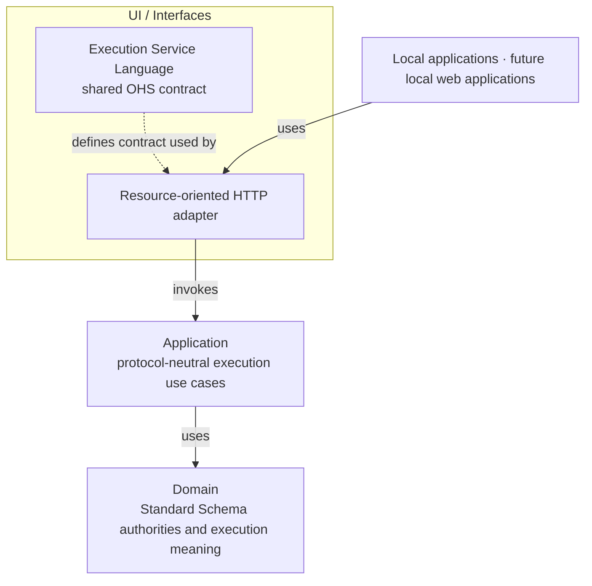
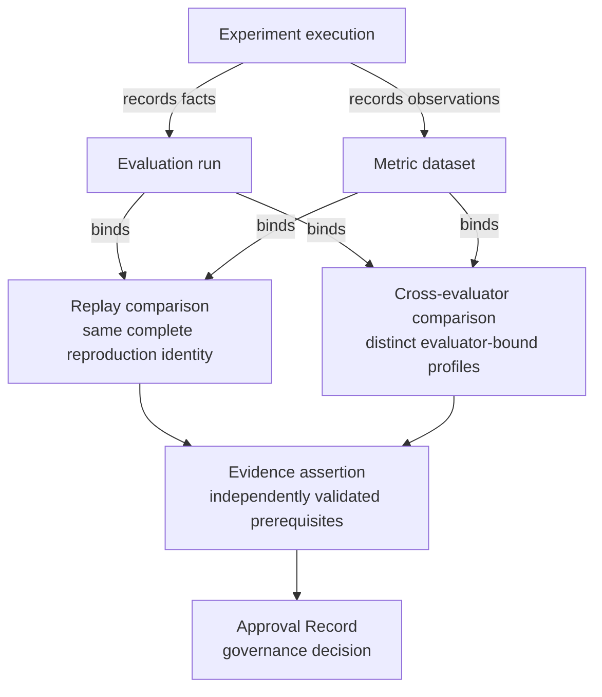

# Standard Schema 2.0 Architecture

Status: **Design authority; implementation and conformance gates remain open**

Standard Schema 2.0 is the language, compiler, runtime, and evidence architecture for describing
and evaluating game-balance models. It is designed to cover RPG and Roguelike numeric systems
without embedding either genre in the compiler or evaluator. The system is a restricted, typed,
non-Turing-complete modeling language with deterministic execution and an immutable evidence chain;
it is not a larger JSON template format.

This document is the human-readable authority for the **macro architecture**: system topology,
subsystem boundaries, cross-subsystem invariants, and the order in which the design becomes an
implemented and proven Standard Schema 2.0. It synthesizes the accepted design decisions, PRD,
domain language, genre-coverage contract, four disposable architecture-probe rounds, and
maintained-product dogfooding.

It describes the intended architecture, not a claim that Standard Schema 2.0 has shipped or passed
conformance. Every implementation and coverage gate called out in this document is open unless its
own acceptance artifact says otherwise.

## 1. How to use this document

Standard Schema 2.0 deliberately separates kinds of authority. No single prose document, source
module, or prototype may become an accidental second specification.

| Authority | Owns | Does not own |
| --- | --- | --- |
| This `ARCHITECTURE.md` | Macro topology, subsystem responsibilities, cross-subsystem invariants, delivery order | Machine semantics, detailed decision rationale, acceptance status |
| [`BALANCING-CONTEXT.md`](../BALANCING-CONTEXT.md) | Canonical domain terms and distinctions | Architecture planning or executable semantics |
| [bADR-0012…0027](badr/) | Binding detailed decisions and their rationale | Consolidated system narrative or implementation status |
| [Product PRD #501](https://github.com/aigengame/godot-agent/issues/501) | `gda-balancing` product outcomes, milestones, and relationship to the `gda` family | Standard Schema 2.0 architecture details |
| [PRD #534](https://github.com/aigengame/godot-agent/issues/534) | Product requirements, acceptance criteria, and live completion tracking | Macro architecture or machine semantics |
| [`standard-schema-2.0/`](standard-schema-2.0/) | Acceptance artifacts, coverage matrices, and prototype evidence status | Language authority or proof by prose |
| Schema-major Kernel Specification | Irreducible bootstrap, admission, and execution laws | Evolving language content or game models |
| Language Definition Bundle (LDB) | The complete language content admitted by one exact Kernel Specification | Host implementation behavior outside its declared contract |
| Conformance vectors | Executable proof obligations derived from Kernel and LDB authority | New semantic decisions |
| Prototype code | Disposable evidence used to challenge the design | Architecture, language, or product authority |

The first permanent, machine-readable Kernel Specification and LDB are published under
`src/gda_balancing/schema2/authorities/` and independently admitted for #538's bounded Quantity
foundation. They prove the bootstrap, identity, closed meta-format, two selected rules, Diagnostic
reason closure, generated projections, and command discovery of that admitted slice only. They do
not yet prove the complete language, Model build, Runtime, Experiment, Evidence, or Genre contracts;
the remaining gates below grow the same authorities vertically.

When this document and an accepted bADR appear to conflict, neither silently overrides the other.
The conflict must be reconciled in the same change: the bADR records the detailed decision and this
document records its macro consequence. Machine semantics must ultimately be expressed by the exact
Kernel Specification and LDB, not inferred from either prose source.

Quick reading paths:

- system and authority overview: sections 3–4;
- language, compilation, and extension: sections 5–7;
- runtime, evidence, and public surface: sections 8–10;
- confidence, dogfooding, and delivery gates: sections 11–13; and
- decision traceability: section 16.

This document uses four delivery terms. A **vertical slice** is an end-to-end product path. A
**tracer** is the first narrow vertical slice for a path. **Dogfooding** means using maintained
examples through the public product path. A **witness** is a bounded executable case that tests one
claim. None of these terms implies broader acceptance.

## 2. Design intent

### 2.1 Goals

Standard Schema 2.0 must:

- express numeric models across RPG and Roguelike systems through a small orthogonal type and
  operation core;
- add ordinary game attributes through Model Source alone and reusable mechanics through complete,
  versioned Domain packages rather than host-code changes;
- admit later game genres through those same source/package contracts without changing Kernel
  primitives, core constructors, runtime phases, compiler dispatch, or evaluator dispatch;
- compile source into a public semantic representation whose identity and meaning are independent of
  implementation-private execution plans;
- execute deterministic, atomic event transactions under an explicit, reproducible runtime profile;
- use one Metrics schema for simulated and observed Metric samples and datasets;
- preserve an immutable chain from Evaluation runs through comparisons and Evidence assertions to
  Approval Records;
- expose the same artifact and outcome model through structured inbound Interfaces, including the
  Structured CLI and local Execution HTTP API;
- refuse unsupported or ambiguous behavior explicitly instead of accepting an open-ended escape
  hatch; and
- make implementation-independent conformance testable from authoritative machine rules and
  vectors.

These goals serve the broader `gda-balancing` product defined by PRD #501. The toolkit remains a
standalone, engine- and game-agnostic sibling of `gda`. Games consume Standard Schema output. The
balancing core does not import game or engine code.

### 2.2 Non-goals

Standard Schema 2.0 does not:

- embed a general-purpose or Turing-complete programming language;
- make RPG templates, Python classes, evaluator functions, or JSON Schema the semantic authority;
- treat every named game attribute as a new language type;
- provide host plugins that can silently add syntax, operations, or runtime behavior;
- claim format or runtime compatibility with UCUM, MLIR, SBML, FMI, Modelica, or ONNX;
- preserve arbitrary Standard Schema 1.x saves, replays, runtime behavior, or unsupported source;
- equate one successful Evaluation run with Evidence, or independent-evaluator agreement with exact
  Replay; or
- use disposable prototypes as release or coverage evidence.

### 2.3 Design principles

1. **One owner for each fact.** Language, model, experiment, approval, generated identity, and
   transport facts have distinct authority domains.
2. **Closed semantics, explicit extension.** The core is closed; extension happens through admitted,
   content-addressed packages and declared compatibility, never ambient host behavior.
3. **Semantic identity before optimization.** RIR is the public semantic boundary; evaluator-private
   lowering may vary without redefining the model.
4. **Determinism has a scope.** Reproduction binds an exact Resolved Runtime profile and every other
   declared identity, not merely a seed.
5. **Atomic facts, honest failures.** Runtime transitions and artifact publication have explicit,
   separately testable atomicity boundaries.
6. **Evidence is earned.** Evaluation runs record facts. Validated comparisons and prerequisite
   graphs justify Evidence. Humans or governance systems issue Approval Records.
7. **Coverage is operational.** Genre support is demonstrated by required operations, scenarios,
   vectors, and public artifact paths—not by vocabulary presence.
8. **Clean 2.0 baseline.** With no released Standard Schema artifacts to preserve, safe conversion is
   preferred over compatibility machinery; unsupported 1.x concepts are deprecated and refused.

## 3. System context, authority boundaries, and host ownership

### 3.1 External authorities and inputs

Three authored artifacts have independent owners:

- **Model Source Package** is the sole editable authority for a game's model definitions and package
  requirements.
- **Experiment Specification** owns scenarios, inputs, selectors, Metric definitions, statistical
  policy, calibration intent, and acceptance intent.
- **Approval Record** owns the governance decision for a named Evidence assertion.

The Model Source Package and Experiment Specification enter the host as authored inputs. The
Approval Record does not enter execution. A person or governance system creates an Approval Record
for a named Evidence assertion.

Machine authority is separate from authored input. It consists of one exact Schema-major Kernel
Specification and one whole Language Definition Bundle (LDB). An execution also binds an Evaluator
Capability Manifest, a platform, external inputs, and an effective seed.

### 3.2 Host placement and artifact flow

The following diagram places each major host subsystem in one implementation layer. External
authorities, inputs, published facts, and governance decisions remain outside the host. The arrows
show input, processing, and publication relationships. They do not show Python imports.



The diagram omits internal representations and execution stages. Sections 5 through 10 define the
Authoring AST, Typed HIR, RIR semantic payload, Runtime, Experiment, Comparison, Evidence, and
publication paths.

### 3.3 Authority lifecycle and host boundaries

The **Schema-major Kernel Specification** is small and non-self-hosted. It defines wire identity,
the bootstrap meta-format, and LDB admission. It also defines irreducible type, evaluation, numeric,
transition, resource, and meta-diagnostic laws. A list of node names or prose descriptions is not a
Kernel Specification.

An exact **Language Definition Bundle** is the only authority for language content. The Kernel
admits the LDB. bADR-0023 defines the LDB as one sealed artifact graph. A canonical root manifest
owns the closed Package Release inventory. Each descriptor binds one Package Release manifest.
Each release contains one manifest and one package-owned conformance-vector child. The Package
Release manifest and its vector child use one package-specific directory. The vector child is
present even when it is empty.

Package Releases own grammar, language types, structured rules, operations, post-admission
diagnostics, runtime profile definitions, Replay comparison policies, and normative vectors.
Admission can derive read-only indexes. A serialized registry or directory listing is not another
authority. The LDB cannot redefine Kernel laws. The Kernel does not contain ordinary language or
game-domain evolution.

The Kernel owns package-coordinate patterns. It also owns the identity domains for the root,
release, and evidence collections. Loaders, admission, public schemas, and rebuild tooling project
these contracts.

The host loads and admits the packaged Kernel/LDB graph. It then indexes and freezes the graph. The
host publishes the context only after these operations succeed. It stores the result in one deeply
immutable `AdmittedAuthorityContext`. The compiler, Runtime, Experiment, Comparison, Evidence,
Template, and CLI subsystems use this context. The context is a performance and ownership boundary.
It is not a semantic authority.

Explicitly injected Kernel/LDB candidates use separate contexts. They cannot change or populate the
packaged baseline. The host caches canonical Wire-Schema meta-validation only for the actual schema
bytes and the actual Kernel schema-profile bytes. The test and CI contract for this lifecycle is in
[`docs/agents/testing.md`](agents/testing.md).

Checked-in LDB maintenance uses bADR-0016's development conformance harness. It admits one complete
candidate graph. The production and independent admission consumers execute every manifest-bound
vector. The production evaluator adapter and independent Runtime consumer also agree on every
`operation-execution` vector. Only then can the replacement authority be published. This is not a
product layer or a public Runtime path; the resolver, public Runtime, and identity rebuild tool do
not execute vectors.

Compiler, resolver, evaluator, CLI, and storage code are conforming host implementations. They are
not semantic authorities. Generated JSON Schema, help text, and SDK types project authoritative
artifacts. These projections cannot add meaning.

### 3.4 Non-normative symbolic architecture

This section is an explanatory view of the relationships above. It does not define machine
semantics or replace a Kernel/LDB judgment. The function names describe architecture mechanisms;
they are not public host API names.

Authority, authored input, and admission symbols are:

```text
K          = one exact Schema-major Kernel Specification
Manifest_i = the manifest owned by Package Release i
Vectors_i  = the Package conformance vector set owned by Package Release i
PR_i       = one exact Package Release
Root       = the canonical LDB root manifest
L          = one whole Language Definition Bundle
J_L        = the successful admission judgment for K and L
A          = one AdmittedAuthorityContext

M          = one Model Source Package
Req(M)     = the dependency requirements authored by M
E          = one Experiment Specification
Profile(E) = the Runtime profile reference authored by E
J_E        = the successful Experiment admission judgment
ECM        = one Evaluator Capability Manifest
Plat       = one platform identity
X          = the external inputs bound by E
s          = the effective seed owned by E
```

Derived-artifact and Evidence symbols are:

```text
Lock               = one canonical Package Lock
ResolutionReceipt  = one Resolution receipt
AST                = one Authoring AST
HIR                = one Typed HIR
RIR                = one RIR semantic payload
RIR_s              = the semantic identity of RIR
RIR_c              = the exact content identity of the canonical RIR JSON
RM                 = one Resolved Model
DebugMap           = one Debug Map
ModelExplanation   = one Model explanation
CapabilityManifest = one generated Capability manifest for RM
BuildReceipt       = one Build receipt

RPD                = one Runtime profile definition
RR                 = one Resolved Runtime profile
EIR                = one optional evaluator-private Execution IR
D                  = one Metric dataset
Run                = one Evaluation run
EO                 = one Evaluation outcome: accepted or rejected
OriginalObs        = the authenticated original Evaluation run and its complete observations
ReplayObs          = the new Evaluation outcome and its complete observations
RC                 = one Replay comparison
CC                 = one Cross-evaluator comparison
ComparisonInputs   = the published comparison artifacts supplied to one Evidence judgment
C                  = the exact comparison artifacts required by one Evidence claim kind
P_E                = the exact claim-specific Evidence prerequisite graph
EA                 = one Evidence assertion
AR                 = one Approval Record
```

Publication and host notation is:

```text
EvidenceInputs   = (ClaimKind, Subjects, Policy, Issuer)
GovernanceInputs = (Decision, ApprovalPolicy, Attestation, SubjectGraph)
AP_o             = the artifact policy for producing outcome o
S_o              = the complete artifact set declared for producing outcome o
Pub_o            = the published artifacts, Locators, and Receipts for outcome o
FS               = the Infrastructure-owned atomic filesystem mechanism
```

`EvidenceInputs` groups one exact LDB-owned claim kind, the exact subject artifacts, the exact
Evidence policy, and the issuer identity. `GovernanceInputs` groups the independent decision, its
Approval policy, the human or organizational attestation, and the complete subject-identity graph.
`EvaluatorBuild` identifies one exact evaluator implementation. `Runtime` and `Evaluator` name the
host components that execute the admitted model. `Trace` and `Snapshots` are execution outputs.
`ReplayPolicy` is the exact LDB-owned Replay comparison policy. `PortableObservationPolicy` is the
exact LDB-owned Portable Observation Policy. `CalibrationArtifacts`, `HoldoutAssertions`, and
`DriftAssertions` are the exact claim-specific prerequisites selected under `ClaimKind`.

`Seal(owner, members)` constructs one canonical, closed aggregate. The owner binds the exact,
ordered members and their content identities. `Seal` does not mean a cryptographic signature or
encryption. `F_A(...)` means that host mechanism `F` consumes `A`. `Id(x)` is the exact content
identity of `x`, and `SemId(RIR)` is the RIR semantic identity. `⊢` marks a proposition established
by a successful judgment. `⇓` introduces the outcome. `...` stands only for other inputs or
identities required by the admitted authorities; it does not permit a host implementation to add
meaning.

#### 3.4.1 Compact mental model

The following expressions show the major end-to-end paths. They omit diagnostic detail and refusal
branches. Section 3.4.2 defines those outcomes and expands each authority boundary.

```text
# Authority admission and the frozen host context
PR_i = Seal(Manifest_i, Vectors_i)
L = Seal(Root, <PR_1, ..., PR_n>)
Admit(K, L) ⇓ Success(J_L)                     # therefore K ⊢ L
A = IndexAndFreeze(K, L, J_L)                  # host context, not authority

# Model build and atomic publication
(Lock, RIR, RM, S_build) = Build_A(M)
Publish_A(AP_build, S_build, FS) ⇓ Success(Pub_build)

# Experiment admission, Runtime admission, and execution
(RR, D, Run) = Evaluate_A(E, RM)

# Comparison publication
OriginalObs = ValidateOriginalReplayInput_A(
    Run_1,
    Trace_1,
    Snapshots_1,
    D_1,
    RR_1,
)
ReplayObs = ValidateReplayInput_A(EO_2, Trace_2, Snapshots_2, D_2, RR_2)
RC = CompareReplay_A(
    OriginalObs,
    ReplayObs,
    ReplayPolicy,
)
    if an exact Replay comparison is requested
CC = CompareEvaluators_A(<Run_i, D_i, RR_i>, PortableObservationPolicy)
    if a Cross-evaluator comparison is requested
if RC is complete:
    ValidateReplayComparison_A(RC, OriginalObs, ReplayObs, ReplayPolicy) ⇓ Success
    S_replay = CompleteComparisonSet_A(RC)
    Publish_A(AP_replay, S_replay, FS) ⇓ Success(Pub_replay)
if CC is complete:
    S_cross_evaluator = CompleteComparisonSet_A(CC)
    Publish_A(AP_cross_evaluator, S_cross_evaluator, FS) ⇓ Success(Pub_cross_evaluator)

# Evidence validation and Evidence publication
if an Evidence judgment is requested:
    C = ComparisonsRequiredBy_A(ClaimKind, ComparisonInputs)
    P_E = CloseEvidencePrerequisites_A(ClaimKind, C, ...)
    EA = ValidateAndIssueEvidence_A(EvidenceInputs, P_E)
    S_evidence = CompleteEvidenceSet_A(EA, P_E, ...)
    Publish_A(AP_evidence, S_evidence, FS) ⇓ Success(Pub_evidence)

# External governance and separate Approval publication
if a governance decision is requested:
    AR = Govern(GovernanceInputs, EA, ...)
        # after the exact subjects and EA are published; outside host execution
    S_approval = CompleteApprovalSet_A(AR, ...)
    Publish_A(AP_approval, S_approval, FS) ⇓ Success(Pub_approval)

# Host call and result flow
Request -> UI -> Application -> Domain_A -> TypedOutcome -> UI

# Domain use of Infrastructure mechanisms
Domain_A -> Infrastructure
```

`Build_A` summarizes resolution, compilation, companion generation, and complete-set assembly.
`Evaluate_A` summarizes Experiment admission, Runtime admission, and execution. Each requested
Replay or Cross-evaluator comparison publishes its own artifact set without issuing Evidence. If a
later Evidence judgment is requested, `ClaimKind` selects the required published comparisons for
`C`. It does not control comparison publication. Section 3.4.2 expands these mechanisms.

#### 3.4.2 Detailed symbolic model

The detailed model uses the following outcome forms:

```text
Operation_A(inputs) ⇓ Success(outputs)
                    | Refusal(stage, diagnostics)

Judgment_A(inputs) ⇓ Success(positive_result)
                   | Verdict(negative_report)
                   | Refusal(stage, diagnostics)

Refusal(stage_n) ⇒ no later-stage success artifacts
```

The symbols preserve separate authority domains. `K` and `L` own machine and language semantics.
`M` owns editable model definitions and requirements. `E` owns evaluation intent. `AR` owns the
governance decision. A derived artifact can bind these authorities, but it cannot replace or edit
them.

**Authority formation is**:

```text
PR_i = Seal(Manifest_i, Vectors_i)
L    = Seal(Root, <PR_1, ..., PR_n>)

Admit(K, L) ⇓ Success(J_L)               # therefore K ⊢ L
A = IndexAndFreeze(K, L, J_L)

Admit(K, L) ⇓ Refusal(stage, diagnostics)  # no A is published
```

Each `PR_i` contains one manifest and its bound Package conformance vector set. `<PR_1, ..., PR_n>`
is the closed, canonical Package Release inventory owned by the LDB root manifest. `J_L` is the
successful admission outcome. `A` contains the exact, deeply immutable Kernel/LDB graph, its
admission outcome, canonical bytes, and read-only indexes. `A` is a host ownership and performance
boundary; `K` and `L`, not `A`, remain the machine authorities.

**Model resolution and compilation are**:

```text
(Lock, ResolutionReceipt) = Resolve_A(Req(M))
(AST, HIR, RIR, DebugMap, ModelExplanation) = Compile_A(M, Lock)

M -> AST -> HIR -> RIR
RIR_s = SemId(RIR)
RIR_c = Id(RIR)
RM = Bind(RIR, Id(K), Id(L), Id(Lock), RIR_s, RIR_c, ...)
CapabilityManifest = ProjectCapabilities_A(Lock, RIR, RM)

BuildReceipt = BindBuildProvenance_A(
    Id(M),
    Id(RM),
    Id(CapabilityManifest),
    Id(DebugMap),
    Id(ModelExplanation),
    Id(ResolutionReceipt),
    ...,
)
S_build = CompleteBuildSet_A(
    Lock,
    RIR,
    RM,
    CapabilityManifest,
    DebugMap,
    ModelExplanation,
    ResolutionReceipt,
    BuildReceipt,
)
Publish_A(AP_build, S_build, FS) ⇓ Success(Pub_build)
```

The resolver selects Package Releases only from `L`. The compiler parses and checks `M` under the
same `A`, then lowers selected, reachable semantics into `RIR`. `RM` is the exact-build execution
authority wrapper. Its identity binds `RIR_s` and `RIR_c` separately. The Debug Map, Model
explanation, Capability manifest, Resolution receipt, and Build receipt are separate companions;
none enters the Resolved Model identity. Resolver and compiler implementation identities belong in
provenance receipts; they do not participate in `Lock`, `RIR`, or `RM` content identity. The build
publishes no member unless the complete build set is generated, validated, and committed.

**Runtime admission and Experiment execution are**:

```text
ECM = DescribeCapabilities(EvaluatorBuild)

CheckExperiment_A(E, RM, Lock, RIR) ⇓ Success(J_E)
    # therefore A, RM, Lock, RIR ⊢ E

CheckExperiment_A(E, RM, Lock, RIR) ⇓ Refusal(stage, diagnostics)
    # execution does not start

RPD = ResolveRuntimeProfile_A(Profile(E), Lock, RIR)
RR  = AdmitRuntime_A(RPD, Lock, RM, RIR, E, ECM, Plat)
X   = ExternalInputs(E)
s   = EffectiveSeed(E)

EIR = PrepareEvaluator(RIR, RR)          # optional and evaluator-private
EvaluatorInput = EIR if present else RIR
(Trace, Snapshots, D, Run) =
    Execute_A(
        Runtime,
        Evaluator,
        EvaluatorInput,
        RM,
        RR,
        E,
        X,
        s,
    )
```

The Experiment judgment checks the exact model/runtime binding, scenarios, input contracts, Event
plans, Metric definitions, and evaluation policy before dispatch. Runtime owns the lifecycle,
scheduler, atomic Event transactions, Snapshots, and refusal boundary. The evaluator implements the
admitted Kernel/LDB contracts and may use an EIR, but neither evaluator code nor EIR is semantic
authority. `Run` records execution facts and binds `D`; neither artifact issues Evidence by itself.
A post-dispatch Runtime refusal produces the required terminal-audit artifact set instead of `D` or
`Run`. An earlier refusal also produces no completed Evaluation run.

**Comparison, Evidence, governance, and publication are**:

```text
OriginalObs = ValidateOriginalReplayInput_A(
    Run_1,
    Trace_1,
    Snapshots_1,
    D_1,
    RR_1,
)
ReplayObs = ValidateReplayInput_A(EO_2, Trace_2, Snapshots_2, D_2, RR_2)
RC = CompareReplay_A(
    OriginalObs,
    ReplayObs,
    ReplayPolicy,
)
    if an exact Replay comparison is requested
CC = CompareEvaluators_A(<Run_i, D_i, RR_i>, PortableObservationPolicy)
    if a Cross-evaluator comparison is requested
if RC is complete:
    ValidateReplayComparison_A(RC, OriginalObs, ReplayObs, ReplayPolicy) ⇓ Success
    S_replay = CompleteComparisonSet_A(RC)
    Publish_A(AP_replay, S_replay, FS) ⇓ Success(Pub_replay)
if CC is complete:
    S_cross_evaluator = CompleteComparisonSet_A(CC)
    Publish_A(AP_cross_evaluator, S_cross_evaluator, FS) ⇓ Success(Pub_cross_evaluator)

if an Evidence judgment is requested:
    C = ComparisonsRequiredBy_A(ClaimKind, ComparisonInputs)
    P_E = CloseEvidencePrerequisites_A(
        ClaimKind,
        C,
        CalibrationArtifacts,
        HoldoutAssertions,
        DriftAssertions,
        ...,
    )
    ValidateAndIssueEvidence_A(EvidenceInputs, P_E) ⇓
        Success(EA) | Verdict(report) | Refusal(stage, diagnostics)
    S_evidence = CompleteEvidenceSet_A(EA, P_E, ...)
    Publish_A(AP_evidence, S_evidence, FS) ⇓ Success(Pub_evidence)

if a governance decision is requested:
    Govern(GovernanceInputs, EA, ...) ⇓
        Success(AR) | Verdict(report) | Refusal(stage, diagnostics)
        # after the exact subjects and EA are published; outside host execution
    S_approval = CompleteApprovalSet_A(AR, ...)
    Publish_A(AP_approval, S_approval, FS) ⇓ Success(Pub_approval)
```

Replay and Cross-evaluator comparisons are separately identified, published artifacts. A completed
comparison command publishes its set independently of Evidence. A later Evidence judgment can use
that publication as an input, but the comparison is not an Evidence assertion. `P_E` closes the
exact graph required by `ClaimKind`. That graph includes the applicable published comparison
artifacts and any required calibration, holdout, and drift artifacts. `ClaimKind` does not decide
whether a comparison is published. The Evidence validator derives `EA` only after it validates the
prerequisite graph. One `Run` or `D` cannot issue Evidence by itself.

Domain Comparison semantics validates `OriginalObs` and `ReplayObs`, applies the admitted
policy, produces the ordered comparison facts, and independently validates the resulting comparison
without a store lookup. Application passes the complete artifacts returned by original-set
authentication and Replay execution. Artifact policy owns comparison-set completeness and
publication. Evidence validation consumes an already published comparison and does not produce or
reinterpret it.

A person or governance system creates `AR` after the exact subject and Evidence artifacts are
published. Governance is outside host execution and is not part of the Evidence publication
transaction. The Approval Record then enters a separate producing-outcome publication transaction.
`AR` binds the independent decision, policy, attestation, and complete subject graph. That graph
identifies the exact model, Experiment, Metric datasets, Evaluation runs, Calibration reports,
Evidence assertions, evaluator, and applicable policy. Artifact policy owns artifact identity, set
completeness, and publication rules. Infrastructure supplies bounded input and atomic filesystem
mechanisms without becoming an authority for artifact meaning.

**The host call and result flow can be read as**:

```text
Request
  -> Bind_UI
  -> Invoke_Application(DomainMechanism)
  -> TypedOutcome
  -> Render_UI

DomainMechanism -> InfrastructureMechanism
```

UI owns binding and rendering. Application owns use-case coordination. Domain code applies the
admitted judgments and implements host artifact policy; it does not own their semantics. `Govern`
remains outside host execution. When a Domain mechanism needs I/O, Infrastructure owns the technical
input or filesystem mechanism. Each host layer conforms to the exact authorities it consumes; no
layer can add language or model meaning.

## 4. Host implementation architecture

Section 4.1 defines the layer dependency rules. Section 4.2 assigns each major subsystem to one
layer.

### 4.1 Layer dependency rules

The Python host has four implementation layers. The layers organize host code. They do not define
Standard Schema semantics. The Kernel and LDB remain the machine authorities.



The diagram shows allowed cross-layer imports. It does not show processing or Standard Schema
authority.

- `interfaces` owns inbound protocol binding, integration contracts, and presentation. The
  `interfaces/cli` adapter owns Command descriptors, the immutable registry, schema and manifest
  projection, argv binding, help, rendering, envelopes, and exit codes. The Execution OHS
  owns one Published Language for OHS-specific handles, selections, response framing, and shared OHS
  errors. It does not own or copy Standard Schema contracts. The current Resource-oriented HTTP
  adapter uses this language and calls the Application service directly. It owns routes, methods,
  media types, status mapping, and HTTP error projection. Its local companion host owns process
  authentication, readiness, status, shutdown, and the in-process server lifecycle. An executable
  Interface entry point is the composition root for its process. Interface adapters translate
  values. They do not implement language or evaluation rules. Any future adapter must use the same
  language and Application boundary rather than wrap HTTP or add another semantic path
  (bADR-0026/0027).
- `application` coordinates one public use case at a time. It returns typed results or refusals. It
  also coordinates process-local Execution sessions, immutable Experiment revisions, and their
  ordering. It does not parse an external protocol, write presentation channels, build Interface
  envelopes, or own admission and Runtime semantics.
- `domain` owns authority admission and lifecycle. It also owns the Kernel-defined canonical JSON
  profile and the Formula, Model, Runtime, Experiment, Comparison, Evidence, and Template rules. It
  owns artifact identity and publication policy. Publication policy uses atomic filesystem
  mechanisms directly. The host has no speculative Repository layer.
- `infrastructure` owns bounded byte input, package-resource access, distribution metadata, file
  locking, and atomic filesystem primitives. It does not select authority members. It does not
  define identity or refusal policy.

A module can import its own layer or a lower layer. It must not import a higher layer. Same-layer
imports must not form a cycle. An AST test enforces these rules. The test also requires one declared
owner for every production module. Removed top-level modules and active Schema 2.x implementation
modules in old locations therefore fail the test.

The historical `schema2/` package contains only packaged machine-authority resources. The `schema/`
package contains the accepted Standard Schema 1.x source-migration input protocol. Active Standard
Schema 2.x Domain code does not use that protocol.

These layers are the durable macro structure. Code and bADR-0025 own the detailed module placement.
This document does not maintain a second file-level module map.

### 4.2 Host subsystem responsibilities

Section 3 shows how external authorities, inputs, and artifacts connect to the host. The following
table assigns each major subsystem to one implementation layer. It separates semantic artifact
policy from domain-neutral storage mechanisms.

| Layer | Subsystem | Responsibility | Produces or exposes |
| --- | --- | --- | --- |
| UI / Interfaces | Inbound adapters | Bind external protocols and present public outcomes without owning execution meaning | Structured CLI commands, Resource-oriented HTTP, Surface manifest, envelopes, and protocol responses |
| UI / Interfaces | Execution OHS and Published Language | Define application-agnostic execution capabilities and only the OHS-specific integration contract | Session handles, revision selections, service-response framing, shared OHS errors, and derived adapter schemas |
| Application | Public use cases | Coordinate each public operation and process-local Execution-session ordering without Interface protocol or presentation rules | Typed results or refusals, session/revision handles, plus publication receipts when the operation publishes artifacts |
| Domain | Kernel/LDB bootstrap | Admit and identify the exact language definition | Kernel identity, whole-LDB identity, and admission outcome |
| Domain | Package resolver | Select one deterministic and compatible package closure | Canonical Package Lock and resolution receipt |
| Domain | Model compiler | Parse and check source, lower it to RIR, and build exact Model semantics | Authoring AST, Typed HIR, RIR semantic payload, Debug Map, and Resolved Model |
| Domain | Runtime and evaluator | Admit exact runtime capabilities and execute atomic Events | Resolved Runtime profile, Snapshots, gameplay outcomes, Refusals, and terminal-audit artifact sets |
| Domain | Experiment semantics | Apply scenarios, inputs, Metric definitions, statistical policy, and acceptance intent | Metric datasets and Evaluation runs |
| Domain | Comparison semantics | Validate complete comparison inputs, apply admitted comparison policies, and independently validate comparison facts | Replay comparisons, Cross-evaluator comparisons, and ordered mismatch diagnostics |
| Domain | Evidence validation and issuance | Validate comparisons and prerequisite graphs; derive candidate/open judgments; issue assertions only after all issuance prerequisites pass | Candidate/open judgments and Evidence assertions |
| Domain | Artifact policy | Define artifact identity, set completeness, publication, retrieval, and recovery | Artifact envelopes, Locators, and Receipts |
| Infrastructure | Input and resource access | Read bounded input, packaged resources, and distribution metadata | Bytes, technical metadata, or explicit I/O failures |
| Infrastructure | Atomic filesystem mechanisms | Lock, stage, materialize, and atomically commit files | Atomic file-operation outcomes |

### 4.3 Execution open host boundary

The Execution OHS gives several downstream contexts one stable integration boundary. Its Published
Language defines only concepts introduced at that boundary. Standard Schema values keep their
Domain-owned schemas, identities, rules, semantics, and refusals. An adapter passes those values
without copying their fields into a transport-owned model. Domain applies the applicable
authority-owned contracts.



The current HTTP API is Resource-oriented; it does not claim complete REST conformance. A
demonstrated consumer need can justify additional REST constraints or a versioned contract change.
Another transport adapter, including MCP, is deferred until a concrete consumer requires it. A
future adapter uses the same Published Language and calls Application directly; it does not wrap
HTTP or become a second execution service (bADR-0027).

## 5. Language and semantic model

### 5.1 Closed value and quantity core

The initial language uses a closed constructor set:

`Bool`, `Int`, `Fixed`, `Decimal`, `Float`, `Enum`, `Record`, `Vector`, `List`, `Set`, `Map`,
`Ref<T>`, `Quantity`, and `Distribution`.

The list is closed for one Schema major. New convenience names do not become primitive types.
The `standard.schema@2.3.0` slice supplies the generic `Enum`, `Record`, `List`, and `Ref`
constructors. The #640 baseline advances that release to `2.4.0` and adds generic List emptiness;
it does not add a type constructor. A Domain package gives each use a nominal identity and exact
definition. Record fields are closed, while Record object-member order is insignificant. Lists are
invariant and bounded. Each Ref definition owns its nominal target and canonical key pattern.
Public structured values use one `{type, value}` envelope. The LDB-selected type remains the
authority; the envelope only carries that type across source, Experiment, Runtime, and artifact
boundaries.

`Quantity` carries orthogonal facets instead:

- representation (`Int`, `Fixed`, `Decimal`, or admitted `Float` profile);
- nominal kind;
- physical or game unit/dimension;
- support/domain constraints; and
- the applicable Numeric profile.

Terms such as `current`, `capacity`, `cost`, and `rate` are roles in a model, not numeric types.
Likewise, `constant`, `parameter`, `input`, `state`, `derived`, `output`, and `random` describe how a
value participates in evaluation rather than creating parallel type families. This separation is
the main orthogonality mechanism: representation, domain meaning, unit, bounds, and evaluation role
can evolve without a combinatorial type hierarchy.

Core lifecycle roles are closed by the language. Domain roles are versioned nominal terms exported
by packages; they never infer kind, unit, support, or Numeric policy. `rate`, for example, names a
use while the Quantity unit still owns its denominator and dimensional legality.

Parameters additionally declare legal domains and whether their variability is discrete or
continuous. Search and calibration may choose only admitted candidates; they cannot turn an invalid
value into a model by clipping or host-language coercion.

### 5.2 Structured rules and operations

Language rules are stable-ID, machine-readable judgments expressed in the Kernel's closed
meta-format. They cover grammar, name resolution, typing, effects, lowering, evaluation, runtime
steps, diagnostic construction, and resource exhaustion. Rule prose explains a rule; it does not
replace its structured semantics.

The pure-expression judgment is closed to literals, typed reads, pure calls, value selection, local
bindings, statically bounded aggregation, and lookup. Named-stream sampling is a separate judgment
with a statically declared random-stream effect; it is never reclassified as pure. Recursion and
unbounded iteration are forbidden. Unit conversion is explicit, and persistent mutation occurs only
through declared transitions. Host callbacks, ambient RNG, implicit conversions, and
implementation-defined iteration are outside the language.

The Kernel's Runtime-node vocabulary includes typed literals, bounded Record/List lookup, and
exact-type canonical equality. The #640 baseline adds generic List emptiness, a typed requirement,
and a single-level guard block. `is-empty` returns Kernel Boolean for one exact admitted List.
`require` compares an already produced Kernel Boolean with its Boolean `expected` member. Equality
continues execution; inequality raises one Operation-declared refusal. `guard-block` also consumes
an already produced Kernel Boolean. False skips its body and continues the enclosing body. True
executes the selected body in authored order and completes with one declared outcome unless an
earlier node refuses. bADR-0022 closes the selected body grammar so that only a typed refusal can
stop it early. The node is allowed
only in the top-level Operation body, produces no local, and cannot contain another guard block. It
adds its own step and the selected body's actual charge; static closure includes the guard and the
complete body bound. These nodes add no second arm, label jump, loop, Runtime phase, package
dispatch, or evaluator callback.

Issue #547 records the next planned reopening. A Target query must filter, order, truncate, and
count an admitted `List`, and no provisional node can. bADR-0028 admits four bounded collection
primitives in the expression family: `where-equal` keeps the elements whose field is canonically
equal to an operand, `order-by` sorts by one exact-int64 field with a declared direction, a tie
field, and input order as the final tie-breaker, `take` keeps the first `count` elements, and
`count` returns the element count. Each node reads one bounded `List`, produces one local, charges
`1 + n` steps, and defines its own element order. `standard.schema@2.5.0` exposes them as
structured Operations. The nodes construct no element, update no `List`, and add no loop, map,
join, or nested body; a consumer that needs one of those reopens the gate again before the freeze.

Runtime executes each Operation body and selected guard body in authored array order. Node families
do not reorder the body. bADR-0015 defines how a terminal audit identifies a refusing node in that
guard-expanded order. The replacement Kernel removes the unused
`runtime_program.evaluation_order` phase list; `operation-body-order` remains an alias policy for
writable operands, not an instruction-order setting.

Lookup returns a typed envelope for the selected field or element.
The statically resolved container type determines the selector: a Record key is a field literal,
and a List key is an exact integer local. Runtime never guesses from same-name locals. RIR carries
the recursive nominal-type and constructor closure selected for those values; Runtime does not read
an ambient LDB inventory.
Equality first requires the same canonical type and then compares canonical values. Enum and Ref
equality therefore use their admitted type definitions; host object identity and host container
order have no semantic force. Missing fields, extra fields, unknown Enum members, invalid Ref keys,
resource exhaustion, and out-of-range lookup produce authority-owned Diagnostics.

Model Source owns module-level named **Formula declarations** with typed parameters, result, and a
structured pure body. Formula names resolve statically, calls form an acyclic graph, and formulas
are neither first-class values nor dynamic callbacks. Every Formula declaration carries adjacent
`body` and canonical human-readable `expression` members. The body is the pair's
authoritative source member; the expression is a package-owned reversible projection, never a peer
semantic authority. If admitted, inline expression syntax remains Authoring-AST sugar. It
normalizes to the same named Formula declaration-and-binding form before Typed HIR. It creates no
alternative typing, identity, evaluation, or explanation rules. bADR-0022/0024 own the detail.

Operations owned by Domain packages declare zero or more typed **Formula slots**. For every slot on
a selected Operation, Model Source binds exactly one compatible Formula. A missing, duplicate, or
incompatible binding refuses before Typed HIR. Every Formula call site closes one total named
parameter-to-actual-operand mapping. Each declared parameter is bound exactly once. Missing, extra,
duplicate, or unknown arguments are refused. Parameter order and same-name capture have no semantic
force. LDB rules traverse the complete Formula and pure-Operation call graph. They reject
mixed cycles and derive the transitive refusal set, deterministic charge bound, and termination
measure. A concrete binding
must fit its slot and surrounding Operation contract. Typed HIR and the RIR semantic payload carry
the binding identity, canonical parameter map, and exact closure. Runtime admission revalidates
them. Packages, templates, compilers, and evaluators provide no optional fallback. A template
default is an ordinary Formula and binding copied into the editable starter source. Reusable
mechanics, control flow, and effect behavior remain Operation-owned. A game's numeric design policy
remains owned by Model Source.

Formula evaluation uses one timing model across derived values and Operations. A Formula itself has
no lifecycle timing. Every read or call lowers to an identified evaluation site with explicit
operands and context.

A `derived` Symbol is read-only computed data, not stored state. Repeated reads at one site use the
same pure result and deterministic charge vector when the frame or Snapshot, operands, and Numeric
profile are unchanged. A new Snapshot starts a new semantic evaluation. A cache may reuse the pure
result. Every dynamic evaluation still applies the charge to the current Runtime resource ledger.
Caching cannot move or remove resource exhaustion.

Initialization reads an immutable pre-Snapshot frame. Runtime commits Snapshot 0 only after all
initialization succeeds. An Event reads its pre-event Snapshot and cannot observe buffered writes.
Observation reads the committed post-transition Snapshot. A snapshot Effect evaluates once and
captures its result. A live Effect evaluates at each declared lifecycle Event against that Event's
pre-event Snapshot. Optimization cannot change result or charge observations.

The Kernel owns a small closed operation vocabulary sufficient to interpret those rules. The LDB
uses that vocabulary to define the complete language and Operations owned by Domain packages. Every
Operation definition declares its inputs, result, effects, refusals, numeric behavior, lowering,
evaluation, and vectors. A host function with the same name is not an Operation definition.

The unreleased 2.0 baseline includes exact-int64 addition, subtraction, multiplication, comparison,
selection, maximum, and floor division. Floor division requires a positive divisor and rounds
toward negative infinity. `core.quantity` exposes typed Operations over this vocabulary; it does
not make the Kernel node a public, polymorphic numeric API. Other representations or Numeric
profiles require an explicit later language decision.

The `RPG-STAT-01` tracer composes progression, build, and effect contributions through their owning
package Operations. Model Source owns one named Formula graph. It binds each package Formula slot,
combines the contributions, rounds the percentage contribution down, and applies the final cap.
Read-only derived Symbols make each contribution and the final Quantity observable through ordinary
committed-Snapshot Metrics. `game.combat` consumes the final Quantity; it does not own or repeat the
composition policy. The CLI and player-facing application consume the same maintained Model Source
and Experiment inputs.

The first `RPG-STAT-01` Model Source selects one compatible package closure. Its root requirements
are `core.quantity@2.2.0`, `game.progression@1.0.0`, `game.build@2.0.0`,
`game.effect@2.0.0`, and `game.combat@2.2.0`. The selected combat release depends on
`game.check@1.1.0` and `game.resource@1.1.0`; the selected build release depends on
`game.generation@1.1.0`. These three dependency releases preserve their earlier exports and
behavior while selecting `core.quantity@2.2.0`. The new combat release also preserves its earlier
Operations and behavior. The Build and Effect contribution releases use a major boundary because
they do not preserve the different public APIs of their `1.0.0` releases. The remaining transitive
coordinates are `standard.compiler@1.1.0`,
`standard.runtime@1.1.0`, and `standard.schema@2.4.0`. Earlier package releases remain available,
but one Model cannot mix their `core.quantity@2.1.0` dependencies with the new closure. bADR-0017
owns the exact dependency edges.

Operation composition is explicit and directional:

1. An LDB Operation is the sole authority for its named formal ports. Every nested call binds the
   complete formal-port set of the callee to caller ports, caller locals, literals, or another
   Kernel-admitted expression. Equal display names have no semantic force.
2. A Model Source entrypoint binds the ports of one exact Operation to resolved Model symbols. It
   also binds or explicitly discards the Operation result.
3. Experiment transition-invocation members select only Model Source entrypoints. They cannot select
   an LDB Operation or repeat its port schema.
4. Scenario initialization assigns the canonical union of the generated Scenario Input Contracts.
   A separate contract admits each Event-local payload. Only an admitted read-only parameter or
   input initialized by the Experiment can be overridden for one Event. Fixed, writable, derived,
   result, and internal values cannot be overridden.
5. The selected LDB lowering owns the total Symbol assignment table and the nested-call composition
   policy. The table defines value ownership, legal port access, result roles, required or optional
   Experiment modes, and actual-target deduplication. The composition policy defines callee
   effect/refusal closure and transitive resource bounds.
6. The host interprets the admitted tables. It does not maintain a parallel role, mode, or
   composition registry.

Every assignment-policy role declares one machine-readable binding kind: `operand`, `result`, or
`internal`. Admission requires a concrete value producer for every readable operand mode. That
producer is an Experiment assignment or a Model initializer. Result roles are execution-produced,
and internal generated roles do not appear on either entrypoint surface.

`math.equation` is reserved for a possible future algebraic/continuous subset and is refused by the
initial 2.0 LDB. It cannot be approximated through evaluator-specific behavior.

### 5.3 Static effects and runtime facts

Effects are statically declared and checked. Effect specifications describe readable and writable
state, emitted signals, randomness, scheduling, resource use, and other observable capabilities.
They support exhaustiveness checks, prevent hidden mutation, and allow the resolver and runtime to
reject undeclared behavior before partial execution.

Signals are typed **intra-transaction facts** routed over statically resolved topology. They are not
independent runtime events and do not silently become persistent state. The LDB owns their type,
validation, ordering, effect, and execution laws.

Entities compose stable identity with explicitly typed components; Model Source chooses the
composition, while Domain packages own reusable component and operation semantics. Adding an
admitted component field does not add a compiler branch. Dynamic membership and target selection
remain declared operations over `EntityRef`, never evaluator-owned object traversal.
`EntityRef` itself is the `game.entity` specialization of the generic nominal `Ref<T>` constructor,
not a game-specific core primitive.

Effects are a composition of separate contracts for apply requirements, value source
(`base`/authored or `resolved`/derived), capture timing (`snapshot` or `live`), continuous or
discrete contribution, buildup and threshold activation, state transition, scheduling, stacking
identity/reducer, reapplication, removal/expiry/dispel, and immunity. Value source and timing are
independent axes: a resolved value may be snapshotted or read live, and a base value may be handled
the same two ways. Buildup accumulates before activation; crossing its threshold creates exactly one
effect instance and its bounded schedule, while typed removal cancels that instance's exact
outstanding events. Action owns interruption, combat owns damage/healing resolution, resource owns
stored quantities, and the runtime owns atomic scheduling; no universal Effect object may silently
absorb those responsibilities.

## 6. Compilation, artifacts, and identity

### 6.1 Compilation boundaries

The public compilation pipeline is:

`wire representation → Authoring AST → Typed HIR → RIR semantic payload → Resolved Model`.

- The **wire representation** is the ingress serialization, initially JSON. It is not the language
  semantic model.
- The **Authoring AST** preserves source structure after parsing.
- **Typed HIR** resolves names, types, units, package symbols, and static effects while retaining
  enough structure for useful diagnostics.
- The **RIR semantic payload** is the canonical, public semantic normal form. Its
  `semantic_identity` excludes Formula `expression` text; the complete canonical RIR JSON has a
  separate `content_identity` for wire integrity. Equivalent admitted source must lower to the same
  semantic projection under the same selected semantic dependencies (bADR-0013/0024).
- The **Resolved Model wrapper** binds the RIR payload to the exact Kernel Specification, whole LDB,
  selected Package Lock, RIR semantic identity, exact RIR content identity, and all other required
  build identities.
- **Execution IR (EIR)** is evaluator-private. It may contain schedules, bytecode,
  layouts, or optimized kernels, but it is neither portable Standard Schema bytecode nor an
  interchange authority.

The **Debug Map** is separate from RIR semantics so that source locations and explanatory provenance
can change without changing model meaning. Resolution and build receipts record how an artifact was
obtained; they are not part of the RIR semantic payload.

Every successful build also publishes a mandatory, separately identified **Model explanation**
derived from the exact RIR and Debug Map. Its closed `formula_explanations` section renders Formula
declarations, structured bodies, canonical expressions, bindings, parameter mappings, result
contracts, types, and evaluation contexts. Its closed `operation_explanations` section renders
Operation control, effect, outcome, and commit boundaries. This section references exact Formula
binding identities instead of restating Formula semantics.

The Model explanation is inspection data, not execution authority. Its generation, validation, and
publication are part of the same atomic build-success artifact set.

### 6.1.1 Resolved invocation graph

Typed HIR closes every invocation before RIR:

1. the LDB owns each Operation's formal ports, result/outcomes, body, and nested call sites;
2. Model Source owns symbols, their initialization policies, and entrypoints that bind those
   symbols to one exact Operation interface;
3. lowering resolves every formal-to-actual edge to canonical Symbol, local, or literal identities.
   It rejects missing, extra, duplicate, unknown, incompatible, cyclic, or illegally writable
   bindings. It closes every Formula parameter-to-actual mapping without parameter-order or
   same-name capture. Each literal must have one exact contextual-type match in the selected
   package-owned Literal Typing Profiles. Each nested callee's effect and refusal closure must fit
   the caller declaration. The LDB composition policy determines the transitive resource charge;
4. RIR records the exact entrypoint and call-site graph plus its generated Scenario Input Contract,
   including each Operation-formal and Formula-parameter mapping identity, each literal's resolved
   context type, Model-owned initializers, and exact required/optional Experiment assignment
   targets;
5. an Experiment selects one entrypoint and totally assigns that contract; and
6. runtime and any private EIR consume those identities without name lookup or ambient capture.

Renaming a Model symbol while updating its entrypoint and Scenario assignments is an authored
semantic change: the actual-operand, call-site, RIR, and Resolved-Model identities change. Reusing
one symbol for two compatible read-only ports is explicit aliasing, not duplication. A writable
alias is legal only when the selected Operation contract explicitly admits it. The accepted #590
Formula contract introduces another Kernel-admitted expression operand, but it does not replace or
weaken the same entrypoint/call-site closure.

A literal has no host-default type. Each type package may independently export Literal Typing
Profiles, and the runtime projection selects the profiles reachable from the Model's exact Type
exports. Numeric profiles match the source kind, formal type, representation, kind, unit, domain,
Numeric policy, and bound. Structured profiles match an explicit typed envelope and validate its
value against the referenced nominal definition. Every profile closes against its owner Type, the
LDB value inventories, and at least one Operation formal value contract. Overlapping profiles for
the same match contract are invalid. Zero or multiple matches refuse before Typed HIR; successful
lowering preserves the selected profile and canonical typed value in the RIR operand. The Symbol
assignment policy therefore remains orthogonal: it owns only Symbol roles, access, initialization
ownership, and Experiment cardinality. Under `operation-body-order`, writable aliases denote one
runtime location for the complete invocation:
a write in one child call is visible to every later sibling call, while a propagated rollback
restores the operation's entry snapshot.

### 6.2 Identity layers

Identity follows semantic responsibility rather than file location:

- vector-set identity covers one canonical package-owned conformance-vector child;
- Package Release content identity covers its canonical manifest, including the exact vector-child
  artifact kind, identity, and byte size;
- Package Release semantic identity covers only its runtime semantic closure, so a vector-only
  change does not pretend that selected runtime semantics changed; the Kernel-owned projection also
  removes only the release's explicit `runtime_semantic_excluded_extensions`, so package-owned
  Formula notation changes exact content without pretending executable Operation semantics changed;
- whole-LDB graph identity covers the root's normative content and child descriptors normalized by
  the Kernel-declared `id`, then `version` order; descriptors bind every Package Release manifest
  identity and byte size without binding transport order or physical locator;
- Package Lock identity covers the exact selected dependency closure;
- RIR payload identity covers reachable normalized model semantics;
- Resolved Model identity covers the exact build wrapper, including Kernel and whole LDB;
- Resolved Runtime profile identity covers the model plus evaluator, platform, numeric, RNG,
  scheduler, effect, and resource-budget contracts;
- Experiment identity covers the exact evaluation intent and its declared model/runtime binding;
- artifact-envelope identity covers the immutable published artifact; and
- Locator and Receipt record transport and retrieval facts without redefining artifact identity.

The detailed identity law and unused-package metamorphic obligation belong to
[bADR-0013](badr/0013-compiler-stages-and-semantic-equivalence-boundary.md). At macro level, selected
semantic-payload identity is narrower than exact-build identity. A change to unused LDB inventory
can leave Lock and RIR bytes unchanged. The change still rebinds the Resolved Model, downstream
Runtime profile, and exact Experiment eligibility. Such executions are not Replay.

### 6.3 Package resolution

Model Source declares requirements; it does not select ambient installed packages. The resolver
uses the exact LDB inventory and deterministic compatibility rules to produce one canonical Package
Lock. Ambiguity, unavailable capabilities, cycles, version conflicts, and unsatisfied requirements
are typed refusals. A complete resolver must handle the general dependency graph. Package-release
identity is exact within one LDB; the same logical id/version in another LDB is a distinct,
non-interchangeable release world rather than a globally unique publication claim. The prototype's
selected cases are not a substitute.

## 7. Extension and genre architecture

### 7.1 Two extension paths

Standard Schema distinguishes ordinary modeling from language evolution:

1. A new admitted `Quantity` attribute or a new composition of existing operations belongs in
   **Model Source**. Examples include a game's `poise`, `heat`, or `corruption` attribute when its
   representation, kind, unit, domain, and role already fit admitted semantics.
2. A reusable nominal kind or mechanic belongs in a complete, content-addressed **Domain package
   release** in the LDB. Each release contains its manifest, dependencies, capabilities, types,
   operations, diagnostics, and normative vectors.

Only a genuinely irreducible primitive, judgment, core constructor, or bootstrap rule requires a
Kernel/Schema-major change. Neither a source attribute nor a Domain package may introduce implicit
syntax, host callbacks, incomplete semantic stubs, or an escape hatch around the LDB.

Standard Schema 2.0 is still under development. Its Kernel remains provisional until Gate 5 and
Gate 6 complete and a maintainer records `Kernel baseline frozen` in PRD #534. Before that event, a
demonstrated gap may reopen the architecture gate and replace the exact baseline. After that event,
another irreducible Kernel addition requires the next Schema major. bADR-0022 owns this evolution
rule; this section does not define a second policy.

This three-level test—Model Source, Domain package, or Kernel change—is the architecture's main
extensibility control. It permits new game concepts while keeping semantics closed and reviewable.

It is also a hard **Core Extension Invariance** promise. A later genre may grow Model Source,
packages, templates, Experiments, coverage rows, and vectors, but not Kernel primitives, core
constructors, runtime phases, or host dispatch. A bounded deterministic mechanic that cannot pass
that test falsifies Standard Schema 2.0's architecture and reopens its design gate; it is never
papered over with a genre exception. Shipping support artifacts for every genre is out of scope,
but preserving this extension route for every later genre is not.

Issues #640, #546, and #547 record successive provisional-baseline reopenings. The #585 Roguelike
product-feedback slice showed that the earlier Kernel could not observe empty admitted Lists, raise
an Operation-declared typed refusal, or skip RNG, lookup, and effect nodes on an unselected path.
Issue #640 added the generic `is-empty`, `require`, and `guard-block` primitives. The later
`RPG-STAT-01` tracer showed that exact integer percentage rules also require
`integer-floor-divide`. The `RPG-TARGET-01` tracer showed that a Target query cannot filter, order,
truncate, or count an admitted `List`; bADR-0028 admits the generic `where-equal`, `order-by`,
`take`, and `count` primitives, and the #547 implementation replaces the #546 identity. Evidence
bound to a superseded Kernel identity does not carry to the current replacement. Gate 5 and Gate 6
must validate the current baseline again. Section 12.2 records these dogfooding results and their
open boundaries.

### 7.2 Package ownership and boundaries

Domain packages own reusable mechanics rather than broad gameplay nouns. Their boundaries must keep
state ownership, transition policy, and observation concerns separable. The RPG package map and its
complete operation contract are specified by [bADR-0017](badr/0017-genre-templates-and-coverage-contract.md)
and the [genre coverage matrix](standard-schema-2.0/genre-coverage.md).

One architecture correction is especially important:

- `entity` owns defeat/revival **state storage**;
- `resource` owns health/shield `Quantity` **storage**; and
- `combat` owns damage, healing, and shield **resolution**, plus defeat/revival transition policy.

This prevents three packages from claiming the same fact while still allowing them to compose.
The genre-research reconciliation made five further boundaries explicit:

- `combat` resolves an ordered vector of typed damage components through matching per-kind
  mitigation before aggregation; a scalar total cannot erase component type or order early;
- `collection` owns typed ordered instance collections, stable order, zone membership, legal moves,
  and named-stream shuffle handoff. Core `List` is representation only; `build` owns admission,
  run scope owns reset, and `economy` owns only economic ledger/inventory facts;
- `generation` returns a typed offer or selected definition plus a reward disposition. The owning
  destination package—`economy`, `collection`, `effect`, or `build`—performs the mutation, so a
  direct card or effect reward does not fabricate an economic transfer;
- `action` owns the closed immutable Action-plan schema, admission, identity, and exact execution.
  A declared external input may submit a plan for admission directly; optional `decision` owns bounded
  candidate evaluation, selection, and Intent projection, while `encounter` supplies actor, context,
  and decision window; and
- `build` replacement is one atomic transition that removes the exact old admission and installs
  the exact new one. It is not an observable remove-then-add sequence.

These boundaries compose with the independent Effect source/timing axes and buildup/activation
contract in section 5.3. Progression, economy, spatial/topology, time/scheduling, and randomness
still require their own permanent conformance vectors at the relevant coverage gates.

Two cross-contract protocols close previously implicit ordering:

- Runtime Events follow the total order. Within one Event, declared Operations and Signal
  subscribers contribute typed requests to one canonical request envelope. Runtime partitions the
  envelope by canonical Effect lifecycle key into one `EffectRequestSet` for each key. Typed removal
  takes precedence over same-key tick, transition, contribution, and reapplication. The remaining
  stages process application or immunity; buildup or activation; stack, cap, or reapplication;
  capture, contribution, or transition; and the final schedule delta. Child-Event requests resolve
  later against the post-commit Snapshot.
  bADR-0017 owns the exact payload boundary, origin key, reducers, order, and cross-product vectors.
- Interactive priority/reaction windows are bounded Domain state machines. `game.action` owns the
  pending proposal; `game.turn` owns responder order, pass/close policy, and bounded nesting;
  external responses enter at declared input boundaries. Counter, replace, cancel, and final
  resolution remain ordinary Events, never a fourth phase or host callback.

### 7.3 Genre templates are distributions

A Genre template is a versioned distribution containing:

- an instantiable starter Model Source Package;
- companion pre-build Experiment templates with scenarios, Metric definitions, and targets;
- a requirements-to-operations coverage matrix with its Golden scenarios and negative vectors; and
- a manifest binding template version, compatible LDB/package ranges, and every member's content
  identity.

Examples and documentation may accompany a release as non-semantic material, but they are not a
substitute for any required member or manifest binding.

Instantiation materializes the starter under a new Model Source Package identity and records the
template id, version, and member-content provenance. That new model is thereafter authored by the
game. Installing a later template release cannot mutate, rebase, or reinterpret it; adoption
requires re-instantiation or explicit authored changes. Initial 2.0 defines no implicit template
upgrade path.

Templates are not Standard Schema instances, runtime profiles, language authorities, or privileged
compiler inputs. Genre behavior exists only through admitted operations and Domain packages. A
template may make a good model easy to start; it may not make otherwise invalid semantics valid.

The Kernel defines a closed Schema-major machine specification for generic artifact-graph
primitives used by template-release admission. Those primitives cover graph projection and
derivation, uniqueness/inventory/set/scoped/interval relations, ordinary Model Source admission,
and Model Source vector execution. Each primitive fixes its typed arguments, result effects,
evaluation law and order, exact failure behavior, canonical comparison and identity consequences,
and resource-charge events.

Kernel operations bind stable LDB-facing names to those primitives. The LDB orders a versioned
program over the operations. It maps member kinds to role collections with explicit cardinality and
required-operation obligations, declares every derived-fact binding, and fixes a per-release step
budget.

This admission path supports multiple pre-build Experiment templates, Golden scenarios, and vectors
without host-selected singleton roles. Metric-definition identifiers are unique within their owning
Experiment template, not globally across the release.

The LDB uses the member kind `experiment-template` for editable pre-build intent. An exact executable
`experiment-specification` is created only after Model build identities exist. Neither member kind
may masquerade as the other.

The Kernel defines the generic role identifier and cardinality contract, but not a role-name
inventory. An LDB can add genre-specific member roles and schemas without a core change. Structural
JSON Schema validation, named host callbacks, and host-only companion checks cannot replace this
semantic path.

Coverage claims are evidence-backed and granular. A `Tracer` row requires a public vertical path;
broader RPG or Roguelike support requires its own Golden scenarios, vectors, and acceptance evidence.
bADR-0012 exclusively owns the generic Claim closure law; bADR-0015 exclusively owns the
terminal-audit member/binding contract for Runtime-refusal prerequisites; and bADR-0017 plus the
coverage matrix add only each row's admitted operations, scenarios, vectors, and observations.
Research mappings may refine those row inputs but remain non-conformance context. All rows in the
current matrix remain open.

### 7.4 Attributing a design failure

An extension failure must be assigned to the authority that can actually fix it:

| Observed failure | Owning defect | Required response |
| --- | --- | --- |
| Admitted operations can express the mechanic, but the starter source, companion Experiment, examples, or coverage mapping are wrong or incomplete | Genre template release | Correct and re-version the template distribution; do not change language semantics |
| The mechanic is reusable and fits the existing Kernel, but its package omits an operation law, capability, diagnostic, dependency, or vector | Domain package release/LDB content | Complete and re-version the package release under LDB authority |
| Model Source, package, compiler, Runtime, identity, refusal, publication, or Evidence contracts cannot represent the mechanic without hidden host behavior or overlapping ownership | Standard Schema/LDB architecture | Reopen the relevant bADR/PRD gate and correct the common language contract before continuing template work |
| The missing behavior is genuinely irreducible and cannot be defined by the admitted rule meta-format and Semantic kernel | Kernel/Schema-major architecture | Treat it as a Schema-major decision with executable laws and independent conformance |

The attempted Standard Schema 1.x RPG template fell into the third category: adding template fields
would not have fixed the underlying authority, type, compilation, runtime, and evidence boundaries.
The four 2.0 probes likewise found mostly Standard Schema foundation gaps, plus narrower package
ownership and template-coverage obligations. A failed genre example is therefore not automatically
a template defect, and a missing convenience field is not automatically a Kernel defect.

## 8. Deterministic atomic runtime

### 8.1 Runtime admission and scope

An LDB-owned **Runtime profile definition** declares an admitted execution policy. Before dispatch,
Runtime admission produces a **Resolved Runtime profile**. That artifact binds the definition to the
exact Kernel, whole LDB, selected Package Lock, Resolved Model, RIR semantic payload, evaluator
build, platform, Numeric profile, RNG algorithm and streams, scheduler/effect policy, and resource
budgets.

The Kernel declares the identity domain for the Runtime profile definition. Admission hashes the
complete selected definition, and the Resolved Runtime profile binds that identity. The definition,
Evaluator Capability Manifest, and Resolved Runtime profile form an acyclic three-node identity
graph. They do not rely on an embedded value comparison.

The Kernel's active-definition contract supplies the required member set, Runtime/RNG bindings,
budget scopes, and positive-bound shape. The LDB supplies the concrete bound values. Hosts interpret
that contract; they do not carry a peer profile schema or copied budget constants.

The Kernel Runtime-program component contract also closes every evaluator-consumed scheduler,
Runtime-configuration, transition, and step object behind required abstract roles. It declares the
relations among the phase, lifecycle, and boundary inventories. Bootstrap consumers implement only
that role meta-protocol. Component paths, member shapes, inventories, and concrete values remain
Kernel authority.

The complete role-to-structure mapping has its own content identity. An evaluator admits only a
mapping identity that it explicitly implements. A change to a path, member shape, or relation
therefore requires an evaluator capability update. It does not turn concrete authority values into
host constants.

The evaluator build also publishes an immutable **Evaluator Capability Manifest**. Admission checks
its implemented Kernel laws, constructors, Numeric/RNG policies, scheduler/effect features,
artifact schemas, and resource accounting against the exact requested authority. Admission then
binds the manifest and validation receipt into the Resolved Runtime profile. The manifest advertises
implementation support; it cannot add or weaken semantics.

Determinism is promised only inside that exact profile and complete reproduction key. A seed alone
cannot establish reproducibility. Resource exhaustion is a typed refusal, not permission to publish
partial success.

One execution instance follows a closed lifecycle:

1. `instantiated` binds exact RIR, Experiment, Resolved Runtime profile, inputs, and seed without
   creating mutable state;
2. `initializing` evaluates against an immutable pre-Snapshot Initialization frame and atomically
   creates and validates Snapshot 0;
3. `event` applies one internal scheduler transition and dispatches one atomic Event;
4. public `step` applies those transitions until the next declared observation or logical boundary;
   an Event-count terminal threshold becomes effective only at such a boundary, after the active
   logical-time transition phase drains;
5. `terminated` seals terminal trace, Snapshot, Metric dataset, and Evaluation run identities; and
6. reset discards the instance and initializes a new one from the same immutable artifacts rather
   than mutating RIR.

### 8.2 Event transaction model

Runtime execution is a sequential, total-order stream of atomic Event transactions. Each event has
one phase in its stable ordering key. At each logical time the fixed order is `input`, `transition`,
then `observation`; signed priority descending and runtime-assigned FIFO enqueue sequence complete
the total order. Models and packages cannot add or reorder phases.

Runtime admission first resolves the Experiment's closed Executable Event plan. Every authored
external-input or transition-invocation root member has a unique stable `root_event_ref`. Canonical
array order assigns the initial enqueue sequence and Runtime-owned `event_id`. The Kernel scheduler
contract maps each root kind to its phase. Runtime produces the root-reference map before dispatch.

Equal logical times are legal. Event identity, host-container iteration, wall clock, threads, and
evaluator parallelism never break ties. Observation members are derived from exact Observation
contracts and Metric definitions. They cannot choose a phase or Model entrypoint.

- An `input` event admits externally supplied, source-sequenced facts and cannot be scheduled by
  model operations.
- A `transition` event executes actions, effects, resource changes, combat, generation, and other
  declared stateful behavior.
- An `observation` event reads final committed state after the transition queue for that logical time
  drains. It emits observations only: it cannot mutate model state, consume model resources, or
  schedule another event at the same logical time.

Dispatching **each queued event** is one atomic transaction over the latest committed Snapshot.
Writes, signals, child events, cancellations, and RNG changes remain buffered until that event
commits. A refusal discards that event's buffers.

State and result slots may carry either exact numeric values or admitted structured envelopes. A
structured write must retain the slot's exact nominal type. Runtime traces and Snapshots preserve
the complete envelope, while Metrics continue to observe explicitly selected numeric members. If a
later precondition or lookup refuses, the Event discards every earlier numeric and structured write
from that transaction.

Every committed Snapshot identity covers its state values and the resumable Runtime continuation.
The continuation includes:

- the lifecycle and `step` boundary;
- the Scenario cursor;
- the admitted-Event catalog and committed-trace prefix identities;
- the pending count and Snapshot coordinate;
- Named RNG state and the scoped resource ledger; and
- the enqueue cursor, root-map identity, and Resolved Runtime profile identity.

This binding prevents equal state values from concealing different future execution. Snapshot
Series materialize each complete normalized admitted Event specification once. They bind its
recomputable identity and cross-bind the Event Trace. Recovery uses those bindings to revalidate
every catalog, commit, and cancellation prefix and reconstruct the exact pending queue.

Catalog admission independently derives each source of an Event specification. It derives roots
from the Experiment Specification. It derives observation Events from the Experiment-owned Metric
definitions. It derives scheduled Events from committed parent provenance, the exact RIR scheduling
Operation, the nested call path and site, normalized actual arguments, and state references.

Recovery replays the admitted RIR path within declared bounds from the committed parent inputs and
state. It recomputes port, local, and literal schedule operands instead of trusting them from the
trace. Locals derived from named RNG streams also replay from the checked seed through the
independently verified committed draw prefix. Coordinated rehashing cannot invent a different queue.
Snapshot Series do not duplicate growing pending or completed arrays at every boundary.

A successful schedule operation provisionally admits a Runtime-owned child `event_id` and returns
it. Commit makes each uncanceled child visible in the queue and records its parent and call-site
provenance. Cancellation targets only a stable admitted pending identity. The target can be a child
that the same transaction provisionally admitted. Runtime buffers cancellation with the other
Event changes.

The LDB owns a separate outcome or Runtime refusal for each of these cases:

- backward scheduling or hidden input admission;
- cancellation of an active or completed Event, or illegal same-time priority;
- queue overflow or zero-time derivation overflow; and
- total-Event or logical-time exhaustion.

The Resolved Runtime profile and audit artifacts identify each budget separately. These budgets
cover Runtime node steps, per-Event Operation steps, queue size, zero-time depth, total Events, and
logical time.

Initialization is a distinct atomic pre-Event boundary. A refusal while deriving or validating
Snapshot 0 discards the whole Initialization frame and returns a `runtime`-stage refusal with exact
Formula-site/frame provenance. Because no Event or committed Snapshot exists, it publishes no
terminal audit and cannot claim rollback facts. Only successful initialization begins Event
dispatch.

Each state slot has one final write, either directly or through an admitted reducer. Reads and
writes follow explicit snapshot boundaries; iteration order and tie-breaking are never inherited
from a host container. RNG uses named streams so unrelated features cannot perturb each other's
draw sequences. Numeric behavior—including overflow, rounding, non-finite values, comparison, and
sampling—is fixed by the selected profile.

Priority/reaction packages may advance bounded proposal/response/pass state across later input
boundaries and ordinary transition Events. They cannot pause a running Event, schedule backward to
input, or use Signals as interactive callbacks. Final Action resolution is scheduled only after the
declared Domain window closes.

On refusal, only the current event rolls back. Earlier committed snapshots remain part of the
terminal audit. A refund, compensation, resurrection, or later correction is a new domain
transition, not retroactive rollback.

### 8.3 Outcomes, refusals, and publication

The architecture keeps three ideas separate:

- a **gameplay outcome** is a modeled result such as victory, defeat, or resource exhaustion;
- a **Refusal** means the Standard Schema invocation could not lawfully complete at a declared
  pipeline stage; and
- a **Verdict** is an Experiment-level judgment under declared acceptance intent.

If a refusal occurs after Event dispatch, the invocation atomically publishes a separate,
retrievable, and verifiable **terminal-audit artifact set**. bADR-0015 exclusively owns that set's
closed member and binding contract. This artifact set records only the refusal. It must not contain
fabricated or incomplete Evaluation runs, Metric datasets, Replay comparisons, or Evidence
assertions. An admission failure before dispatch has no terminal audit.

Recovery revalidates the member identities and the complete internal closure. That closure covers
the Event catalog, trace, Snapshot, state, rollback, refusing Event, and Diagnostic. The audit
materializes the exact catalog prefix, complete last Snapshot, and refusing Event specification.

Recovery uses those artifacts to:

1. rederive Event admission;
2. recompute the continuation journals and Snapshot identity;
3. bind a derived observation refusal to the next Metric definition and enqueue cursor; and
4. walk admitted RIR resource transitions without rerunning the evaluator.

The final step derives the first budget-breaching instruction, completed nested-call prefix, and
exact Event charge. Recovery then closes the attempted steps against the committed resource ledger.
A wire-valid, rehashed cross-field mutation is not an authoritative refusal.

An initialization refusal occurs after Runtime inputs bind but before Event dispatch. It is a
`runtime`-stage refusal with no terminal-audit receipt, Snapshot, trace, Evaluation run, or Metric
dataset. This is not an admission failure and does not weaken the post-dispatch terminal-audit
requirement.

Event-transaction atomicity and artifact-publication atomicity are distinct invariants. Both must be
fault-injected and verified independently.

## 9. Experiment, metrics, and evidence

### 9.1 Experiment-owned intent

An Experiment Specification owns everything that turns a model into a testable question:

- scenarios and their bounded external-input/transition-invocation root Event plans;
- canonical one-time initialization over the union of selected entrypoints' Scenario Input
  Contracts;
- exact per-Event Model-entrypoint selection and separately derived Event-local payload admission;
- derived observation Events from exact Observation contracts and Metric definitions;
- exact model/runtime compatibility binding;
- Metric definitions and observation points;
- statistical method, sample plan, and uncertainty policy;
- calibration objective, observation model, and identifiability/replication policy;
- acceptance intent and comparison policy; and
- holdout and drift policy where observed data is involved.

Model Source must not hide experiment-specific acceptance thresholds. Evaluator code must not
silently choose Metric definitions or statistical policy.

### 9.2 One Metrics schema

Simulated and observed measurements use the same Metrics schema. Provenance distinguishes their
origin; parallel metric languages do not. Calibration requires an explicit observation model,
identifiability or replication analysis, a frozen holdout, and drift handling. A fitted value is not
automatically an accepted model.

### 9.3 Immutable evidence chain



An Evaluation run records what happened; it does not issue Evidence by itself. Comparisons bind
exact inputs, policies, datasets, and identities. Evidence is an immutable assertion whose complete
prerequisite graph has been independently validated. An Approval Record is a separate governance
artifact.

**Replay** requires identical complete reproduction identities, including one identical Resolved
Runtime profile. Independent evaluator builds necessarily have distinct evaluator-bound profiles;
their agreement is a **Cross-evaluator comparison**, not Replay. It may support an independently
validated `cross_evaluator_conformant` claim but can never issue `reproducible` for a different
profile.

The #545 implementation advances `standard.experiment` from `1.0.0` to `1.1.0`; it does not add a
new package id such as `standard.comparison`. `standard.experiment@1.1.0` owns `exact-replay-v1`
under the Kernel-admitted `language.replay_comparison_policies` collection. One definition has `id`,
`version`, one policy-wide `comparator`, and an ordered `checks` list of stable keys. The initial
policy uses `canonical-equal` for these four keys:

| Check key |
| --- |
| `evaluation-outcome-status` |
| `event-trace-identity` |
| `snapshot-series-identity` |
| `metric-dataset-identity` |

The exact Replay contract requires complete reproduction-identity equality before Runtime dispatch.
This is a fixed precondition, not a policy field or caller-selectable mode. Event-trace identity
already closes the root Event map, terminal statuses, and Named RNG observations, so the policy does
not repeat those facts as separate checks.

`exports.replay_comparison_policies` lists the policy id. The Kernel includes
`replay_comparison_policies` in the required language members and the Package Release semantic
closure. Introducing these Kernel contract shapes reidentifies the Kernel, the whole LDB, and
downstream exact wrappers. A later policy-only change reidentifies the Package Release semantic and
content identities, the whole LDB, and downstream exact wrappers without changing the Kernel. The
Replay comparison binds the Package Release coordinate, policy id/version, and whole-LDB identity.
The policy is not a separate published artifact.

Kernel admission validates the closed definition shape, non-empty policy id and version, non-empty
and unique check keys, fixed check order, supported policy-wide comparator, export ownership, and
semantic-closure projection. It derives one read-only policy index keyed by id. The Kernel vector
union adds one `replay-comparison` variant. It binds a policy id, complete original and Replay
observations, and the expected ordered checks and result. The `standard.experiment` vector child uses
package-contract vectors for missing, extra, duplicate, reordered, unsupported, export, and
semantic-closure cases.
Its `replay-comparison` vectors include a complete match and internally consistent mismatch bundles
that exercise every check key. Each vector expects the complete ordered result induced by its
bundle; it does not require an isolated mismatch that violates artifact bindings. Both the
comparison producer and its independent validator must pass these vectors. No host constant,
serialized registry, or directory scan can select the policy.

Cross-evaluator comparison uses one exact LDB-owned **Portable Observation Policy**. That closed,
versioned artifact owns the selector grammar, mandatory classes, projection/comparator mapping,
applicable Runtime/Numeric profile scope, and deterministic closure/order algorithm. The algorithm
derives a **Resolved Portable Observation Plan** for the common profile, selected Lock/RIR, exact
Experiment, and vectors. The comparison binds that plan and both complete observation sets;
empty/under-covering policies or plans, caller-filtered subsets, unknown selectors, and widened
tolerances refuse. Missing, unexpected, and mismatched observations are reported explicitly, so
agreement cannot be manufactured by comparing only convenient fields or by copying Experiment
intent into the LDB.

## 10. Public interfaces and artifact publication

### 10.1 Public command taxonomy

The Standard Schema 2.x CLI follows artifact ownership rather than internal implementation modules:

| Group | Commands or reserved surface | Purpose |
| --- | --- | --- |
| `schema` | `get language-bundle`, `get wire-schema`, `get diagnostic-catalog` | Retrieve language authority or generated projections |
| `package` | `list`, `get` | Inspect LDB package inventory |
| `formula` | `parse`, `render` | Convert contextual Formula notation and structured bodies without execution |
| `model` | `check`, `build`, `inspect`, `diff`, `migrate` | Validate and resolve model artifacts |
| `template` | `list`, `get`, `instantiate` | Distribute and instantiate starter sources |
| `experiment` | `check`, `run`, `replay`, `compare` | Validate and execute evaluation intent |
| `evidence` | `inspect`, `verify` | Inspect Evidence assertions or validate Evidence prerequisite graphs and content identities |
| `calibration`, `approval` | Reserved | Future surfaces; absence is explicit |
| meta | `version`, `manifest`, `serve`, `help` | Product discovery and local service lifecycle |

There is no public `runtime` or `metrics` command group: those are execution and artifact concepts
owned through model/experiment operations, not independent user workflows.

The ungrouped `serve` command starts the local companion host for the loopback-only,
Resource-oriented HTTP adapter. It is a foreground operational command, not a new semantic command
group. bADR-0026 owns its accepted `/v1` transport and lifecycle boundaries. Accepted bADR-0027
owns the shared Execution OHS and Published Language without changing the current HTTP protocol
contract.

Each command has one structured **Command descriptor** that owns its parameters, defaults,
channels, outcome decoding, and schema reference. Help, structured parameter schema, `--schema`, and
the aggregate Surface manifest are derived from it; conformance verifies those projections. CLI
parsing must not create a second default or outcome authority.

### 10.2 Publication model

Artifact identity is independent of filesystem path, URL, object-store key, or transport. An
immutable artifact envelope carries the artifact and its identity; a **Locator** says where it can be
retrieved; a **Receipt** records publication or retrieval facts.

For each artifact-producing command, the Command descriptor declares one complete artifact set for
each producing outcome. The Application flow invokes Domain publication policy, which commits the
declared set atomically through Infrastructure mechanisms. The descriptor also requires an
**Invocation key**. The key makes retries idempotent and lets a client recover an already committed
outcome after a transport failure. A stdout-only command does not need to publish an artifact set or
accept an Invocation key. Local filesystem publication and production storage adapters must satisfy
the same observable contract. Their trust boundaries and durability guarantees remain explicit.

Every successful `model build` artifact set includes its Debug Map and Model explanation. Its Build
receipt and artifact-set framing bind both exact identities. If either projection cannot be
generated, validated, or committed, the command publishes no partial success. `model inspect`
retrieves and pretty-renders the stored Model explanation; it never regenerates meaning from source
or RIR. Presentation whitespace is non-canonical and cannot change artifact identity.

## 11. Quality attributes and current confidence

The architecture is designed around six quality attributes. The current rating distinguishes design
coverage from implementation proof.

| Attribute | Architectural mechanism | Current conclusion |
| --- | --- | --- |
| Consistency | Scoped authority, canonical terms, one semantic pipeline, identity rules | Macro decisions and the genre-research ownership refinements are aligned; ongoing anti-drift checks are required |
| Completeness | Closed language/runtime/artifact contracts plus RPG/Roguelike coverage matrix | Research broadened the requirement contract and exposed new Variant rows; all rows remain open, so full Schema and genre coverage are not yet proven |
| Reliability | Deterministic profiles, atomic events/publication, typed refusals, terminal audits, immutable evidence | The bounded executable authority mechanism passed independent mutation/refusal probes; permanent publication, Evidence issuance, and full-system conformance remain open |
| Orthogonality | Quantity facets, source/package/kernel extension test, separate authored domains, RIR/EIR split | Selected extension and authority mechanisms passed narrow mutation probes without RPG host dispatch; whole-system and cross-genre proof remain open |
| Extensibility | Complete content-addressed Domain packages, Core Extension Invariance, and permanent cross-genre witnesses | The current #546 authority, compatible package closure, and `RPG-STAT-01` path are rebuilt, and production and independent consumers agree on the new primitive and package vectors. Earlier non-RPG and Roguelike results do not carry automatically; their current-identity evidence, the public Extension Invariance Receipt, and broader mechanic breadth remain open |
| Operability | Descriptor-derived CLI, local Execution HTTP adapter, Execution OHS and Published Language, immutable artifacts, idempotent invocation, receipts | Local descriptor, HTTP, and publication paths were exercised; the shared OHS contract is extracted, the HTTP adapter consumes it, and semantic parity is covered; additional transport adapters are deferred until a concrete consumer requires one |

The current evidence supports these status statements:

- The bounded Gate 1 authority probe passed.
- Permanent Kernel/LDB authorities and selected vertical slices replace part of the disposable
  evidence. The #546 authority, compatible package closure, maintained example bindings, and
  `RPG-STAT-01` path are rebuilt against the current identity. Production and independent
  consumers agree on the new Kernel primitive and Package Release vectors. Evidence that binds an
  earlier provisional Kernel identity, including the #640 replacement, does not carry
  automatically. The remaining earlier-slice evidence still requires current-identity validation,
  and Gate 2 remains open.
- Every genre coverage row remains open. Schema conformance and genre completeness are not proven.
- Production conformance and readiness remain open until the remaining gates close with
  authoritative artifacts and independent evidence.

## 12. Dogfooding and architecture changes

Disposable probes and dogfooding with maintained product examples challenged the architecture.
This section records only the resulting macro architecture changes and the limits of each result.
The [Standard Schema 2.0 evidence record](standard-schema-2.0/README.md) indexes acceptance artifacts
and prototype evidence. [PRD #534](https://github.com/aigengame/godot-agent/issues/534) and the linked
issues own detailed observations, acceptance criteria, and live completion status.

### 12.1 Disposable architecture probes

- **First RPG vertical tracer**
  - Architecture consequence: Established the first end-to-end artifact path. It separated Event
    atomicity from publication atomicity and exposed missing machine semantics.
  - Open boundary: LDB semantic authority, independent evaluator or lowerer conformance, portable
    publication, normative Evidence, and every genre row remained unproven.
  - Evidence: [prototype evidence](standard-schema-2.0/README.md#prototype-evidence).
- **Semantic-authority probe**
  - Architecture consequence: Separated Replay from Cross-evaluator comparison. It also clarified
    the RIR, Debug Map, receipt, and descriptor-owned outcome boundaries.
  - Open boundary: Both paths shared handwritten semantic code. The probe did not pass the
    semantic-authority gate.
  - Evidence: [prototype evidence](standard-schema-2.0/README.md#prototype-evidence).
- **Orthogonality and extensibility probe**
  - Architecture consequence: Separated game attributes in Model Source from reusable mechanics in
    Domain packages. It fixed package ownership, compensation, and identity blast-radius rules.
  - Open boundary: Machine judgments, general solving, Effect breadth, independent Evidence, and
    every genre row remained open.
  - Evidence: [prototype evidence](standard-schema-2.0/README.md#prototype-evidence).
- **Executable Kernel/LDB authority gate**
  - Architecture consequence: Showed that independent bootstrap, lowering, and evaluation stacks
    can consume the same executable Kernel/LDB and agree on a selected slice. It required closed law
    inputs, results, effects, refusals, and resource accounting.
  - Open boundary: This is the bounded Gate 1 result. It does not prove the permanent language, full
    conformance, genre breadth, portable publication, or production readiness.
  - Evidence: [Gate 1 evidence](standard-schema-2.0/README.md#prototype-evidence).

### 12.2 Maintained product examples

- **RPG cast ([#540](https://github.com/aigengame/godot-agent/issues/540))**
  - Architecture consequence: Moved selected Runtime, RNG, and Operation-outcome semantics from host
    code into the Kernel and LDB. It also fixed explicit invocation binding, evaluator capability,
    terminal audit, and Metric dataset contracts.
  - Open boundary: The result covers one exact cast and one independent evaluator case. It closes
    no general evaluator or genre claim.
  - Evidence: [rpg-combat-cast](../examples/schema2/rpg-combat-cast/) and the
    [evidence record](standard-schema-2.0/README.md#permanent-delivered-slices-538-539-540-553-554-592).
- **Sealed LDB graph ([#592](https://github.com/aigengame/godot-agent/issues/592))**
  - Architecture consequence: Made the LDB a sealed graph of complete Package Releases and bound
    conformance-vector children. Admission now completes before derived indexes become visible. A
    non-RPG economy witness uses the fixed compiler and evaluator.
  - Open boundary: The witness is not the public Extension Invariance Receipt and closes no genre
    row. It binds an earlier provisional Kernel identity, so it is not standing evidence for the
    current #546 replacement.
  - Evidence: [evidence record](standard-schema-2.0/README.md#permanent-delivered-slices-538-539-540-553-554-592)
    and [bADR-0023](badr/0023-sealed-multi-member-language-definition-bundle.md).
- **Formula authoring ([#590](https://github.com/aigengame/godot-agent/issues/590))**
  - Architecture consequence: Kept Formula policy in Model Source while Domain packages own Formula
    slots. Canonical expressions remain reversible projections of structured bodies. Runtime
    timing, caching, explanation, and specialization rules are now explicit machine contracts.
  - Open boundary: The example does not define a general Formula catalog, arbitrary scripting, or
    complete RPG statistics.
  - Evidence: [rpg-combat-cast](../examples/schema2/rpg-combat-cast/),
    [bADR-0022](badr/0022-machine-readable-language-rules-and-formal-semantics.md), and
    [bADR-0024](badr/0024-canonical-reversible-formula-notation.md).
- **RPG stat composition ([#546](https://github.com/aigengame/godot-agent/issues/546))**
  - Architecture consequence: Added exact-int64 floor division to the provisional Kernel and kept
    typed Quantity Operations, contribution contracts, Model-owned Formula policy, and combat
    consumption in separate owners. One compatible Package Lock selects the new Quantity release
    without mixing earlier exact dependencies.
  - Implementation evidence: Production and independent consumers agree on the new primitive and
    Package Release vectors. The maintained Model Source and Experiment run progression, build,
    effect, cap, and combat-consumer paths from shared inputs. Maintained refusal and boundary
    vectors cover dependency cycles, kind and unit mismatches, rounding, and caps. The CLI and the
    player-facing Attack Damage Training application consume those same inputs.
  - Open boundary: The result covers one exact stat-composition and damage-application path. It
    does not define a general stat taxonomy, arbitrary numeric representations, defense stages, or
    complete RPG coverage. The row and the wider architecture gates remain open.
  - Evidence: [rpg-stat-composition](../examples/schema2/rpg-stat-composition/),
    [bADR-0017](badr/0017-genre-templates-and-coverage-contract.md), and
    [bADR-0022](badr/0022-machine-readable-language-rules-and-formal-semantics.md).
- **Reciprocal same-time Events ([#595](https://github.com/aigengame/godot-agent/issues/595))**
  - Architecture consequence: Added stable root Event references and exact cancellation targets.
    Runtime now proves canceled roots in artifact recovery and selects only reachable initialization
    Formula sites.
  - Open boundary: The example does not define general Action interruption, turn order, revival
    policy, Replay, or Evidence.
  - Evidence: [rpg-combat-cast](../examples/schema2/rpg-combat-cast/) and
    [bADR-0014](badr/0014-deterministic-atomic-event-runtime.md).
- **Explicit combat defeat and action eligibility
  ([#708](https://github.com/aigengame/godot-agent/issues/708))**
  - Architecture consequence: `game.combat` composes existing Runtime nodes into one eligible-cast
    Operation. It requires a non-negative authored defeat threshold before `actor_resource`
    spending or RNG, while execution still records the Operation's `event-steps` charge. It caps
    applied damage at current health, then compares transaction-local post-cast target health with
    the threshold. If the comparison succeeds, the Operation completes with `target-defeated`;
    that outcome's commit policy then commits the resulting Event state. The raw cast remains
    available without this policy.
  - Validation consequence: Neutral Operation vectors cover an eligible action, a target-defeating
    boundary, an ineligible actor, and refusal of a negative threshold. Production and independent
    consumers must agree on outcome, result, state, RNG, effects, refusals, actual charge, and Event
    order. The maintained RPG tracer runs consecutive complete one-action Experiment revisions
    through the public local HTTP service and stops only on the explicit outcome. A linked boundary
    probe maps the committed defeated-target state to the later actor-health input and proves the
    `actor-ineligible` path without `actor_resource` spending, RNG, or gameplay state changes. The
    neutral vectors still record the exact `event-steps` charge for both paths.
  - Open boundary: This slice does not add general Action lifecycle, turn order, revival storage,
    target eligibility, a distinct threshold-crossing rule, downed states, teams, encounters, or a
    host-side health rule. Callers stop on the explicit `target-defeated` outcome; the Operation
    does not independently reject an already-defeated target before the cast.
  - Evidence: [rpg-combat-cast](../examples/schema2/rpg-combat-cast/),
    [issue #708](https://github.com/aigengame/godot-agent/issues/708), and
    [bADR-0017](badr/0017-genre-templates-and-coverage-contract.md).
- **Periodic Effect ([#596](https://github.com/aigengame/godot-agent/issues/596))**
  - Architecture consequence: Kept the Effect lifecycle in a Domain package and reused ordinary
    Runtime scheduling. Reachability includes scheduled Operations. Public traces record Formula
    evaluations for snapshot and live policies.
  - Open boundary: Immunity, stacking, dispel, buildup, contributor, request-precedence, and broader
    Effect coverage remain open.
  - Evidence: [rpg-periodic-effect](../examples/schema2/rpg-periodic-effect/) and
    [bADR-0017](badr/0017-genre-templates-and-coverage-contract.md).
- **Structured selection ([#636](https://github.com/aigengame/godot-agent/issues/636))**
  - Architecture consequence: Added authority-owned Enum, Record, List, and Ref values to the
    public Model and Experiment path. The same slice added typed literals, bounded lookup,
    exact-type equality, structured Snapshot/trace values, and atomic rollback after structured
    writes.
  - Open boundary: The example proves one neutral bounded selection flow. It does not define entity
    identity, rewards, inventory, targeting, arbitrary collections, or a general query language.
  - Evidence: [structured-selection](../examples/schema2/structured-selection/),
    `standard.schema@2.3.0`, and `standard.conformance.structured@1.0.0`.
- **Roguelike reward feedback ([#585](https://github.com/aigengame/godot-agent/issues/585),
  [#640](https://github.com/aigengame/godot-agent/issues/640))**
  - Architecture consequence: The product-feedback path exposed three missing generic capabilities:
    List emptiness, an Operation-declared typed requirement, and bounded effectful path control.
    Issue #640 replaces the provisional Kernel design with `is-empty`, `require`, and a single-level
    `guard-block`, plus the `operation-execution` conformance vector.
  - Implementation evidence: The #640 Kernel and LDB export these generic capabilities as
    `standard.schema@2.4.0` and `standard.conformance.structured@2.0.0`. The LDB also exports the
    `game.generation@1.0.0` and `game.build@1.0.0` mechanic Package Releases. Production and
    independent consumers agree on the admitted Operation vectors. The maintained Roguelike path
    runs these Operations, and affected authority and example identities are rebuilt against the
    #640 Kernel identity.
  - Open boundary: The later #546 replacement supersedes the #640 identity. The maintained example
    now binds the current authority, but #640 evidence bound to the old identity does not carry
    automatically and still needs current-identity validation. The synchronized designer loop
    still authors result Records because the Kernel Runtime-node vocabulary does not construct
    them. The `game.generation` and `game.build` Operations validate those Records before commit.
    The #585 HITL decision must judge that bounded authoring cost; the example does not establish
    general Record construction or close a genre claim.
  - Evidence: [issue #640](https://github.com/aigengame/godot-agent/issues/640),
    [roguelike-reward-build](../examples/schema2/roguelike-reward-build/),
    [bADR-0017](badr/0017-genre-templates-and-coverage-contract.md), and
    [bADR-0022](badr/0022-machine-readable-language-rules-and-formal-semantics.md).

### 12.3 Architecture consequence

The disposable probes found the authority mechanism, but they also shared assumptions that hid host
semantics. The maintained vertical slices moved the required laws into permanent Kernel/LDB
authority. They also added independent checks for the exact behavior that each product path uses.
General evaluator conformance, complete package resolution, broader Runtime and Effect semantics,
and cross-genre vertical slices remain open.

Research also mapped representative mechanics from three game families into the coverage matrix.
The non-authoritative record remains on the dedicated research branch at commit
[9664c80](https://github.com/aigengame/godot-agent/tree/9664c80ea57c7dece4f7e7cd7b9fe746cfa3049f/libs/gda-balancing/research/schema2-genre-conformance).
That work refined Domain package and coverage requirements. It did not prove abstraction
completeness, close a coverage row, or advance a delivery gate.

## 13. Validation and delivery plan

Work proceeds through gates; later claims depend on earlier authority and conformance.

### Gate 1 — independent Kernel/LDB authority mechanism (bounded PASS)

The final architecture-level disposable probe established:

- an executable Kernel Specification with complete laws for every admitted bootstrap node and
  judgment in the probe;
- an LDB that drives Model Source Package → Authoring AST → Typed HIR → RIR semantic payload,
  post-admission diagnostics, Numeric/RNG/scheduler/effect behavior, and discriminating prototype
  vectors;
- truly independent bootstrap, lowerer, and evaluator implementations with no shared semantic code;
- mutual artifact consumption, mutation/refusal convergence, byte-identical RIR semantic payloads
  for equivalent Model Source Packages, and honest Cross-evaluator results; and
- explicit negative cases proving that host-only primitives and incomplete rules are rejected.

The source and evidence commits are retained through closed, unmerged PR #537. This result confirms
the authority mechanism only; no #534 acceptance criterion or Genre row closes until the same
contracts exist as permanent Kernel/LDB artifacts and normative conformance vectors.

### Gate 2 — permanent conformance foundation

Acceptance of this architecture and its bADRs authorizes Gate 2 and later vertical-slice work. PRD
#534 stays open while that work runs. Its acceptance criteria and Genre rows are delivery and claim
gates. They are not prerequisites for starting implementation.

Replace disposable evidence with the smallest permanent conformance foundation needed by the
production RPG tracer. Publish versioned Kernel/LDB artifacts and a reusable conformance harness.
Add authoritative vectors only for the paths that the tracer exercises. These paths include
bootstrap, grammar, types and effects, lowering, diagnostics, Numeric and RNG behavior, selected
package resolution, identity, audit and publication, CLI, comparisons, and Evidence.

Do not implement every rule or package horizontally. Gate 3 extends the same suite from source to
Evidence. Later gates add general resolution, cross-LDB identity, broader publication, and Evidence
cases when their vertical scenarios need them.

Issue #538 delivers the first bounded part of this gate. It provides packaged, content-addressed
Kernel/LDB authority and independent bootstrap, rule, and reason conformance. It also provides one
typed-Quantity source schema, exact wire and Diagnostic projections, and descriptor-derived
`schema get` and `manifest` discovery.

Numeric and RNG behavior, selected package resolution, publication, comparison, and Evidence remain
open until a vertical tracer exercises each contract. Issue #538 makes no success claim for those
absent artifact domains.

Issue #636 extends the permanent foundation with authority-owned structured-value definitions and
vectors. Production and independent consumers execute the same Enum, Record, List, Ref, lookup,
equality, diagnostic, and resource-bound cases. The maintained neutral selection example carries
those values through Model build, Experiment admission, Runtime execution, Snapshots, traces, and a
numeric Metric. It does not close the broader type system or Genre coverage gates.

Issue #640 replaced the provisional Kernel identity used by the earlier slices and rebuilt the
affected Kernel/LDB authorities, consumers, vectors, and downstream exact identities. Issue #546
replaces that Kernel identity to add `integer-floor-divide`. The current Kernel/LDB authority,
compatible Package Releases, maintained example bindings, and `RPG-STAT-01` path are rebuilt.
Production and independent consumers agree on the new primitive and Package Release vectors. The
#640 Roguelike result, the #592 non-RPG witness, and other evidence bound to a superseded Kernel
identity do not carry automatically; their remaining claims require current-identity validation.

Gate 2 follows bADR-0012's dependency order:

1. Publish permanent Kernel/LDB and encoding/identity/schema authorities.
2. Implement bounded artifact, graph, and terminal-audit validators.
3. Authenticate an eligible independent Verifier receipt.
4. Aggregate.

This architecture fixes the stage order. bADR-0012 exclusively owns the detailed Claim closure
contract, while bADR-0015 owns terminal-audit members and bindings.

Gate 2 also publishes and validates three closed schemas: Evaluator Capability Manifest, Portable
Observation Policy, and Resolved Portable Observation Plan. The first independent-evaluator
comparison requires all three. A comparison cannot use an empty or caller-selected observation
subset.

A host or candidate utility must not create Schema 2.x canonical encoding, identity domains,
algorithms, or wire-schema identities. It consumes the permanent authorities from step 1 or passes
reverse-conformance checks against them. An aggregator remains a research utility until steps 1–3
are permanent and validated. Locally consistent envelopes and copied identities do not change that
status.

Every Gate 2 claim aggregator implements bADR-0012's Claim closure contract. Gate 2 remains open
until its permanent authorities, validators, receipt contract, and verification path exist. The
receipt law does not preselect a signature algorithm, credential system, or deployment trust
topology. Runtime-refusal prerequisites also implement bADR-0015's complete terminal-audit contract
and exact vector-result binding. All validators preserve deterministic caps, report-all ordering
and deduplication, and explicit truncation before aggregation runs.

#### First candidate/open evidence-verification slice

Issue #541 delivers the first executable `evidence verify` judgment. This slice validates the exact
artifact graph for the LDB-owned `evaluable` claim kind. A successful result is only
`candidate`/open. It does not issue an Evidence assertion, authenticate an independent Verifier, or
close a claim.

The initial command takes one explicit Model Source Package, Experiment Specification, Model-build
Artifact-set receipt, and Experiment-run Artifact-set receipt. The public fields are
`model_build_artifact_set_receipt` and `experiment_run_artifact_set_receipt`. The Model-build
receipt is not the build set's `build-receipt` member. The command does not discover artifacts
through a store scan. It uses the installed package's admitted Kernel/LDB context, applies the
existing Model and Experiment admission rules, recomputes their content identities, authenticates
both receipt-backed artifact sets, and validates every required identity and prerequisite edge. A
post-dispatch Runtime refusal is eligible only when its complete terminal-audit set and
cross-bindings pass bADR-0015 validation. The command does not rebuild the Model or rerun the
Experiment.

The `evaluable` judgment means that the exact Experiment, Resolved Model, Resolved Runtime profile,
and evaluator combination passed admission and reached Runtime dispatch. A successful producing
outcome, a completed `experiment-verdict` artifact set, or a complete post-dispatch Runtime-refusal
outcome can support the judgment. Invalid Experiment or Metric intent, evaluator-capability failure,
Runtime-profile admission failure, a pre-dispatch refusal, or an incomplete outcome graph cannot
support it. The judgment does not establish execution success, Metric-target success,
reproducibility, cross-evaluator conformance, or Claim closure.

This is an initial delivery boundary, not a permanent restriction. A later application can justify
explicit external Kernel/LDB input, independent Verifier authentication, durable Verifier receipts,
or claim aggregation. Add those capabilities when the application supplies the required authority
and trust boundaries. Do not add download, cache, dynamic bootstrap, credential, signing,
revocation, or aggregation mechanisms before that need exists.

#### First exact Replay comparison slice

Issue #545 defines the first public `experiment replay` vertical slice. The command takes one
Experiment Specification and one authenticated Experiment-run Artifact-set receipt, plus the normal
output locator and Invocation key. The receipt is the single anchor for the original run. The
command does not accept a parallel list of member identities or find a run through a store scan.

The initial slice accepts only an original producing outcome with an `evaluation-run` primary
member. An Experiment Verdict or Runtime refusal is not an Evaluation run. The command returns a
typed `evaluation` refusal for these ineligible outcomes. This boundary can change when a real
application needs an explicit outcome-comparison contract. It is not a permanent prohibition.

Replay first prepares the Evaluator Capability Manifest, Resolved Runtime profile, and Reproduction
receipt without Event dispatch. It checks these prepared values against the original run. A mismatch
in authority, model, Experiment, external input, seed, evaluator, or Runtime-profile identity refuses
before dispatch. The same prepared value then enters the existing execution path, so `experiment
run` and `experiment replay` do not own separate Runtime preparation rules.

Application coordinates receipt input, original-set authentication, Replay execution, comparison,
and publication. Domain Artifact policy authenticates the original set and returns its complete
member map. Application passes those members and the new Replay observations directly to Domain
Comparison semantics. The comparison owner performs no Locator or store lookup. It applies the
admitted policy, produces the comparison, and validates every binding before Artifact policy can
publish the declared set. Evidence validation is not part of this path.

The `standard.experiment@1.1.0` Package Release owns `exact-replay-v1` under
`language.replay_comparison_policies`. The policy fixes the ordered comparison checks. It compares the
Evaluation outcome status (`accepted` or `rejected`), Event-trace identity, Snapshot-series identity,
and Metric-dataset identity with one policy-wide canonical-equality comparator. The Event-trace
contract already closes the root Event map, terminal statuses, and Named RNG observations. The
caller cannot select fields, omit checks, or change a comparator or tolerance. The comparison tool
uses one versioned implementation identity; this initial slice does not add a tool manifest or
comparison plug-in system.

A completed Replay comparison publishes one atomic Artifact set with the Replay comparison as its
primary member. A match uses the success set, which also contains the new Evaluation run and its
supporting artifacts. A mismatch uses one fixed Verdict set. It contains the comparison, Event
trace, Snapshot series, Metric dataset, Reproduction receipt, Resolved Runtime profile, and
Evaluator Capability Manifest from the Replay execution. It does not require an `evaluation-run` or
`experiment-verdict` member, because those artifacts are mutually exclusive and the comparison
already records the original and Replay outcome statuses. The original run remains a separate
publication and is referenced by identity. A match returns success with `claim_state: candidate`.
An observation mismatch returns a negative Verdict with the ordered mismatches. The comparison
artifact contains no Evidence claim, and neither outcome issues `reproducible`. A post-dispatch
Runtime refusal publishes only the existing refusal-only terminal-audit set.

The initial command uses the installed package's admitted Kernel/LDB context. It does not add an
external authority input, dynamic evaluator selection, an HTTP endpoint, or a Godot playtest path.
These are delivery boundaries that can change when an application supplies a concrete need and the
required authority contract.

### Gate 3 — production RPG tracer

Implement one production vertical slice through the public CLI and durable artifact path. It must
close all 12 `Tracer` rows in the genre coverage matrix with Golden scenarios and normative vectors.
Within this gate, product-feedback slices exercise the public Model and Experiment path before its
proof infrastructure is complete. These slices consume and challenge permanent artifacts. They do
not close a coverage row by themselves. PRD #534 and its linked issues own their live sequence and
acceptance criteria. The coverage matrix owns row-closure rules.

### Gate 4 — full RPG coverage

Close the remaining 11 RPG rows without adding parallel compiler/runtime semantics. Validate package
composition, state ownership, effect breadth, encounters, progression, economy, and evidence paths.

### Gate 5 — Roguelike cross-genre tracer

Close the seven Roguelike-specific rows—including generated effect pools and cross-run Meta
progression—by reusing the same Kernel, LDB, package, runtime, artifact, and
evidence contracts. If Roguelike support requires a second language or host dispatch, the
orthogonality claim fails and the architecture must be revisited.
An earlier Roguelike-shaped product-feedback slice may challenge these assumptions, but it neither
advances this gate nor owns the cross-genre claim. Formal Gate 5 validation still begins only after
Gate 4 closes. Issue #640 was the architecture follow-up to one such challenge. Issue #546 later
replaces that unreleased Kernel identity for an independent RPG stat-composition need. Neither issue
closes a Roguelike coverage row or advances Gate 5, and future validation must bind the current
Kernel identity.

### Gate 6 — adversarial non-RPG extension witness

Add a permanent nested priority/reaction-window scenario that exercises proposal, response,
counter-to-counter, pass, cancellation/replacement, and final resolution across declared input
boundaries. It is a focused scheduler-abstraction witness, not a promise that a complete card or
tactics template ships. The witness may add only Model Source Packages, package/LDB content,
Experiments, rows, and vectors. Any Kernel, constructor, phase, compiler-dispatch, or
evaluator-dispatch change fails Core Extension Invariance and reopens the architecture.
Closure publishes an independently validated Extension Invariance Receipt through this sequence:

1. Freeze the identities of both independent implementation builds before traversing the witness
   graph.
2. Traverse the complete reachable graph into a closed Non-Kernel Authority Token Inventory. The
   inventory covers every non-Kernel identity that can affect resolution, dispatch, result decoding,
   or trace.
3. Independently validate an exhaustive bijection that renames every inventory member.
4. Require both implementations to consume each other's artifacts without a rebuild.
5. Bind the identical core projections and build identities, inventory, rename map, and public
   results into the receipt.

An omitted token class or representative-only rename fails the gate.

No further disposable architecture prototypes are planned. Gate 1 resolved the bounded semantic-
authority mechanism risk; additional validation belongs in the permanent conformance and production
tracer suites unless a later decision introduces a new semantic root, open host extension, or
cross-artifact authority boundary.

## 14. Migration and compatibility

Standard Schema 2.0 is a clean forward baseline because no Standard Schema product artifacts have
been released. New models, templates, experiments, and evidence use 2.0 authority and identity from
the start.

Schema version and `gda-balancing` product/package version are independent compatibility axes.
Adopting Standard Schema 2.0 does not by itself require a `gda-balancing` 2.0.0 release, and a
toolkit release cannot silently change the Schema major, exact Kernel, or LDB identity.

A limited converter may migrate 1.x **source** only when the mapping is semantics-preserving and
auditable. It emits a migration report binding the input identity, an embedded, independently
rehashable LDB-validated Source Converter Specification, LDB identity, successful mappings,
defaults, warnings, and refusals. A concept without a safe mapping is declared
deprecated/unsupported and refused. Exact input identity is claimed only for regular files whose
complete stream fits the converter's 16 MiB observation cap; non-regular or larger inputs fail at
usage ingress without a fabricated identity.
Before success, the converter canonicalizes the candidate Model Source Package and applies the LDB's
`max_source_bytes` as well as `max_symbols`; either target-bound overflow is a typed migration
refusal and publishes no partial Model Source Package.

Successful conversion atomically publishes the new Model Source Package and a separately typed
`migration-report`. A pre-runtime conversion refusal publishes no command success artifact; its
exit-2 envelope carries an LDB-validated `migration-refusal-report` that binds the attempted safe
mappings and the complete bounded refusal evidence. The refusal report is auditable evidence of
the failed attempt, not a partial Model Source Package, success receipt, or terminal-audit artifact
set.

There is no dual 1.x/2.x semantic stack, gray runtime rollout, reverse migration, or compatibility
promise for saves, replays, runtime behavior, rulesets, or partial Evidence. Standard Schema 1.x
remains design history and conversion input, not a constraint that can weaken 2.0 invariants.

## 15. External design provenance

External standards contribute selected mechanisms. They are not peer authorities, and their use
does not imply general compatibility.
[bADR-0020](badr/0020-explicit-mappings-to-external-modeling-standards.md) is the sole detailed
mapping authority for the pinned editions, adopted mechanisms, excluded surfaces, local owners, and
required vectors. The local Kernel Specification and LDB remain the only machine authority; this
architecture document deliberately does not duplicate the mapping table.

## 16. Decision and acceptance map

Use this map when a macro statement needs its detailed decision or live acceptance status:

| Area | Detailed decision | Acceptance/evidence surface |
| --- | --- | --- |
| Authority domains and artifact ownership | [bADR-0012](badr/0012-language-and-artifact-authority-domains.md) | PRD #534 authority criteria |
| Compiler stages, RIR, Debug Map, Model explanation, EIR | [bADR-0013](badr/0013-compiler-stages-and-semantic-equivalence-boundary.md) | Kernel/LDB, Formula/explanation, and independent-lowerer vectors |
| Deterministic atomic runtime and profiles | [bADR-0014](badr/0014-deterministic-atomic-event-runtime.md) | Runtime, refusal, Replay, and fault vectors |
| Outcomes, refusals, diagnostics, terminal audit | [bADR-0015](badr/0015-invocation-outcomes-and-diagnostic-locations.md) | Diagnostic catalogs and publication vectors |
| Closed core and package extension | [bADR-0016](badr/0016-closed-type-core-and-versioned-package-extensions.md) | Package and orthogonality vectors |
| Genre templates and coverage | [bADR-0017](badr/0017-genre-templates-and-coverage-contract.md) | [Genre coverage matrix](standard-schema-2.0/genre-coverage.md) |
| Metrics schema, calibration, comparisons, Evidence | [bADR-0018](badr/0018-unified-metrics-calibration-and-evidence-chain.md) | Evidence graph and independent validation vectors |
| Clean break and limited source migration | [bADR-0019](badr/0019-schema-2.0-clean-break-and-limited-source-migration.md) | Migration fixtures and reports |
| External-standard mappings | [bADR-0020](badr/0020-explicit-mappings-to-external-modeling-standards.md) | Mapping-specific conformance vectors |
| CLI taxonomy and structured surface | [bADR-0021](badr/0021-schema-2.0-cli-taxonomy-and-structured-surface.md) | Command descriptors and Surface manifest |
| Executable Kernel/LDB semantics | [bADR-0022](badr/0022-machine-readable-language-rules-and-formal-semantics.md) | Completed bounded Gate 1 evidence and permanent conformance suite |
| Sealed multi-member LDB graph | [bADR-0023](badr/0023-sealed-multi-member-language-definition-bundle.md) | Root/package admission, public retrieval, packaging, and mutation vectors |
| Canonical Formula notation | [bADR-0024](badr/0024-canonical-reversible-formula-notation.md) | Formula pairing, parse/render, and JSON contract vectors |
| Host implementation dependencies | [bADR-0025](badr/0025-dependency-directed-implementation-layers.md) | Import-direction gate, Interface-boundary regressions, and source/wheel parity |
| Local Execution HTTP Interface | [bADR-0026](badr/0026-local-http-execution-service.md) | Loopback service, closed protocol, exact revisions, and CLI/HTTP parity vectors |
| Execution OHS and Published Language | [bADR-0027](badr/0027-execution-open-host-service-and-published-language.md) | Issue #789 design acceptance, shared-contract extraction, authority conformance, and semantic HTTP parity |
| Bounded collection primitives | [bADR-0028](badr/0028-kernel-bounded-collection-primitives.md) | Kernel node contract probes, `standard.schema@2.5.0` package vectors, production/independent evaluator agreement, and the `rpg.target-check-v1` Golden path |

PRD #534 remains the live answer to “is this accepted and complete?” This document answers “what
system are we building, where does each responsibility belong, and in what order can we prove it?”
