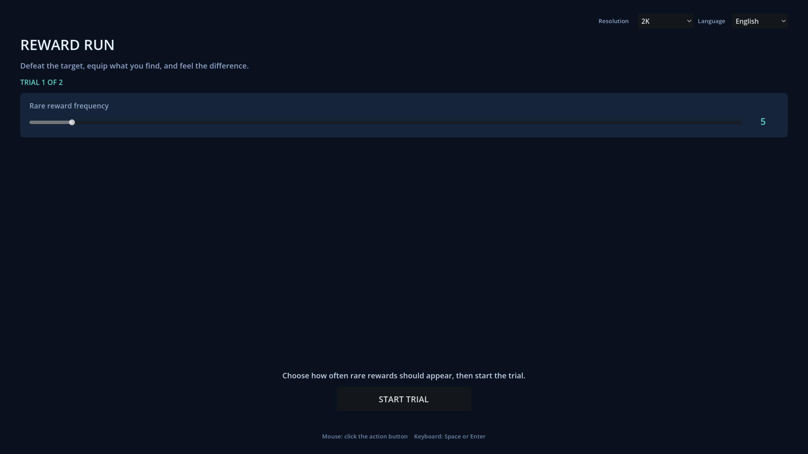
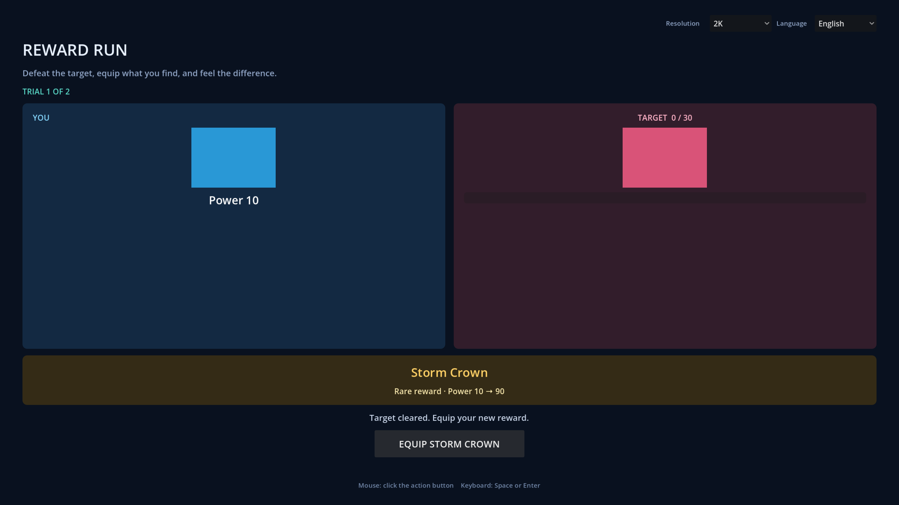
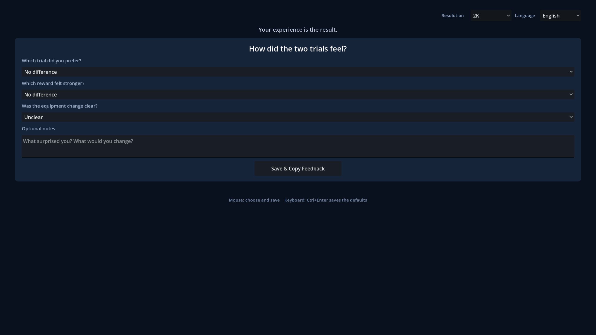

# Reward Run playable

Reward Run is the player-facing HITL product for the maintained
`roguelike-reward-build` slice. The player changes how often rare rewards appear, completes two
short trials, feels the resulting build change, and records feedback.

The playable hides Model, Experiment, Formula, Runtime, trace, Metric, typed-value, artifact,
identity, and HTTP details. It uses blockout shapes, short Tween animations, and direct
mouse/keyboard controls. A playthrough takes about five minutes.

## Player flow

1. Choose **Rare reward frequency** and start Trial 1.
2. Break the first target with the Training Blade.
3. Equip the selected reward.
4. Test the changed build on a stronger target.
5. Change the frequency and complete Trial 2.
6. Compare both trials and save feedback.

The maintained seed makes `5` and `2` a useful comparison. Frequency `5` selects the rare Storm
Crown and produces power 90. Frequency `2` selects the common Iron Guard and produces power 30.
The control still accepts the complete maintained range.

The main screen offers 1080p, 2K (2560×1440), and 4K resolution options. It starts at 2K and uses
a 1920×1080 logical canvas. The language option switches all player-facing text between English
and Simplified Chinese. English is the default.

After both trials, **Save & Copy Feedback** writes `user://reward_run_feedback.json`, shows its
platform-specific absolute path, and copies the same payload to the clipboard. The payload contains
the chosen frequency, observed reward/build result, perception answers, notes, and opaque
maintainer provenance.

## Visual checkpoints

| Frequency | Reward | Feedback |
| --- | --- | --- |
|  |  |  |

## Architecture

Dependencies point down. Calls go down and signals report state up.

```text
UI -> Reward Content -> RewardRun System
                    \-> GdaExecutionClient Add-on -> Godot / local HTTP service
```

- `addons/gda_balancing_client/gda_execution_client.gd` owns executable discovery, the child
  process, readiness, credentials, generic `/v1` requests, session/revision handles, and shutdown.
  It contains no Reward, Combat, or Effect concepts.
- `content/reward_run/reward_run_documents.gd` reads the maintained Model Source and Experiment.
  It maps `rare_weight` to the player-facing Reward frequency control and creates complete later
  Experiment values.
- `content/reward_run/reward_trial.gd` validates the returned reward/build relationships and owns
  the Reward-specific gameplay and feedback projections. Technical provenance stays in Content.
- `content/reward_run/reward_run_controller.gd` coordinates service preparation, two live trials,
  atomic failure, explicit retry, and feedback.
- `systems/reward_run.gd` owns combat, equipment, and completion state. It receives gameplay-only
  values and has no gda-balancing dependency.
- `ui/playtest_shell.gd` owns the common player shell, display/language preferences, and feedback
  interaction. `ui/reward_run_view.gd` owns Reward presentation and Tween animations.
- `main.gd` creates one client and injects it into Reward Content. The product architecture has no
  Autoload, service locator, event bus, `EditorPlugin`, or plugin registry. When `gda` injects the
  optional `GdaHarness`, Reward Content uses it only for development logs; product behavior and
  dependency resolution do not depend on it.

The Add-on can later serve another Content module through a separate Execution session. This
playable does not implement Combat/Effect adapters or a universal gameplay payload.

## Authoritative data path

Reward Content reads these maintained files directly:

- `examples/schema2/roguelike-reward-build/model-source.json`;
- `examples/schema2/roguelike-reward-build/experiment.json`.

It sends both complete JSON values to the generic local service. Each player change produces a
complete immutable Experiment revision. A run always names the returned exact revision.

The playable has no generated case file, generator, deployment copy, or fallback data path. The
Model Source Package and Experiment Specification remain the only authored authorities.

## Launch

Install this package environment and provide Godot 4.6 or later. From `libs/gda-balancing`, run:

```bash
GDA_GODOT=/absolute/path/to/godot \
  examples/schema2/playtest/scripts/run_reward_run.sh
```

This one command starts Godot. The injected Add-on starts and owns `gda-balancing serve`. The
launch script supplies an absolute executable from `GDA_BALANCING_EXECUTABLE` or the current
`PATH`. When no path is supplied, the Add-on performs its own `PATH` lookup. An invalid explicit
path reaches the Add-on and produces the same visible retry instead of silently selecting another
installation.

This is a repository-local product. It does not package Python, embed a companion executable, or
claim standalone export support.

## Verify

Run the package-level structure and source-authority checks:

```bash
uv run pytest tests/test_schema2_playtest.py
```

Run the live Controller path through a real local service:

```bash
GDA_BALANCING_EXECUTABLE="$PWD/.venv/bin/gda-balancing" \
  uv run --directory ../.. --frozen gda script run \
  res://tests/test_reward_run_controller_live.gd \
  --project "$PWD/examples/schema2/playtest" \
  --json
```

The focused Godot scripts also cover executable discovery, direct maintained-document loading,
same-session revisions, artifact projection, refusal atomicity, retry, UI control binding,
Gameplay, display preferences, localization, and feedback persistence.
`test_reward_run_main_live.gd` additionally runs the critical UI → bootstrap → Content → Add-on →
real-service path through two revisions and feedback save.

For a visual check, use the launch command and complete both trials with mouse and keyboard. `gda`
may be used to inspect the scene, inject input, capture screenshots, and read errors during
development. It is not part of the playable's runtime architecture.
